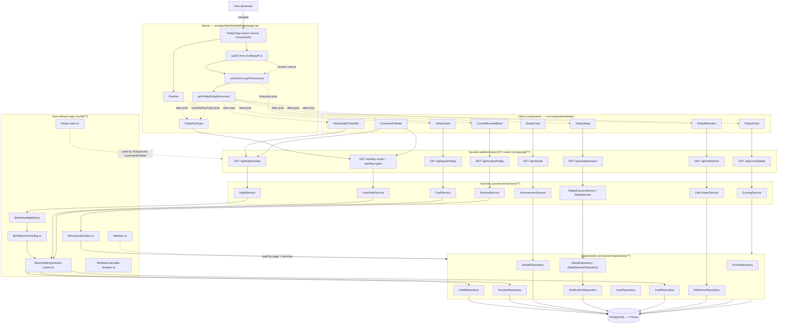
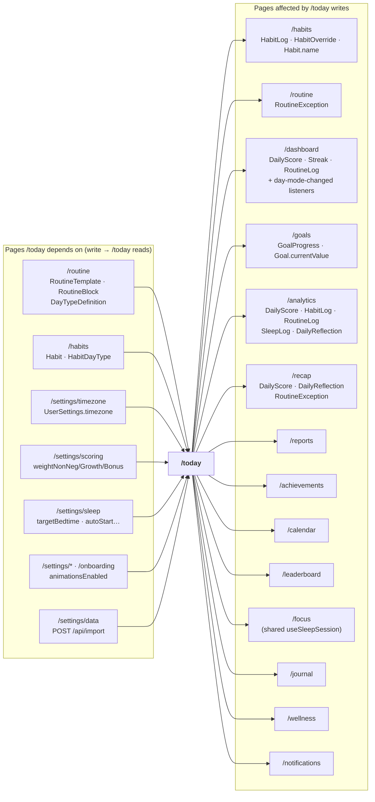
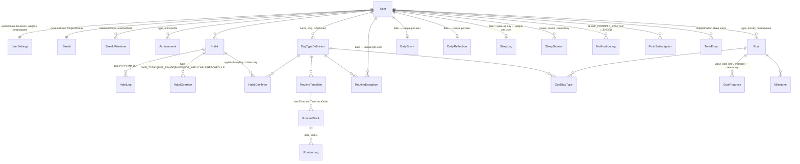

# `/today` — Complete System Audit

**Route:** `http://localhost:3000/today`
**Route file:** `src/app/(dashboard)/today/page.tsx`
**Project:** RoutineOS (`daily-plan`) — Next.js (App Router) + Prisma + PostgreSQL (Neon)
**Audit date:** 2026-09-30 · **Amended:** 2026-09-30 (ten dataflow/scoring/validation defects repaired — [§24.1](#241-fixed); UI/UX pass — [§25](#25-uiux-pass-2026-09-30))
**Status of this document:** describes **only** what exists in the codebase. Every claim is file-anchored. Where something could not be proven from code it is marked **`Needs verification`**. Anything that looks like a feature but is not wired up is listed explicitly in [§15](#15-currently-not-supported). Corrections made during the repair passes are recorded in [§24.1](#241-fixed); architectural items deliberately left unchanged — each with the reason — are in [§24.2](#242-open--deliberate-non-changes). The presentation-only UI pass is in [§25](#25-uiux-pass-2026-09-30).

---

## Table of contents

| §   | Section                                                                                                         |
| --- | --------------------------------------------------------------------------------------------------------------- |
| 1   | [What `/today` is, in one paragraph](#1-what-today-is-in-one-paragraph)                                         |
| 2   | [UI block diagram](#2-ui-block-diagram)                                                                         |
| 3   | [UI → component mapping](#3-ui--component-mapping)                                                              |
| 4   | [Frontend architecture](#4-frontend-architecture)                                                               |
| 5   | [Backend / API architecture](#5-backend--api-architecture)                                                      |
| 6   | [Database dependency](#6-database-dependency)                                                                   |
| 7   | [Date and day-type logic](#7-date-and-day-type-logic)                                                           |
| 8   | [Complete user actions (serial)](#8-complete-user-actions-serial)                                               |
| 9   | [What can the user create](#9-what-can-the-user-create)                                                         |
| 10  | [What can the user edit](#10-what-can-the-user-edit)                                                            |
| 11  | [What can the user delete](#11-what-can-the-user-delete)                                                        |
| 12  | [Cross-page dependencies](#12-cross-page-dependencies)                                                          |
| 13  | [Impact analysis](#13-impact-analysis)                                                                          |
| 14  | [Current System Capabilities](#14-current-system-capabilities)                                                  |
| 15  | [Currently NOT Supported](#15-currently-not-supported)                                                          |
| 16  | [Loading / Error / Empty / Edge states](#16-loading--error--empty--edge-states)                                 |
| 17  | [Authentication & security](#17-authentication--security)                                                       |
| 18  | [Performance](#18-performance)                                                                                  |
| 19  | [External integrations](#19-external-integrations)                                                              |
| 20  | [Background jobs / cron effects](#20-background-jobs--cron-effects)                                             |
| 21  | [Data flow diagrams](#21-data-flow-diagrams)                                                                    |
| 22  | [File-by-file dependency inventory](#22-file-by-file-dependency-inventory)                                      |
| 23  | [Current behavior summary](#23-current-behavior-summary)                                                        |
| 24  | [Findings register — fixed and open](#24-findings-register)                                                     |
| 25  | [UI/UX pass (2026-09-30)](#25-uiux-pass-2026-09-30)                                                             |
| 26  | [Correctness and layout pass (2026-09-30, second pass)](#26-correctness-and-layout-pass-2026-09-30-second-pass) |
| 27  | [Final state and verification (2026-09-30)](#27-final-state-and-verification-2026-09-30)                        |

---

## 1. What `/today` is, in one paragraph

`/today` is the app's **daily console**. It is a single **Server Component** page (`src/app/(dashboard)/today/page.tsx`) that renders a responsive _bento grid_ of **nine blocks**: a page header (title + user-timezone date + command-palette trigger), today's score, the currently-running routine block, today's habit checklist, the resolved day type, the streak, sleep, active goals, and a daily reflection form. The server component authenticates the session, resolves the user's authoritative timezone, computes `today` as a `YYYY-MM-DD` calendar label, and resolves the **day type** once (server-side, through `RoutineService.getRoutineForDate`) before handing `today` and `timezone` to eight **Client Components**. Each client component fetches its own data from a session-authenticated JSON API route on mount. Every write the page performs is an optimistic client update followed by a `POST`/`PUT` to a Zod-validated route, then a background refetch. The page has **no date picker** — the date is always _today_ in the user's timezone.

---

## 2. UI block diagram

Layout: one `div.gradient-mesh-animated` background layer (`-z-10`), then a CSS grid
`grid-cols-1 → md:grid-cols-2 → xl:grid-cols-6` with eight cells. Everything below is the **real** structure from `src/app/(dashboard)/today/page.tsx`.

```
/today  (src/app/(dashboard)/today/page.tsx — async Server Component)
│
├── [background] div.gradient-mesh-animated.pointer-events-none.-z-10.opacity-60   (aria-hidden)
│
└── TodayMotionProvider  → framer-motion <MotionConfig reducedMotion={enabled?'user':'always'}>
    │
    ├── HEADER (wrapped in <Stagger>)
    │   ├── <h1> "Today"
    │   ├── <p class="glass-panel"> CalendarIcon + formatInTimeZone(new Date(), timezone, 'EEEE, MMMM d, yyyy')
    │   │      └── DATA: server-resolved timezone (UserSettings.timezone) — STATIC per render
    │   └── CommandPalette  (client) — trigger button + ⌘/Ctrl+K dialog
    │          └── DATA: lazy (habits + day types fetched on first open)
    │              ACTIONS: open palette, search, log habit, set day type, start sleep, jump to reflection, jump to sleep, go to /focus
    │
    └── BENTO GRID
        │
        ├── [hero] cell xl:col-span-2 xl:row-start-1 → TodayScore {date=today}  (Stagger delay .06)
        │      └── DATA: GET /api/score/{today}  → DailyScore (+ live recompute)
        │      └── DISPLAY: score hero (big number + "/100" + grade pill + contextual line),
        │                three labelled bars Core/Growth/Bonus each with value + bar + hint,
        │                completion tiles Habits % / Routine % / Sleep /100
        │      └── STATES: PanelSkeleton (6 rows, min-h-[19rem]) / error + "Try again" /
        │                "No score yet for today" static empty state
        │      └── ACTIONS: none (read-only)
        │      └── REDESIGNED — the concentric SVG rings + legend row were replaced by
        │                labelled bars; "Try again tomorrow" (SCORE_GRADES.F) replaced by
        │                contextual copy. See §25.
        │
        ├── [hero] cell xl:col-span-4 xl:row-start-1 → CurrentRoutineBlock {timezone}  (Stagger .10)
        │      └── DATA: GET /api/routine/today (60 s poll + 'day-mode-changed' listener)
        │      └── DISPLAY: "Right now" header, live countdown ring, block title,
        │                start–end tag, description, "Next: <block> at HH:mm" or "Last block of the day."
        │      └── STATES: PanelSkeleton / error + "Try again" / PanelEmpty "Nothing running right now"
        │      └── ACTIONS: none (read-only — completion lives on /dashboard, /routine)
        │
        ├── [main, tall] cell xl:col-span-3 xl:row-span-2 → TodayHabitChecklist {date=today}  (Stagger .14)
        │      └── DATA: GET /api/habits/today?date=  (first load only)
        │                GET /api/habits?status=ACTIVE&limit=100 (after modal close only)
        │      └── DISPLAY: HabitProgressBar (N/M · P%), per-tier groups
        │                (HABIT_TIERS_ORDERED, 11 tiers), row = checkbox + icon + name
        │                + "added today" badge (MANUAL) + estimatedDuration "X min",
        │                hover-revealed row actions
        │      └── MODAL: AddHabitModal
        │      └── POPOVER: "Add to Today" search-and-pick list of active habits
        │      └── STATES: GlassPanel skeleton (min-h-[30rem]) / inline error <p role="alert"> /
        │                EmptyState "No habits scheduled for today"
        │      └── ACTIONS: toggle done/not-done (+Undo toast), skip, add-to-today,
        │                remove-from-today (MANUAL only), rename inline, + New Habit
        │
        ├── [main] cell xl:col-span-3 xl:row-start-2 → TodayDayType {date, resolvedDayType} (Stagger .18)
        │      └── DATA: GET /api/day-mode?date=  ‖ GET /api/day-types?active=true   (Promise.all)
        │      └── DISPLAY: "Day Type" PanelHeader, then a **headline block** — day-type icon
        │                (text-3xl) + name (text-lg/xl bold) + a coloured status line
        │                ("Natural schedule for today" = primary / "Manually overridden for
        │                today" = amber), plus "Using a one-off routine for today" when an
        │                exception pins a templateId
        │      └── COLLAPSIBLE: "Change day type" → DayContextSelector grid
        │      └── STATES: compact GlassPanel with a same-size Skeleton / two separate
        │                error lines / "You have not created any day types yet → /routine"
        │      └── ACTIONS: pick a day type, Reset to schedule
        │      └── REDESIGNED — the day-type name was a `text-xs` badge beside the heading;
        │                it is now the card's largest text. See §25.
        │
        ├── [main] cell xl:col-span-3 → StreakCard {}                     (Stagger .22)
        │      └── DATA: GET /api/streak  → Streak + uncelebrated StreakMilestone
        │      └── DISPLAY: flame (intensity scales with streak), milestone arc SVG,
        │                currentStreak, longest, totalCompletedDays, "Next: 1 week · N to go",
        │                streakStartDate relative label
        │      └── STATES: PanelSkeleton / error + "Try again" / "No streak recorded yet."
        │      └── ACTIONS: none (read-only)
        │
        ├── [bottom] cell xl:col-span-3  id="today-sleep" → TodaySleep {date=today}  (Stagger .26)
        │      └── DATA: useSleepSession() → GET /api/sleep/session (15 s poll, tab-visible only)
        │                POST /api/sleep (manual log form)
        │      └── DISPLAY (4 mutually-exclusive bodies):
        │                1. active session → pulsing green panel, HH:MM:SS elapsed, "Started at HH:mm",
        │                   "auto-started" badge when source = AUTO_NO_RESPONSE, "I woke up" button
        │                2. pending prompt → amber panel, target bedtime, live M:SS auto-start countdown,
        │                   "Start now" / "Not yet"
        │                3. today's SleepLog → 2×2 grid Bedtime / Wake time / Duration / Target
        │                   + SleepQualityMeter (0–100 score, band, rating, felt rested, wake-ups)
        │                4. nothing → moon icon + "No sleep logged yet today."
        │      └── MODALS: "Log Sleep" Radix Dialog (portalled), "Still sleeping?" Dialog
        │                (createPortal → document.body)
        │      └── STATES: GlassPanel skeleton (min-h-[14rem]) / inline error alert
        │      └── ACTIONS: Start sleep, I woke up (+long-run confirm), Start now, Not yet,
        │                manual Log Sleep / Edit save
        │
        ├── [bottom] cell xl:col-span-3 → TodayGoals {date=today}          (Stagger .30)
        │      └── DATA: GET /api/goals/today?date= (first 5 goals)
        │      └── DISPLAY: "Active Goals" + "View All" link → /goals; per goal: title,
        │                "Done today"/"Not done today" (DAILY) or "current / target unit",
        │                priority pill, Progress bar, "Repeats daily" or "N days left", "%"
        │      └── STATES: GlassPanel skeleton / error + "Retry" / EmptyState "No active goals" + Create Goal
        │      └── ACTIONS: Mark done today / Undo check-in (DAILY goals only), navigate to /goals
        │
        └── [bottom] cell xl:col-span-3  id="today-reflection" → DailyReflection {date=today} (Stagger .34)
               └── DATA: GET /api/reflections?date= ; POST /api/reflections
               └── DISPLAY — 3 mutually exclusive views:
                  1. empty  → "Take a moment to reflect on your day" + "Start Reflection"
                  2. edit   → 4 sliders (Energy/Mood/Stress/Focus 1–5) + 7 textareas
                              (Biggest Win, Biggest Challenge, Overall Reflection, Gratitude,
                               Lessons Learned, Improvements, Tomorrow's Focus) +
                              "Tomorrow's Priorities" (one per line) + Save / Cancel
                  3. read   → energy/mood/stress/focus "n/5" row + every non-empty text field
                              + "Edit" button + "Reflection saved." notice
               └── STATES: GlassPanel skeleton (min-h-[16rem]) / inline error <p role="alert">
               └── ACTIONS: start, edit, save, cancel

└── <Toaster position="bottom-right" richColors closeButton />   (sonner, mounted on this page only)
```

### Anchor IDs (used by the command palette)

| ID                 | On                                                                                 |
| ------------------ | ---------------------------------------------------------------------------------- |
| `today-reflection` | the grid **cell** wrapping `DailyReflection` (not the card) — `today/page.tsx:165` |
| `today-sleep`      | the grid **cell** wrapping `TodaySleep` — `today/page.tsx:148`                     |

Both live on the grid cell rather than inside the card so a card restyle cannot move or remove them.

---

## 3. UI → component mapping

Each row is a real chain traced through imports. Paths are relative to the repo root.

### 3.1 Score

```
Score panel
→ src/components/today/TodayScore.tsx
→ src/components/today/ScoreBreakdown.tsx
→ src/components/motion/useCountUp.ts            (framer-motion animate)
→ src/lib/api-client.ts                          (apiRequest, unwraps { success, data })
→ src/lib/dates.ts                               (formatDisplayDate)
→ src/types/score.ts                             (SCORE_GRADES, ScoreGrade)
→ GET /api/score/[date]
→ src/app/api/score/[date]/route.ts
→ src/server/services/scoring.service.ts         (recalculateDate → calculateDailyScore)
   ↳ src/server/domain/scoring/score-calculator.ts  (computeDayScore)
   ↳ src/server/domain/scoring/tier-weights.ts      (DEFAULT_TIER_WEIGHTS, tierToPoints, weightForTier)
   ↳ src/config/scoring.ts                        (CALCULATION_RULES)
   ↳ src/lib/scheduling/resolve-routine.ts        (resolveDayTypeForDate)
   ↳ src/lib/habits/day-type-match.ts             (habitAppliesToDayType)
→ repositories:
   src/server/repositories/habit.repository.ts   (findAll, findLogsByDate)
   src/server/repositories/routine.repository.ts (findLogsByDate)
   src/server/repositories/score.repository.ts   (findByDate, upsertScore)
   src/server/repositories/user.repository.ts     (getSettings → tier weights)
→ side effect: automationService.handleEvent({ type:'SCORE_THRESHOLD' })  (fire & forget)
→ Prisma models: DailyScore, HabitLog, RoutineLog, Habit, RoutineException, DayTypeDefinition, UserSettings
```

### 3.2 Right now (current routine block)

```
Right now panel
→ src/components/today/CurrentRoutineBlock.tsx
→ src/lib/routine/duration.ts   (getCurrentBlock, getNextBlock, calculateBlockProgress)
→ GET /api/routine/today
→ src/app/api/routine/today/route.ts
→ src/server/services/routine.service.ts   (getRoutineForDate)
   ↳ src/lib/scheduling/resolve-routine.ts (resolveDayTypeFromException)
   ↳ src/lib/routine/duration.ts           (isOvernightBlock, calculateBlockDuration)
   ↳ src/lib/dates.ts                      (getTodayString, timeToMinutes)
→ src/server/repositories/routine.repository.ts
   (findException, findTemplateWithBlocks, findTemplateByDayType, findLogsByDate)
→ Prisma models: RoutineException, RoutineTemplate, RoutineBlock, RoutineLog, DayTypeDefinition
```

The page itself also calls `RoutineService.getRoutineForDate` **directly** (`today/page.tsx:32`) — server-side, no HTTP — but only to obtain `routine.dayType`; that result is never rendered as blocks.

### 3.3 Habits

```
Habits panel
→ src/components/today/TodayHabitChecklist.tsx
→ src/components/today/celebration.tsx       (useCelebration → canvas-confetti; actionToast; errorToast)
→ src/components/habits/AddHabitModal.tsx    (modal)
   ↳ src/context/AppContext.tsx  useApp().addHabit   → POST /api/habits
→ src/hooks/useUserTimezone.ts                (AddHabitModal startDate)
→ src/store/achievement.store.ts              runAchievementCheck → POST /api/achievements/unlock
→ src/lib/pwa/notifications.ts                showNotification (system notification)
→ src/constants/habit-tiers.ts                (HABIT_TIER_CONFIG, HABIT_TIERS_ORDERED)
→ src/lib/motion.ts                           (EASE)
→ GET  /api/habits/today?date=      → src/app/api/habits/today/route.ts
   POST /api/habits/today           → (ADD / REMOVE)
→ src/server/services/habit.service.ts
   (getHabitsForDate, logHabit, skipHabit, addHabitToToday, removeHabitFromToday, updateHabit)
   ↳ src/lib/habits/eligibility.ts    (calculateHabitEligibility)
      ↳ src/lib/habits/scheduling.ts  (isHabitScheduledForDate)
      ↳ src/lib/habits/frequency.ts   (parseFrequencyConfig)
      ↳ src/lib/habits/day-type-match.ts (habitAppliesToDayType)
      ↳ src/lib/scheduling/resolve-routine.ts
   ↳ src/lib/streaks/calculate-streak.ts (calculateStreak, recordStreakMilestone)
   ↳ src/server/services/scoring.service.ts  (calculateDailyScore)
   ↳ src/server/services/achievement.service.ts (checkForUnlocks, fire & forget)
   ↳ src/server/services/automation.service.ts  (handleEvent HABIT_COMPLETED, fire & forget)
→ src/server/repositories/habit.repository.ts, streak.repository.ts, audit.repository.ts, user.repository.ts
→ Prisma models: Habit, HabitLog, HabitOverride, HabitDayType, Streak, StreakMilestone,
                 DailyScore, Achievement, AutomationRule, AuditLog, UserSettings
```

### 3.4 Day type

```
Day Type panel
→ src/components/today/TodayDayType.tsx
→ src/components/context/DayContextSelector.tsx   (CustomDayType, BUILT_IN_DAY_TYPE_OPTIONS)
→ src/constants/routine.ts       (DAY_TYPE_CONFIG, ENUM_TO_SLUG)
→ src/constants/day-types.ts     (enumValueForSlug)
→ src/components/ui/Collapsible.tsx
→ GET  /api/day-mode?date=  +  GET /api/day-types?active=true     (Promise.all)
→ src/app/api/day-mode/route.ts        → src/server/services/day-mode.service.ts (getDayMode, setDayMode)
   ↳ src/lib/scheduling/resolve-routine.ts (resolveDayTypeForDate, resolveNaturalDayType)
   ↳ src/server/repositories/routine.repository.ts (findException, findDayTypeDefinitionBySlug,
                                                      listExceptions, upsertException, deleteExceptionsForDate)
   ↳ src/server/repositories/score.repository.ts   (findByDate, upsertScore)
   ↳ src/server/services/scoring.service.ts        (calculateDailyScore for MINIMUM mode)
→ src/app/api/day-types/route.ts      → src/server/services/day-type.service.ts (listDayTypes)
   → src/server/repositories/routine.repository.ts (listDayTypeDefinitions)
→ Prisma models: RoutineException, DayTypeDefinition, RoutineTemplate, DailyScore
```

### 3.5 Streak

```
Streak panel
→ src/components/streak/StreakCard.tsx
→ src/components/today/celebration.tsx   (useCelebration().streakMilestone)
→ src/components/today/ui.tsx            (GlassPanel, PanelHeader, PanelSkeleton, Tag)
→ GET /api/streak
→ src/app/api/streak/route.ts
→ src/server/services/achievement.service.ts  (getStreakWithMilestones)
→ src/server/repositories/streak.repository.ts (findByUserId, create, getUncelebratedMilestones)
→ Prisma models: Streak, StreakMilestone
→ Client-only state: localStorage key `routineos.streak.celebrated`
```

### 3.6 Sleep

```
Sleep panel
→ src/components/today/TodaySleep.tsx
→ src/hooks/useSleepSession.ts          (module-level singleton store + 15 s poller)
→ src/components/sleep/SleepQualityMeter.tsx → src/lib/sleep/sleep-score.ts
→ src/lib/sleep/calculate-duration.ts   (calculateSleepDuration, calculateSleepScore)
→ src/lib/pwa/notifications.ts         (showNotification for the prompt)
→ src/components/motion/Mount.tsx
→ src/components/ui/Dialog.tsx         (Radix; long-run confirm via createPortal → document.body)
→ GET  /api/sleep/session
→ POST /api/sleep/session/start | /stop | /respond
→ POST /api/sleep   (manual log)
→ src/server/services/sleep-session.service.ts (resolveSleepState, startSleep, stopSleep, respondToPrompt)
   ↳ src/server/services/notification.service.ts, src/server/services/push.service.ts
   ↳ src/server/repositories/{sleep-session,sleep,time-entry,user,notification}.repository.ts
→ src/app/api/sleep/route.ts → src/server/services/sleep.service.ts (logSleep)
   ↳ src/lib/sleep/calculate-duration.ts (calculateSleepDuration, calculateSleepDeficit)
   ↳ src/server/repositories/sleep.repository.ts (upsertLog)
→ Prisma models: SleepLog, SleepSession, NotificationLog (SLEEP_PROMPT / SLEEP_TRACKING_STARTED / SLEEP_ENDED),
                 PushSubscription, TimeEntry, UserSettings
```

### 3.7 Goals

```
Goals panel
→ src/components/today/TodayGoals.tsx
→ src/components/today/celebration.tsx   (actionToast, errorToast)
→ src/components/motion/Mount.tsx
→ src/lib/dates.ts                       (calendarDaysBetween → days remaining)
→ GET  /api/goals/today?date=
→ POST /api/goals/[id]/checkin
→ src/app/api/goals/today/route.ts → src/server/services/goal.service.ts
   (getVisibleGoalsForDate, getProgressLogsForDate)
   ↳ src/lib/scheduling/resolve-routine.ts (resolveDayTypeForDate)
→ src/app/api/goals/[id]/checkin/route.ts → GoalService.checkInDaily
→ src/server/repositories/goal.repository.ts
   (findActiveInDateWindow, findActiveByDayTypeId, findProgressLogsByDate, addProgressLog, update, findById)
→ Prisma models: Goal, GoalProgress, GoalDayType, DayTypeDefinition, RoutineException
```

### 3.8 Reflection

```
Reflection panel
→ src/components/today/DailyReflection.tsx
→ src/components/ui/{Textarea,Slider}.tsx
→ GET  /api/reflections?date=
→ POST /api/reflections
→ src/app/api/reflections/route.ts
→ src/server/services/life-context.service.ts (getReflection, saveReflection)
→ src/server/repositories/reflection.repository.ts (findByDate, upsertReflection)
→ src/schemas/reflection.schema.ts        (reflectionSchema)
→ Prisma model: DailyReflection  (gratitude & tomorrowPriorities stored as JSON strings)
```

### 3.9 Command palette

```
CommandPalette
→ src/components/today/CommandPalette.tsx
→ src/lib/api-client.ts             (apiRequest)
→ src/hooks/useUserTimezone.ts      (client-side "today" for the log POST)
→ src/constants/day-types.ts        (enumValueForSlug — resolves the real DayType enum from the definition's slug)
→ src/lib/today-sync.ts             (notifyTodayDataChanged — refreshes the habit/score/streak cards)
→ cmdk  <Command>  +  src/components/ui/Dialog.tsx
→ sonner toast
→ GET  /api/habits/today?date=   ‖  GET /api/day-types?active=true   (Promise.all, on first open)
→ POST /api/habits/[id]/log
→ POST /api/day-mode                ({ mode:'DAY_TYPE', dayType: enumValueForSlug(d.slug), dayTypeId })
→ POST /api/sleep/session/start
→ next/navigation: router.push('/focus'), router.refresh()
```

---

## 4. Frontend architecture

### 4.1 Page structure

| Concern               | Reality                                                                                                                                                                                  |
| --------------------- | ---------------------------------------------------------------------------------------------------------------------------------------------------------------------------------------- |
| Component kind        | **Async Server Component** (`export default async function TodayPage()`), `today/page.tsx:20`                                                                                            |
| Sibling route files   | **None.** `src/app/(dashboard)/today/` contains only `page.tsx` — no `loading.tsx`, no `error.tsx`, no `template.tsx`                                                                    |
| Route-segment loading | Falls through to `src/app/(dashboard)/loading.tsx` → `<PageSkeleton />`                                                                                                                  |
| Route-segment error   | Falls through to `src/app/(dashboard)/error.tsx` (full-page error UI + `ErrorReporter.reportClientError`)                                                                                |
| Layout                | `src/app/(dashboard)/layout.tsx` — sidebar, header, footer, mobile nav, `FloatingFocusBar`, `CelebrationHost`, `SleepPromptHost`, `OfflineBanner`, `DataErrorBanner`; `noindex` metadata |
| Root layout           | `src/app/layout.tsx` — `ThemeProvider` → `AuthProvider` → `AppProvider` → `CookieConsentProvider`, plus `AutoLogout`, `SWRegistration`, `Analytics`, `CookieConsentBanner`               |

### 4.2 Providers / contexts active on `/today`

| Provider                                                                          | File                                              | Does it affect `/today` content?                                                                                                                                                      |
| --------------------------------------------------------------------------------- | ------------------------------------------------- | ------------------------------------------------------------------------------------------------------------------------------------------------------------------------------------- |
| `ThemeProvider`                                                                   | `src/components/providers/ThemeProvider.tsx`      | Yes — light/dark theme drives all `/today` colours (`.glass-panel`, `gradient-mesh-animated` use tokens from `globals.css`)                                                           |
| `AuthProvider` (NextAuth `SessionProvider` + `AuthSync` + `DeviceSessionTracker`) | `src/components/auth/AuthProvider.tsx`            | Indirectly — `AuthSync` calls `useSettingsLoader`, which pre-loads `UserSettings` into the settings store used by `useAnimationsEnabled`, `useUserTimezone`, `useCelebration`         |
| `AppProvider`                                                                     | `src/context/AppContext.tsx`                      | **Indirectly and redundantly** — see §4.5                                                                                                                                             |
| `CookieConsentProvider`                                                           | `src/components/privacy/CookieConsent.tsx`        | No                                                                                                                                                                                    |
| `TodayMotionProvider`                                                             | `src/components/today/TodayMotionProvider.tsx`    | **Yes** — wraps the whole grid in `<MotionConfig reducedMotion>`                                                                                                                      |
| `SleepPromptHost` (layout)                                                        | `src/components/shared/SleepPromptHost.tsx`       | No — it early-returns `null` when `pathname === '/today'` because `TodaySleep` renders the same prompt inline. It still subscribes to the shared `useSleepSession` store (same poll). |
| `CelebrationHost` (layout)                                                        | `src/components/achievements/CelebrationHost.tsx` | **Yes** — renders `AchievementPopup` for achievements unlocked from `/today`'s habit toggle                                                                                           |

There is **no** `React.Context` created by `/today` itself. `AppContext` and the zustand stores are app-wide.

### 4.3 State inventory

| State                                                                                         | Kind                       | Owner                                                                                                                                                         | Initial                                               | Updated by                                                                                                                                 | Read by                                                                                                                                | Persisted                                  |
| --------------------------------------------------------------------------------------------- | -------------------------- | ------------------------------------------------------------------------------------------------------------------------------------------------------------- | ----------------------------------------------------- | ------------------------------------------------------------------------------------------------------------------------------------------ | -------------------------------------------------------------------------------------------------------------------------------------- | ------------------------------------------ |
| `timezone`                                                                                    | server                     | `today/page.tsx:27`                                                                                                                                           | `UserSettings.timezone ?? 'UTC'`                      | nothing (per-request)                                                                                                                      | header date, `CurrentRoutineBlock`, `TodayDayType`, `TodayScore`, `TodayHabitChecklist`, `TodayGoals`, `TodaySleep`, `DailyReflection` | no                                         |
| `today` (`YYYY-MM-DD`)                                                                        | server                     | `today/page.tsx:28`                                                                                                                                           | `getTodayString(timezone)`                            | nothing                                                                                                                                    | every panel as the `date` prop                                                                                                         | no                                         |
| `resolvedDayType`                                                                             | server                     | `today/page.tsx:31–33`                                                                                                                                        | `RoutineService.getRoutineForDate().dayType`          | nothing                                                                                                                                    | `TodayDayType` prop only                                                                                                               | no                                         |
| `TodayScore.data`                                                                             | local `useState`           | `TodayScore.tsx:40`                                                                                                                                           | `EMPTY` (all null)                                    | `fetchScore({ background })` — first load, "Try again", or a `today-data-changed` broadcast                                                | `ScoreBreakdown`                                                                                                                       | no (re-fetched from server each mount)     |
| `CurrentRoutineBlock.blocks`                                                                  | local `useState`           | `CurrentRoutineBlock.tsx:43`                                                                                                                                  | `[]`                                                  | `fetchRoutine()` on mount, 60 s interval, `day-mode-changed`                                                                               | ring/next/current render                                                                                                               | no                                         |
| `CurrentRoutineBlock.tick`                                                                    | local `useState`           | `:54`                                                                                                                                                         | `0`                                                   | `setInterval` every 30 s                                                                                                                   | forces re-evaluation of "now"                                                                                                          | no                                         |
| `TodayHabitChecklist.habits`                                                                  | local `useState`           | `:116`                                                                                                                                                        | `[]`                                                  | `fetchTodayHabits()` (first load + background refetch), optimistic toggle, optimistic add/remove, **and a `today-data-changed` broadcast** | progress bar + rows                                                                                                                    | no                                         |
| `TodayHabitChecklist.allHabits`                                                               | local `useState`           | `:117`                                                                                                                                                        | `[]`                                                  | `fetchAllHabits()` **only after `AddHabitModal.onClose`**                                                                                  | `addableHabits` popover list                                                                                                           | no                                         |
| `TodayHabitChecklist.search`                                                                  | local `useState`           | `:124`                                                                                                                                                        | `''`                                                  | popover input                                                                                                                              | `addableHabits` filter                                                                                                                 | no                                         |
| `TodayHabitChecklist.{togglingId, addingId, editingId, draftName, modalOpen, loading, error}` | local `useState`           | `:118–125`                                                                                                                                                    | `null`/`''`/`false`                                   | user interaction                                                                                                                           | row rendering + disabled states                                                                                                        | no                                         |
| `TodayDayType.mode`                                                                           | local `useState`           | `:46`                                                                                                                                                         | `null`                                                | `fetchMode()` on mount and after every change                                                                                              | badge, natural/override text, reset button                                                                                             | no                                         |
| `TodayDayType.dayTypes`                                                                       | local `useState`           | `:47`                                                                                                                                                         | `[]`                                                  | `fetchDayTypes()` (in parallel with `fetchMode`)                                                                                           | `DayContextSelector`, `hasDayTypes`                                                                                                    | no                                         |
| `TodayDayType.{dayTypesError, saving, loading, error}`                                        | local `useState`           | `:48–52`                                                                                                                                                      | —                                                     | fetch + change handlers                                                                                                                    | error lines, disable reset                                                                                                             | no                                         |
| `TodayGoals.goals`                                                                            | local `useState`           | `:48`                                                                                                                                                         | `[]`                                                  | `fetchGoals()` on mount; optimistic check-in + rollback                                                                                    | goal rows                                                                                                                              | no                                         |
| `TodayGoals.togglingId`                                                                       | local `useState`           | `:89`                                                                                                                                                         | `null`                                                | `toggleGoalDone`                                                                                                                           | disables the button                                                                                                                    | no                                         |
| `DailyReflection.{saved, hasSaved, isEditing, formData, prioritiesText, notice}`              | local `useState`           | `:72–80`                                                                                                                                                      | `null`/`false`/`EMPTY`                                | `fetchReflection()` on mount and after save; edit/cancel handlers                                                                          | view selection + form                                                                                                                  | no                                         |
| `TodaySleep.isEditing` / `.saveError` / `.longRunningOpen`                                    | local `useState`           | `:48–51`                                                                                                                                                      | `false`/`null`                                        | dialog open/close, save result                                                                                                             | dialogs                                                                                                                                | no                                         |
| `TodaySleep.notifiedReminder`                                                                 | `useRef<Set<string>>`      | `:50`                                                                                                                                                         | empty set                                             | effect when `prompt` appears                                                                                                               | dedupes the system notification per prompt id                                                                                          | no                                         |
| `useSleepSession` store                                                                       | **module-level singleton** | `src/hooks/useSleepSession.ts:76–81`                                                                                                                          | `{ state:null, loading:true, busy:null, error:null }` | `refresh()` (15 s poll + focus/visibility), `run()` after any mutation                                                                     | `TodaySleep`, `SleepPromptHost`, `/focus`                                                                                              | no                                         |
| `useSettingsStore`                                                                            | zustand                    | `src/store/settings.store.ts`                                                                                                                                 | `{ settings:null, status:'idle' }`                    | `useSettingsLoader` on auth, settings pages                                                                                                | `useAnimationsEnabled`, `useUserTimezone`, `useCelebration`                                                                            | yes — `PUT /api/settings` → `UserSettings` |
| `useAchievementStore`                                                                         | zustand                    | `src/store/achievement.store.ts`                                                                                                                              | `{ events: [] }`                                      | `runAchievementCheck()` after a habit COMPLETED                                                                                            | `CelebrationHost` (layout)                                                                                                             | no                                         |
| `localStorage['routineos.streak.celebrated']`                                                 | browser storage            | `StreakCard.tsx:60,73,82`                                                                                                                                     | absent                                                | streak increase                                                                                                                            | dedupes the milestone confetti                                                                                                         | yes (browser)                              |
| URL / query state                                                                             | —                          | **None**                                                                                                                                                      | —                                                     | —                                                                                                                                          | —                                                                                                                                      | —                                          |
| Derived state                                                                                 | `useMemo`                  | `habitsByTier`, `addableHabits` (`TodayHabitChecklist`), `{current, next}` (`CurrentRoutineBlock`), `effectiveDayType` / `activeDayTypeName` (`TodayDayType`) | —                                                     | derived from the state above                                                                                                               | render                                                                                                                                 | —                                          |
| Optimistic updates                                                                            | —                          | habit toggle (`TodayHabitChecklist.tsx:191`), goal check-in (`TodayGoals.tsx:96`), `AppContext.addHabit` (`AppContext.tsx:703`)                               | —                                                     | rolled back in `catch`                                                                                                                     | —                                                                                                                                      | —                                          |

### 4.4 Hooks used on `/today`

| Hook                               | File                                      | Inputs                      | Outputs                                                                                                     | Side effects / API                                                                                                                 |
| ---------------------------------- | ----------------------------------------- | --------------------------- | ----------------------------------------------------------------------------------------------------------- | ---------------------------------------------------------------------------------------------------------------------------------- |
| `auth()`                           | `src/lib/auth.ts`                         | –                           | `{ user, session }` or `null`                                                                               | reads/verifies the JWT session                                                                                                     |
| `userService.getTimezone(userId)`  | `src/server/services/user.service.ts`     | userId                      | `string`                                                                                                    | `UserRepository.getSettings` → DB                                                                                                  |
| `RoutineService.getRoutineForDate` | `src/server/services/routine.service.ts`  | userId, date                | `DayRoutine`                                                                                                | exception + template + logs reads                                                                                                  |
| `apiRequest<T>(path, opts)`        | `src/lib/api-client.ts`                   | path, method/body/query     | unwrapped `T`; throws `ApiError`                                                                            | `fetch` with `credentials:'include'`, `cache:'no-store'`                                                                           |
| `useSleepSession()`                | `src/hooks/useSleepSession.ts`            | –                           | `{ state, loading, busy, error, refresh, start, stop, respond, longRunning }`                               | ref-counted 15 s `GET /api/sleep/session` poll (only while `document.visibilityState === 'visible'`); `POST` on start/stop/respond |
| `useUserTimezone()`                | `src/hooks/useUserTimezone.ts`            | –                           | `{ timezone, today, isLoading }`                                                                            | reads `useSettings()`; `settings.timezone → browser zone → DEFAULT_TZ('UTC')`                                                      |
| `useSettings()`                    | `src/hooks/useSettings.ts`                | –                           | `{ settings, status, error, saving, pending, loading, ready, load, save, patchLocal, reset, ensureLoaded }` | zustand selector over `useSettingsStore`                                                                                           |
| `useAnimationsEnabled()`           | `src/hooks/useThemeTransition.ts:66`      | –                           | `boolean`                                                                                                   | reads `useSettingsStore`                                                                                                           |
| `useCelebration()`                 | `src/components/today/celebration.tsx:26` | –                           | `{ enabled, habitDone, allNonNegotiablesDone, streakMilestone }`                                            | `canvas-confetti` bursts, gated on `animationsEnabled`                                                                             |
| `useApp()`                         | `src/context/AppContext.tsx`              | –                           | habits/goals/routineBlocks/actions                                                                          | **used only by `AddHabitModal`**                                                                                                   |
| `useReducedMotion()`               | framer-motion                             | –                           | `boolean`                                                                                                   | reads the OS media query                                                                                                           |
| `useCountUp(value, duration)`      | `src/components/motion/useCountUp.ts`     | number                      | animated number                                                                                             | framer-motion `animate`                                                                                                            |
| `runAchievementCheck()`            | `src/store/achievement.store.ts:90`       | –                           | `Promise<void>`                                                                                             | `POST /api/achievements/unlock`, then pushes to `useAchievementStore`                                                              |
| `showNotification(title, opts)`    | `src/lib/pwa/notifications.ts:87`         | title, options              | `Promise<boolean>`                                                                                          | may call `Notification.requestPermission()`; prefers `ServiceWorkerRegistration.showNotification`                                  |
| `useRouter()`                      | `next/navigation`                         | –                           | router                                                                                                      | `push('/focus')`, `refresh()` — **CommandPalette only**                                                                            |
| `useSyncExternalStore`             | React                                     | store subscribe/getSnapshot | snapshot                                                                                                    | backs `useSleepSession`                                                                                                            |

### 4.5 Observed implementation detail — redundant fetches caused by `AppContext`

`AppProvider` is mounted in the **root** layout, so it runs on `/today`. On every page load it issues, in `Promise.all` (`src/context/AppContext.tsx:535–548`):

- `fetchAllHabits()` → paginated `GET /api/habits`
- `fetch('/api/routine')` → all templates/blocks
- `fetch('/api/goals')` → all goals

and, once `selectedDate` is set (`:694–697`), `fetchHabitLogs(selectedDate)` → `GET /api/habits/logs?date=`.

`TodayHabitChecklist`, `TodayGoals` and `CurrentRoutineBlock` each keep **their own** `useState` and never read `useApp()`. So on `/today` these four requests are made and their results are not used by the page (except that `AddHabitModal` — rendered _inside_ `TodayHabitChecklist` — does call `useApp().addHabit`, which does mutate `AppContext.habits`).

`AppContext.dataError` is surfaced by `DataErrorBanner` in the `(dashboard)` layout, so **a failure of any of those four requests shows a banner on `/today` even though `/today` does not display the data**.

> This is a descriptive observation, not a recommendation. Nothing was changed.

---

## 5. Backend / API architecture

All routes below are Next.js App Router route handlers under `src/app/api/**`. Every one performs `await auth()` and returns `{ error: 'Unauthorized' }` with **401** when there is no session. **None** of them use `withAuth`, `createApiHandler`, `withRateLimit`, or any rate limiter.

### 5.1 Read endpoints

#### `GET /api/habits/today?date=YYYY-MM-DD`

- **Purpose** — today's _eligible_ habits with their `HabitLog` completion state.
- **Query** — `date`; falls back to `getTodayString(userTimezone)`.
- **Validation** — none (raw string; only used as an equality filter).
- **Service** `HabitService.getHabitsForDate` (`src/server/services/habit.service.ts:80`):
  1. `habitRepository.findAll(userId, { status:'ACTIVE' })` **∥** `habitRepository.findLogsByDate(userId, date)`
  2. `userRepository.getSettings(userId)` → `timezone` (once, threaded into every eligibility call)
  3. `Promise.all(habits.map(h => calculateHabitEligibility(h.id, userId, date, timezone)))`
  4. keep only `isEligible` entries
- **Response** — `{ success:true, data: Array<{ id, name, tier, color, icon, estimatedDuration, targetCount, category, isEligible, eligibilityReason?, source: 'SCHEDULED'|'MANUAL'|'DAY_TYPE_FILTER', log: { id, status } | null }> }`
- **Errors** — 401; 500 `'Failed to fetch habits'`.
- **Cost** — one `HabitRepository.findById` **per active habit**, plus one `findActiveOverrides` per habit, plus one `resolveDayTypeForDate` for each day-type-restricted habit. _(Observed implementation detail / potential concern.)_

#### `GET /api/habits?status=ACTIVE&limit=100`

- **Validation** — `habitQuerySchema` (`src/schemas/habit.schema.ts:71`): `limit` int 1–100, `offset` ≥ 0, `status`/`tier` string arrays, `sortBy`, `sortOrder`.
- **Service** — `HabitService.listHabits` ∥ `countHabits` → `habitRepository.findAll` / `countAll`.
- **Response** — `{ success:true, data, meta:{ total, limit, offset, hasMore } }`.

#### `GET /api/routine/today[?date=]`

- **Purpose** — the resolved template's blocks + their `RoutineLog` for a date.
- **Service** `RoutineService.getRoutineForDate`:
  1. `routineRepository.findException(userId, date)`
  2. `resolveDayTypeFromException(date,'UTC',exception)` → `{ dayType, templateId }`
  3. template = `templateId ? findTemplateWithBlocks(templateId,userId) : findTemplateByDayType(userId, dayType)`
  4. if none → `{ template:null, blocks:[], totalBlocks:0, completedBlocks:0, completionRate:0 }`
  5. `routineRepository.findLogsByDate(userId, date)`; join by `routineBlockId`
- **Response** — `{ success:true, data: DayRoutine }` incl. `dayType`, `template`, `exception`, `blocks[]` (with `durationMinutes`, `isOvernight`, `log`), `totalBlocks`, `completedBlocks`, `completionRate`.
- **Errors** — 401; 500.

#### `GET /api/score/{date}`

- **Purpose** — today's daily score. **For today it always recalculates and persists**; for a past date it serves the stored row (`existing ?? calculate`).
  `src/app/api/score/[date]/route.ts:37–45`
- **Service** — `ScoringService.recalculateDate` (preserves `isMinimumDay`, `isRestDay`, reasons) → `calculateDailyScore`.
- **Calculation** (`src/server/services/scoring.service.ts:82–226`):
  - `calculateScoreSchema.parse({ date })`
  - weights = `DEFAULT_TIER_WEIGHTS` overridden by `UserSettings.weightNonNeg/weightGrowth/weightBonus`
  - `habitRepository.findAll(userId,{status:'ACTIVE'})`, `habitRepository.findLogsByDate(userId,date)`, `routineRepository.findLogsByDate(userId,date)`
  - `resolveDayTypeForDate(userId,date)` then `habits = allHabits.filter(h => habitAppliesToDayType(h, resolved))`
  - tier buckets: **core** = `NON_NEGOTIABLE`+`GROWTH`; **growth** = `LIFESTYLE`+`FLEXIBLE`; **bonus** = `BONUS`,`OPTIONAL`,`EXPERIMENTAL`,`SPECIAL`,`JUST_FOR_FUN`,`UNDEFINED`,`ALTERNATIVE`
  - per habit: `points (habit.points ?? tierToPoints(tier)) × weightForTier(tier, weights)`; `PARTIAL` gets `CALCULATION_RULES.partialCompletion.scoreMultiplier`
  - `computeDayScore({ nonNeg: core%, growth: growth%, bonus: bonus% }, { weights, isRestDay, isMinimumDay })` → `{ totalScore (0–100), band.grade }`
  - `habitCompletionRate = completed / scoredHabits.length` (scoped to day-type-applicable habits)
  - `routineCompletionRate = routineCompleted / routineLogs.length`
  - `sleepScore = calculateSleepScore(actualDurationMinutes, targetMinutes, quality, feltRested)`, where `targetMinutes` is the window snapshotted on the day's `SleepLog` (`calculateSleepDuration(targetBedtime, targetWakeTime)`), else `UserSettings.minSleepDuration`, else `null` → the field stays `null`. This is the same function `TodaySleep` and `SleepQualityMeter` display, so the score card and the sleep card cannot disagree about the same night.
  - `scoreRepository.upsertScore(userId, date, { …, sleepScore, calculationData: JSON.stringify({ timestamp, breakdown, habitCount, completedCount, weights, sleepTargetMinutes }) })`
  - fire-and-forget `automationService.handleEvent({ type:'SCORE_THRESHOLD', date, totalScore })`
- **Grades** — `getGradeFromPercentage` (`src/types/score.ts:343`): ≥95 `A+`, ≥85 `A`, ≥70 `B`, ≥50 `C`, ≥30 `D`, else `F`.
- **Response** — `{ success:true, data: DailyScoreWithContext }`.
- **Sleep input** — `sleepRepository.findByDate(userId, date)` adds one indexed read per score computation.

#### `GET /api/goals/today?date=YYYY-MM-DD`

- **Validation** — regex `^\d{4}-\d{2}-\d{2}$`, else falls back to the user-timezone today.
- **Service** ∥-pair: `GoalService.getVisibleGoalsForDate` + `GoalService.getProgressLogsForDate`.
  - `resolveDayTypeForDate(userId, date)`; `dayWindow(date)` (half-open UTC day)
  - `goalRepository.findActiveInDateWindow(userId, start, end)` → split `appliesEveryDay` / day-type-restricted
  - if `resolved.dayTypeId` is null → only global goals
  - else `goalRepository.findActiveByDayTypeId(userId, dayTypeId)` filtered to the window, de-duplicated
  - `latestProgressByGoal` from the day's `GoalProgress` rows → `loggedToday`
- **Response** — `{ success:true, data:[...], meta:{ date, dayType, dayTypeId, dayTypeSource, total } }`.
- **Errors** — 401; 500 `'Failed to load goals'`.

#### `GET /api/day-mode?date=YYYY-MM-DD`

- **Validation** — required `date` matching the regex, else **400 `'Invalid date'`**.
- **Service** `DayModeService.getDayMode` (∥): `routineService.listExceptions(userId,date)[0]`, `scoreRepository.findByDate(userId,date)`, `resolveDayTypeForDate(userId,date)`.
- **Response** — `{ success:true, data: DayModeSnapshot }`: `{ date, dayType, dayTypeId, dayTypeName, naturalDayType, templateId, hasException, exception{...}|null, isMinimumDay, isRestDay, minimumDayTemplateId }`.

#### `GET /api/day-types?active=true`

- **Purpose** — the user's own day types for the picker.
- **Service** — `DayTypeService.listDayTypes` → `routineRepository.listDayTypeDefinitions(userId)` (filters `isArchived`, no `_count`).
- Without `?active=true` it returns `listAllDayTypes` → `listDayTypeDefinitionsWithCounts` (the management list). **/today only ever requests `active=true`.**

#### `GET /api/reflections?date=YYYY-MM-DD`

- **Validation** — `date` must be present, else **400 `'Date parameter required'`**. Not regex-checked.
- **Service** — `lifeContextService.getReflection` → `reflectionRepository.findByDate`.
- **Response** — `{ success:true, data: DailyReflection | null }`.

#### `GET /api/streak`

- **Service** — `AchievementService.getStreakWithMilestones` → `streakRepository.findByUserId` (**creates a `Streak` row if missing**), `streakRepository.getUncelebratedMilestones`.
- **Response** — `{ success:true, data: Streak & { uncelebratedMilestones: StreakMilestone[] } }`.

#### `GET /api/sleep/session` (polled every 15 s while the tab is visible)

- **Service** — `SleepSessionService.resolveSleepState(userId)`. Runs `Promise.all([ensureSleepPrompt, sessionRepository.findActive, promptView, sleepRepository.findByDate(getTodayString(tz))])`.
  `ensureSleepPrompt` is a **write**: if `sleepReminder && notificationsEnabled && targetBedtime` and `now >= bedtime(tz)` and no prompt exists for `sleep-prompt:<localDate>` and there is no active session and no `SleepLog` for today, it creates a `NotificationLog` row (`type=SLEEP_PROMPT`, `status=PENDING`, `actionUrl='/today'`) and sends a web-push.
- **Response** — `{ success:true, data: { timezone, active, prompt, todaySleepLog } }`.
- **Errors** — 401; 500.

### 5.2 Write endpoints

| Endpoint                     | Method                      | Body                                                                                                                                                                       | Validation                                                                                                                                                                                                                                                                                                                                         | Service → Repo                                          | Prisma effect                                                                                                                                                                                                                                                                                                                                                                                                                                                                 | Response / errors                                                                                                                       |
| ---------------------------- | --------------------------- | -------------------------------------------------------------------------------------------------------------------------------------------------------------------------- | -------------------------------------------------------------------------------------------------------------------------------------------------------------------------------------------------------------------------------------------------------------------------------------------------------------------------------------------------- | ------------------------------------------------------- | ----------------------------------------------------------------------------------------------------------------------------------------------------------------------------------------------------------------------------------------------------------------------------------------------------------------------------------------------------------------------------------------------------------------------------------------------------------------------------- | --------------------------------------------------------------------------------------------------------------------------------------- |
| `/api/habits/[id]/log`       | POST                        | `{ date, status, completedAt }`                                                                                                                                            | `logHabitSchema` (`src/schemas/habit.schema.ts:54`): `habitId` cuid (merged from URL, **URL wins**), `date` regex, `status ∈ {COMPLETED,MISSED,SKIPPED,NOT_APPLICABLE,PARTIAL}`, `completedAt` nullable, plus optional `durationMinutes/quantity/difficulty/energyLevel/moodBefore/moodAfter/note`                                                 | `HabitService.logHabit`                                 | `habitRepository.findById` (ownership) → `calculateHabitEligibility` → `habitRepository.upsertLog` → if `COMPLETED`: `streakRepository.findByUserId` + `calculateStreak` + `recordStreakMilestone` → `new ScoringService().calculateDailyScore` → `automationService.handleEvent(HABIT_COMPLETED)` (ff) → `AchievementService.checkForUnlocks` (ff)                                                                                                                           | upserts `HabitLog` (`@@unique([userId,habitId,date])`); may write `Streak`/`StreakMilestone`; always rewrites `DailyScore` for the date | `{ success:true, data:{ log, streakUpdated, newStreak } }`; 400 `{error:'Invalid input',details}`; 400 with the thrown message; 500 |
| `/api/habits/[id]/skip`      | POST                        | `{ date, reason }`                                                                                                                                                         | inline `skipHabitSchema`: `date` regex, `reason` optional                                                                                                                                                                                                                                                                                          | `HabitService.skipHabit`                                | `habitRepository.createOverride(type:'SKIP_TODAY')` **and** `habitRepository.upsertLog(status:'SKIPPED')`                                                                                                                                                                                                                                                                                                                                                                     | `HabitOverride` + `HabitLog`                                                                                                            | `{ success:true }`; 400; 500                                                                                                        |
| `/api/habits/today`          | POST                        | `{ date, action:'ADD'\|'REMOVE', habitId }`                                                                                                                                | inline `dayAddRemoveSchema`                                                                                                                                                                                                                                                                                                                        | `HabitService.addHabitToToday` / `removeHabitFromToday` | ADD → `HabitOverride{ type:'RESCHEDULE', startDate=date, endDate=date, reason:'Added to today manually' }` (idempotent — returns early if one already covers the date); REMOVE → deletes every covering `RESCHEDULE` override. The `Habit` row itself is untouched.                                                                                                                                                                                                           | `HabitOverride`                                                                                                                         | `{ success:true, data:{ date, action, habitId } }`; 400; 500                                                                        |
| `/api/habits/[id]`           | **PUT** (and `PATCH` alias) | `{ name }`                                                                                                                                                                 | `updateHabitSchema`                                                                                                                                                                                                                                                                                                                                | `HabitService.updateHabit`                              | verifies ownership, forwards `name`; supports many more fields but **`/today` only sends `name`**                                                                                                                                                                                                                                                                                                                                                                             | `Habit.name`                                                                                                                            | `{ success:true, data: habit }`; 400                                                                                                |
| `/api/habits`                | POST                        | full habit payload                                                                                                                                                         | `createHabitSchema`                                                                                                                                                                                                                                                                                                                                | `HabitService.createHabit` (via `AppContext.addHabit`)  | creates `Habit` (`status:'ACTIVE'`, `points` default from `HABIT_TIER_CONFIG`, `appliesEveryDay` default `true`), `HabitTag`, and `HabitDayType` when `appliesEveryDay === false`                                                                                                                                                                                                                                                                                             | `Habit`, `HabitTag`, `HabitDayType`                                                                                                     | 201 `{ success:true, data }`                                                                                                        |
| `/api/goals/[id]/checkin`    | POST                        | `{ date, completed }`                                                                                                                                                      | `goalCheckinSchema` (`src/schemas/goal.schema.ts:71`): `date` **anchored** regex, `completed` boolean (both required)                                                                                                                                                                                                                              | `GoalService.checkInDaily`                              | ownership check; **404 `NotFoundError` → `'Goal not found'`**; non-`DAILY` → `ValidationError` → 400 `'Daily check-in is only available for DAILY goals'`; then `goalRepository.addProgressLog({ value: 1                                                                                                                                                                                                                                                                     | 0, note:'daily-checkin:done'\|'daily-checkin:cleared', date: UTC midnight })`**and**`goalRepository.update({ currentValue: 1            | 0, status: COMPLETED\|ACTIVE, completedAt })`                                                                                       | `GoalProgress` (create — no upsert) + `Goal` (update) | `{ success:true, data: goal }`; 400; 404; 500 |
| `/api/day-mode`              | POST                        | `{ date, mode, dayType?, dayTypeId?, reason?, templateId? }`                                                                                                               | inline `dayModeSchema`: `date` regex, `mode ∈ {MINIMUM,REST,DAY_TYPE,CLEAR}`, `dayType` = `dayTypeSchema` (the 6 enum values), `dayTypeId` `min(1)`, `reason`/`templateId` optional                                                                                                                                                                | `DayModeService.setDayMode`                             | **`/today` only ever sends `mode:'DAY_TYPE'` or `mode:'CLEAR'`.** DAY_TYPE → validates `dayTypeId` belongs to the user → `routineService.upsertException` (which itself re-validates the template and the definition ownership). CLEAR → `routineService.clearException`.                                                                                                                                                                                                     | `RoutineException` (upsert / delete). MINIMUM/REST would write `DailyScore` but are **not reachable from `/today`**.                    | `{ success:true, data }`; 400 `{error:'Invalid input',details}`; 400 with the message; 500                                          |
| `/api/reflections`           | POST                        | `{ date, energy, mood, stress, focus, reflectionText?, biggestWin?, biggestDifficulty?, lessonsLearned?, gratitude?, improvements?, tomorrowFocus?, tomorrowPriorities? }` | `reflectionSchema` (`src/schemas/reflection.schema.ts:3`): ratings int 1–5 optional; `reflectionText` ≤2000; `biggestWin`/`biggestDifficulty`/`tomorrowFocus` ≤500; `lessonsLearned`/`improvements` ≤1000; `gratitude` = string ≤2000 **or** `string[]` (array branch unlimited); `tomorrowPriorities` = `string[]` **or** string (both unlimited) | `lifeContextService.saveReflection`                     | serialises `gratitude` / `tomorrowPriorities` to JSON strings, then `reflectionRepository.upsertReflection`                                                                                                                                                                                                                                                                                                                                                                   | `DailyReflection` (upsert on `@@unique([userId,date])`)                                                                                 | `{ success:true, data }`; 400; 500                                                                                                  |
| `/api/sleep`                 | POST                        | `{ date, actualBedtime, actualWakeTime, quality?, feltRested?, … }`                                                                                                        | `logSleepSchema` (`src/schemas/sleep.schema.ts:14`): `date` regex (required); `actualBedtime`/`actualWakeTime` **required** `^\d{2}:\d{2}$`; `quality` int 1–5; `wakeUpCount` int ≥0; `feltRested` boolean; `notes` ≤2000; optional `targetBedtime`/`targetWakeTime`/`moodOnWaking`/`energyOnWaking`                                               | `SleepService.logSleep`                                 | normalises times, `calculateSleepDuration`, `deficitMinutes = max(0, minSleepDuration-actual)`; **snapshots the target window from `UserSettings` when the client sent none** (§24.1 F2); `sleepRepository.upsertLog`; then **recomputes `DailyScore` for the date** (§24.1 F3)                                                                                                                                                                                               | `SleepLog` (upsert on `@@unique([userId,date])`) + `DailyScore`                                                                         | `{ success:true, data }`; 400 with the message; 500                                                                                 |
| `/api/sleep/session/start`   | POST                        | –                                                                                                                                                                          | –                                                                                                                                                                                                                                                                                                                                                  | `SleepSessionService.startSleep`                        | idempotent (returns the active session if one exists); `timeEntryRepository.stopRunning`; `sleepSessionRepository.create({ source: MANUAL })`; creates a `SLEEP_TRACKING_STARTED` `NotificationLog`                                                                                                                                                                                                                                                                           | `SleepSession`, `TimeEntry` (stopped), `NotificationLog`                                                                                | `{ success:true, data }`                                                                                                            |
| `/api/sleep/session/stop`    | POST                        | –                                                                                                                                                                          | –                                                                                                                                                                                                                                                                                                                                                  | `SleepSessionService.stopSleep`                         | `sleepSessionRepository.end(...)` with `durationMinutes = max(1, round(Δ/60000))`; computes `wakeDate = getTodayString(tz)`, `bedtime`, `wakeTime` via `formatInTimeZone`; `sleepRepository.upsertLog(userId, wakeDate, { actualBedtime, actualWakeTime, actualDurationMinutes, targetBedtime, targetWakeTime })` — the targets snapshotted from `UserSettings` (§24.1 F2); creates a `SLEEP_ENDED` `NotificationLog`; then recomputes `DailyScore` for `wakeDate` (§24.1 F3) | `SleepSession`, `SleepLog`, `NotificationLog`, `DailyScore`                                                                             | `{ success:true, data:{ session, log, bedtime, wakeTime, durationMinutes, deficitMinutes } }`                                       |
| `/api/sleep/session/respond` | POST                        | `{ promptId, answer:'YES'\|'NOT_YET' }`                                                                                                                                    | inline `respondSchema`                                                                                                                                                                                                                                                                                                                             | `SleepSessionService.respondToPrompt`                   | `NOT_YET` → `notificationRepository.markDismissed`. `YES` → `sleepSessionRepository.createFromPrompt(userId, promptKey, now, USER_CONFIRMED)` (unique on `[userId, promptKey]` makes it idempotent), stop running time entry, `markSent`, `SLEEP_TRACKING_STARTED` notification. Missing prompt → **200 with `alreadyHandled:true`** (not an error)                                                                                                                           | `SleepSession`, `NotificationLog`, `TimeEntry`                                                                                          | `{ success:true, data }`; 400; 500                                                                                                  |
| `/api/achievements/unlock`   | POST                        | –                                                                                                                                                                          | –                                                                                                                                                                                                                                                                                                                                                  | `AchievementService.checkForUnlocks`                    | evaluates against a "world state" built from `Streak`, `Goal`, `DailyScore`, `SleepLog`, `countAllCompletedLogs`; may create `Achievement` rows                                                                                                                                                                                                                                                                                                                               | `Achievement`                                                                                                                           | `{ success, count, unlocked[] }`                                                                                                    |

### 5.3 Non-HTTP backend call on the page

`src/app/(dashboard)/today/page.tsx:31–32` constructs `new RoutineService()` and calls `getRoutineForDate(userId, today)` **directly**, bypassing HTTP, solely to obtain `routine.dayType`. This reads `RoutineException`, `RoutineTemplate`, `RoutineBlock` and `RoutineLog` on every page render — _and then `CurrentRoutineBlock` fetches the same data a second time through `/api/routine/today`. (Observed implementation detail / potential concern: duplicated server work + duplicated client work for the same data.)_

### 5.4 External API calls made on behalf of `/today`

- **Web Push** — `pushService.notify` is called from `SleepSessionService.ensureSleepPrompt`, which runs on `/today`'s 15 s poll. It catches all errors and never throws.
- **No AI call, no calendar sync, no billing call, no e-mail send** is triggered synchronously by a `/today` render. E-mail and push for the "Good morning" sleep notification are handled by `notificationService` in the request path (fire-and-forget with `.catch(() => undefined)`).

---

## 6. Database dependency

### 6.1 Models read/written by `/today`

| Model                      | Purpose                             | Key fields used by `/today`                                                                                                                                                                                                           | Rel. to User               | Rel. to "today"                          | Read                      | Write                                                       | Indirect                                                                                        |
| -------------------------- | ----------------------------------- | ------------------------------------------------------------------------------------------------------------------------------------------------------------------------------------------------------------------------------------- | -------------------------- | ---------------------------------------- | ------------------------- | ----------------------------------------------------------- | ----------------------------------------------------------------------------------------------- |
| `UserSettings`             | per-user preferences                | `timezone`, `targetBedtime`, `targetWakeTime`, `minSleepDuration`, `sleepReminder`, `sleepAutoStartEnabled`, `sleepAutoStartAfterMinutes`, `notificationsEnabled`, `animationsEnabled`, `weightNonNeg`, `weightGrowth`, `weightBonus` | 1:1 (`userId @unique`)     | none (long-lived row)                    | ✅                        | ❌ (writes only from `/settings/*`, `/onboarding`)          | ✅                                                                                              |
| `User`                     | account                             | `id`                                                                                                                                                                                                                                  | —                          | —                                        | ✅ (session only)         | ❌                                                          |                                                                                                 |
| `Habit`                    | a tracked habit                     | `id,name,tier,status,color,icon,estimatedDuration,targetCount,category,points,appliesEveryDay,startDate,endDate,frequencyType,frequencyValue`                                                                                         | `userId`                   | via eligibility                          | ✅                        | ✅ (create + rename)                                        | ✅                                                                                              |
| `HabitLog`                 | one habit on one day                | `id,habitId,userId,date,status,completedAt,note`                                                                                                                                                                                      | `userId`, `habitId`        | `date` = the selected day                | ✅                        | ✅ (`logHabit`, `skipHabit`)                                | ✅                                                                                              |
| `HabitOverride`            | per-date exception                  | `type` (`SKIP_TODAY`,`SKIP_RANGE`,`PAUSE`,`NOT_APPLICABLE`,`RESCHEDULE`), `startDate`,`endDate`,`reason`                                                                                                                              | `userId`, `habitId`        | date range                               | ✅                        | ✅ (`skip`, add/remove from today)                          | ✅                                                                                              |
| `HabitDayType`             | habit ↔ day type join               | `dayTypeId`                                                                                                                                                                                                                           | via `Habit`                | via day type                             | ✅ (eligibility)          | ✅ (habit create with `appliesEveryDay:false`)              |                                                                                                 |
| `DayTypeDefinition`        | user-defined day types              | `id,name,slug,description,color,icon,isArchived`                                                                                                                                                                                      | `userId`                   | via `RoutineException`/`RoutineTemplate` | ✅                        | ❌ (written from `/routine`)                                | ✅                                                                                              |
| `RoutineException`         | per-date day-type/template override | `date` (unique per user), `dayType`, `dayTypeId`, `templateId`, `note`, `reason`                                                                                                                                                      | `userId`                   | **this is the "today" override**         | ✅                        | ✅                                                          | ✅                                                                                              |
| `RoutineTemplate`          | schedule for a day type             | `id,name,dayType,dayTypeId,isDefault,isActive`                                                                                                                                                                                        | `userId`                   | selected by resolved day type            | ✅                        | ❌                                                          | ✅                                                                                              |
| `RoutineBlock`             | one time-boxed activity             | `id,title,startTime,endTime,isOvernight,description,color,icon,sortOrder,trackCompletion,energyLevel`                                                                                                                                 | `userId`                   | via template                             | ✅                        | ❌                                                          | ✅                                                                                              |
| `RoutineLog`               | block status on a day               | `date`, `status` ∈ `{COMPLETED,MISSED,PARTIAL,IN_PROGRESS}`                                                                                                                                                                           | `userId`, `routineBlockId` | `date`                                   | ✅ (read + scored)        | ❌ **not from `/today`**                                    | ✅                                                                                              |
| `Goal`                     | a tracked goal                      | `id,title,type,priority,status,currentValue,targetValue,unit,endDate,appliesEveryDay`                                                                                                                                                 | `userId`                   | via date window                          | ✅                        | ✅ (`currentValue`,`status`,`completedAt`)                  | ✅                                                                                              |
| `GoalProgress`             | dated goal progress log             | `value`, `date` (DateTime, UTC midnight), `note`                                                                                                                                                                                      | via `Goal`                 | the day                                  | ✅                        | ✅ (`create`)                                               | ✅                                                                                              |
| `GoalDayType`              | goal ↔ day type join                | `dayTypeId`                                                                                                                                                                                                                           | `userId`, `goalId`         | via day type                             | ✅ (visibility)           | ❌                                                          |                                                                                                 |
| `DailyScore`               | per-day score snapshot              | `date`, `coreScore`, `growthScore`, `bonusScore`, `totalScore`, `overallGrade`, `habitCompletionRate`, `routineCompletionRate`, `sleepScore`, `isMinimumDay`, `isRestDay`, `calculationData`                                          | `userId`                   | `@@unique([userId,date])`                | ✅                        | ✅ — **reading `GET /api/score/[today]` writes this row**   | ✅                                                                                              |
| `DailyReflection`          | per-day reflection                  | `date` (unique per user), `energy`,`mood`,`stress`,`focus`, `reflectionText`, `biggestWin`, `biggestDifficulty`, `lessonsLearned`, `gratitude` (JSON string), `improvements`, `tomorrowFocus`, `tomorrowPriorities` (JSON string)     | `userId`                   | `@@unique([userId,date])`                | ✅                        | ✅                                                          | ✅                                                                                              |
| `SleepLog`                 | per-day sleep                       | `date` (unique per user, = wake-up day), `targetBedtime`, `targetWakeTime`, `actualBedtime`, `actualWakeTime`, `actualDurationMinutes`, `deficitMinutes`, `quality`, `wakeUpCount`, `feltRested`                                      | `userId`                   | `@@unique([userId,date])`                | ✅                        | ✅                                                          | ✅                                                                                              |
| `SleepSession`             | a live sleep tracking run           | `startedAt`, `endedAt`, `status`, `source`, `promptKey`                                                                                                                                                                               | `userId`                   | — (instant)                              | ✅                        | ✅                                                          | ✅                                                                                              |
| `NotificationLog`          | in-app/push notification rows       | `type` (`SLEEP_PROMPT`,`SLEEP_TRACKING_STARTED`,`SLEEP_ENDED`), `relatedEntityId` (= `sleep-prompt:<localDate>`), `scheduledFor`, `status`, `actionUrl`                                                                               | `userId`                   | —                                        | ✅ (pending SLEEP_PROMPT) | ✅ (created/updated by the poll and by start/stop/respond)  | ✅                                                                                              |
| `Streak`                   | streak aggregates                   | `currentStreak`, `longestStreak`, `coreStreak`, `totalCompletedDays`, `streakStartDate`                                                                                                                                               | `userId @unique`           | —                                        | ✅                        | ✅ (indirectly, when a habit is completed)                  | ✅                                                                                              |
| `StreakMilestone`          | milestone events                    | `milestoneDays`, `streakType`, `reachedDate`, `celebrated`                                                                                                                                                                            | `userId`                   | `reachedDate`                            | ✅                        | ✅ (indirectly)                                             | ✅                                                                                              |
| `Achievement`              | unlocked badges                     | `type`, `title`, `level`, `unlockedAt`, `celebrated`                                                                                                                                                                                  | `userId`                   | —                                        | ✅                        | ✅ (indirectly, via `runAchievementCheck`)                  | ✅                                                                                              |
| `TimeEntry`                | running timer                       | `userId`, status                                                                                                                                                                                                                      | `userId`                   | —                                        | ❌                        | ✅ (**stopped** by `startSleep`)                            | ✅                                                                                              |
| `PushSubscription`         | web-push endpoint                   | —                                                                                                                                                                                                                                     | `userId`                   | —                                        | ✅ (by push service)      | ❌                                                          | ✅                                                                                              |
| `AutomationRule` / `Task`  | automations                         | —                                                                                                                                                                                                                                     | `userId`                   | —                                        | ❌                        | ⚠️ possible                                                 | `automationService.handleEvent` on `HABIT_COMPLETED` / `SCORE_THRESHOLD` can create `Task` rows |
| `AuditLog` / `ActivityLog` | audit trail                         | —                                                                                                                                                                                                                                     | `userId`                   | —                                        | ❌                        | ❌ **not from `/today`** (only from archive/delete/restore) |                                                                                                 |

Models **not** referenced by `/today` in any form: `Project`, `Task` (directly), `Milestone`, `JournalEntry`, `JournalRevision`, `FocusSession`, `Break`, `MoodLog`, `EnergyLog`, `WeatherLog`, `HealthMetric`, `NutritionEntry`, `ProductivityPattern`, `UserConnection`, `Challenge`, `WeeklyReview`, `MonthlyReset`, `AIInsight`, `Template`, `Attachment`, `Category`, `Tag`, `MinimumDayTemplate`, `UserSubscription`, `Quote`, `DeviceSession`, `DataExport`, `FeatureFlag`, `APIKey`, `Feedback`, `AuditLog`.

### 6.2 Relationship diagram (only relations that actually exist)

```
User
 ├──(1:1) UserSettings
 ├──(1:1) Streak
 ├──(many) StreakMilestone
 ├──(many) Achievement
 ├──(many) NotificationLog , PushSubscription , TimeEntry
 │
 ├── Habit ──────────┬──(many) HabitLog        @@unique([userId,habitId,date])
 │                   ├──(many) HabitOverride   (type SKIP_TODAY|SKIP_RANGE|PAUSE|NOT_APPLICABLE|RESCHEDULE)
 │                   ├──(many) HabitTag ── Tag
 │                   └──(many) HabitDayType ── DayTypeDefinition
 │                          (only when Habit.appliesEveryDay === false)
 │
 ├── DayTypeDefinition
 │      ├──(many) HabitDayType
 │      ├──(many) GoalDayType
 │      ├──(many) RoutineTemplate
 │      └──(many) RoutineException
 │
 ├── RoutineTemplate ──(many) RoutineBlock ──(many) RoutineLog  @@unique([userId,routineBlockId,date])
 │        ▲
 │        └── RoutineException.templateId (nullable, onDelete SetNull)
 │
 ├── RoutineException   @@unique([userId,date])   ← THE per-date day-type override
 │        dayType (enum) + dayTypeId → DayTypeDefinition + templateId → RoutineTemplate
 │
 ├── Goal ─────────────┬──(many) GoalProgress   (date is a DateTime, UTC midnight)
 │                    ├──(many) GoalDayType ── DayTypeDefinition
 │                    ├──(many) Milestone
 │                    ├──(many) GoalTag ── Tag
 │                    ├──(many) Task
 │                    └── Project? (onDelete SetNull)
 │
 ├── DailyScore     @@unique([userId,date])   core/growth/bonus/total, grade, rates, calculationData JSON
 ├── DailyReflection@@unique([userId,date])   4 ratings + 8 text fields (2 stored as JSON strings)
 ├── SleepLog       @@unique([userId,date])   date = the day you WOKE UP
 ├── SleepSession   @@unique([userId,promptKey])   live session
 ├── Category       ←── Habit.categoryId (SetNull), RoutineBlock.categoryId (SetNull)
 └── MinimalDayTemplate ──(many) MinimumDayTemplateHabit ── Habit
```

### 6.3 Data classification for the selected date

| Category                                | What                                                                                                                                                                                                                                                                                                                                                                                                                               |
| --------------------------------------- | ---------------------------------------------------------------------------------------------------------------------------------------------------------------------------------------------------------------------------------------------------------------------------------------------------------------------------------------------------------------------------------------------------------------------------------- |
| **Fetched for the selected date**       | `HabitLog` (that date), `HabitOverride` (that date), `RoutineLog` (that date), `RoutineException` (that date), `GoalProgress` (that day, UTC window), `DailyScore` (that date), `DailyReflection` (that date), `SleepLog` (today in the user timezone), `SleepSession` (active)                                                                                                                                                    |
| **Calculated dynamically (not stored)** | habit eligibility (`calculateHabitEligibility`), day type resolution (`resolveDayTypeForDate`), score buckets & total, `habitCompletionRate`, `routineCompletionRate`, streak (recomputed inside `HabitService.logHabit` via `calculateStreak`, then persisted to `Streak`), "right now" block selection & ring percentage, "days left" on goals, habit progress %, sleep score, count-up animation value, next-milestone progress |
| **Persisted**                           | `HabitLog`, `HabitOverride`, `RoutineException`, `DailyScore`, `GoalProgress`, `Goal.currentValue/status/completedAt`, `SleepLog`, `SleepSession`, `NotificationLog`, `Streak`, `StreakMilestone`, `Achievement`, `Habit` (create/rename)                                                                                                                                                                                          |
| **Snapshot-based**                      | `DailyScore.calculationData` (JSON: timestamp, full `breakdown` incl. per-habit contributions, `habitCount`, `completedCount`, weights); `DailyScore` itself for **past** dates — `/api/score/[date]` serves stored rows unchanged for any date that is not today                                                                                                                                                                  |
| **Generated by cron / background jobs** | **Nothing that `/today` displays directly.** The only indirect case is `Streak`, which `GET /api/cron/compute-daily-scores` rebuilds nightly; `/today` reads `Streak` but the value it shows for _today_ is only updated by a `COMPLETED` habit log, not by cron. See §20.                                                                                                                                                         |
| **User-created**                        | `Habit`, `DayTypeDefinition`, `RoutineTemplate`/`RoutineBlock`, `Goal`, `UserSettings` — all created from _other_ pages and consumed by `/today`                                                                                                                                                                                                                                                                                   |

---

## 7. Date and day-type logic

### 7.1 How "today" is determined

```
src/app/(dashboard)/today/page.tsx:21   const session = await auth();          // 401 → redirect('/login')
src/app/(dashboard)/today/page.tsx:27   const timezone = await userService.getTimezone(session.user.id)
src/app/(dashboard)/today/page.tsx:28   const today = getTodayString(timezone)
src/lib/dates.ts:32                      getTodayString(tz) { return format(toZonedTime(new Date(), tz), 'yyyy-MM-dd') }
src/server/services/user.service.ts       getTimezone() { const s = await userRepository.getSettings(userId); return s?.timezone || DEFAULT_TZ }
src/lib/dates.ts:25                      DEFAULT_TZ = 'UTC'
```

Key properties:

- `UserSettings.timezone` is the **authoritative** column (`prisma/schema.prisma:576–586`). `User.timezone` exists but every date-bucketing read uses `UserSettings`.
- If `UserSettings` cannot be read, the code falls back to **`'UTC'`** — there is deliberately **no default timezone** in `lib/dates.ts` (`getTodayString` requires the argument).
- The header date string uses `formatInTimeZone(new Date(), timezone, 'EEEE, MMMM d, yyyy')` — computed in the user's zone.
- `CurrentRoutineBlock` computes its wall clock with `Intl.DateTimeFormat('en-GB', { timeZone: timezone, hour:'2-digit', minute:'2-digit', hour12:false })`, wrapped in a `try/catch` that falls back to the device zone if the IANA string is invalid.

### 7.2 Weekday / weekend / holiday / rest day / day type

| Question                              | Answer, from code                                                                                                                                                                                                                                                                                                                                                                                    |
| ------------------------------------- | ---------------------------------------------------------------------------------------------------------------------------------------------------------------------------------------------------------------------------------------------------------------------------------------------------------------------------------------------------------------------------------------------------- |
| **Weekday**                           | `resolveNaturalDayType(date, _timezone)` (`src/lib/scheduling/resolve-routine.ts:45`): parses `YYYY-MM-DD` as **UTC midnight**, reads the ISO weekday with `formatInTimeZone(dateObj,'UTC','i')`, folds `7 → 0`, and returns `'WEEKEND'` when the folded value is `0` (Sunday) or `6` (Saturday), else `'WORKDAY'`. The `timezone` argument is **ignored** — a calendar date's weekday is intrinsic. |
| **Weekend**                           | Same function. Saturday and Sunday → `WEEKEND`.                                                                                                                                                                                                                                                                                                                                                      |
| **Holiday**                           | **There is no automatic holiday detection anywhere in the codebase.** `HOLIDAY` exists only as a `DayType` enum member and a `DAY_TYPE_CONFIG` entry. It can only take effect by the user explicitly selecting it (which writes a `RoutineException`) or by having a `DayTypeDefinition` whose slug maps to it.                                                                                      |
| **Rest day**                          | A persisted flag: `DailyScore.isRestDay` (+ `restDayReason`). It is set only by `POST /api/day-mode` with `mode:'REST'`. **`/today` never sends `mode:'REST'`** — `TodayDayType` only sends `DAY_TYPE` and `CLEAR`. The `isRestDay` value is _read_ by `DayModeService.getDayMode` but **never displayed** by any `/today` component.                                                                |
| **Minimum day**                       | Likewise `DailyScore.isMinimumDay`. `TodayDayType` used to render "Minimum Day"; that `QuickActions` block was removed (`today/page.tsx:131–137` explains why: `/routine` has no such entry). `/today` no longer sends `mode:'MINIMUM'` and does not display the flag.                                                                                                                               |
| **Day type (the one `/today` shows)** | `resolvedDayType = (await routineService.getRoutineForDate(userId, today)).dayType`, computed **on the server** and passed to `TodayDayType` as a prop. Separately, `TodayDayType` fetches `GET /api/day-mode?date=today` and prefers the server prop (`resolvedDayType ?? mode?.dayType`).                                                                                                          |
| **Day type (canonical rule)**         | `resolveDayTypeFromException(date, 'UTC', exception)`: a `RoutineException` for that date **always wins**; otherwise the natural weekday rule. This single function is used by `RoutineService.getRoutineForDate`, `DayModeService`, `calculateHabitEligibility` (via `resolveDayTypeForDate`), `GoalService.getVisibleGoalsForDate` and `ScoringService`.                                           |
| **Day type id (for custom types)**    | `resolveDayTypeForDate` also resolves the user's `DayTypeDefinition`: from the exception's `dayTypeId`, or — on the natural branch — by `findDayTypeDefinitionBySlug(userId, ENUM_TO_SLUG[dayType])`. If the user owns no such definition, `dayTypeId` is `null`.                                                                                                                                    |
| **Active routine template**           | In `getRoutineForDate`: `templateId` from the exception → `findTemplateWithBlocks(templateId, userId)`; otherwise `findTemplateByDayType(userId, dayType)`. **If no template exists the day has zero blocks** and `CurrentRoutineBlock` renders "Nothing running right now".                                                                                                                         |

### 7.3 Scheduled habits for the day

`calculateHabitEligibility(habitId, userId, date, timezone?)` (`src/lib/habits/eligibility.ts:31`) checks, in order:

1. habit exists → else `HABIT_NOT_FOUND`
2. `status === 'ARCHIVED'` → ineligible
3. `status === 'PAUSED'` → ineligible
4. `date < format(toZonedTime(habit.startDate, DEFAULT_TZ),'yyyy-MM-dd')` → `BEFORE_START_DATE`
5. `habit.endDate` set and `date > endDay` → `AFTER_END_DATE`
6. an active `HabitOverride` of type `SKIP_TODAY` / `SKIP_RANGE` → `SKIPPED`
7. `PAUSE` override → `PAUSED`
8. `NOT_APPLICABLE` override → `NOT_APPLICABLE`
9. `appliesEveryDay === false` → `resolveDayTypeForDate` then `habitAppliesToDayType(habit, resolved)`; mismatch → `DAY_TYPE_MISMATCH` with `source:'DAY_TYPE_FILTER'`
   - `habitAppliesToDayType` (`src/lib/habits/day-type-match.ts:50`): global if `appliesEveryDay !== false`; if restricted with **zero** assignments → `false`; match by `dayTypeId`; else — **only if** `resolved.dayType` is `WORKDAY` or `WEEKEND` — match by `slugToDayType(assignment.slug) === resolved.dayType`; otherwise `false`
10. `isHabitScheduledForDate(habit, date, timezone)` (`src/lib/habits/scheduling.ts:59`): `ARCHIVED` → false; no parseable `frequencyValue` → **true** (defaults to daily); `DAILY` → true; `SPECIFIC_WEEKDAYS` → `daysOfWeek.includes(weekdayOfCalendarDate(date))`; `WEEKLY_TARGET`/`MONTHLY_TARGET`/`YEARLY_TARGET`/`RANDOM` → **true**; `ONE_TIME` → `exactDates.includes(date)`; `CUSTOM` → true
11. `!scheduled && !rescheduleOverride` → `NOT_SCHEDULED` with `source:'SCHEDULED'`

On success: `source = (rescheduleOverride && !scheduled) ? 'MANUAL' : 'SCHEDULED'`.

The `RESCHEDULE` override (created by "Add to Today") therefore **overrides step 10** but still yields to skip/pause/NA above.

The `/today` habit list keeps only `isEligible === true` entries (`HabitService.getHabitsForDate:124`).

### 7.4 Goals relevant to that day

`GoalService.getVisibleGoalsForDate(userId, date)` (`src/server/services/goal.service.ts:92`):

1. `resolveDayTypeForDate(userId, date)`
2. `dayWindow(date)` — half-open `[dateT00:00:00Z, date+1T00:00:00Z)`
3. `goalRepository.findActiveInDateWindow` → `status: ACTIVE` ∧ `startDate < end` ∧ `endDate >= start`; split into `appliesEveryDay` and the rest
4. if `resolved.dayTypeId` is `null` → return the global goals only
5. else `goalRepository.findActiveByDayTypeId(userId, dayTypeId)` filtered to `goal.startDate < end && goal.endDate >= start`
6. de-duplicate by id

`loggedToday` per goal = the `value` of the **first** `GoalProgress` row for that day (`findProgressLogsByDate`), else `null`.

`/today` then takes `list.slice(0, 5)` — **the card shows at most 5 goals**, silently.

### 7.5 Changing the date

**Not supported.** There is no date picker, no date router segment, no query parameter, and no client-side date state anywhere in `src/app/(dashboard)/today/` or `src/components/today/`. The date is computed once on the server per request from the user's timezone. Consequences:

- `GET /api/habits/today?date=`, `/api/goals/today?date=`, `/api/day-mode?date=`, `/api/reflections?date=` all receive the same server-derived `today`.
- `CommandPalette` uses `useUserTimezone().today` for its habit-log POST — the same calendar day, but derived **client-side** from the settings store (falling back to the browser zone while settings load). _(Observed implementation detail: during the settings-loading window this can differ from the server value for a user whose timezone differs from their device zone.)_
- `TodaySleep`'s manual log form posts `{ date }` = the server `today`, while `useSleepSession` reads/writes `SleepLog` for `getTodayString(tz)` on the server.
- The only "date change" available to a user is `POST /api/day-mode` (`DAY_TYPE` / `CLEAR`), which changes _what schedule applies to today_ — not which day is displayed.

### 7.6 Condition table (verified)

| Condition                               | Behaviour on `/today`                                                                                                                                                                                                                      |
| --------------------------------------- | ------------------------------------------------------------------------------------------------------------------------------------------------------------------------------------------------------------------------------------------ |
| Weekday (`Mon–Fri`)                     | natural day type `WORKDAY`; `DAY_TYPE_CONFIG.WORKDAY` (💼, label "Workday"); goals/habits restricted to a `work-day` definition apply                                                                                                      |
| Weekend (`Sat`, `Sun`)                  | natural day type `WEEKEND`; 🌴 "Weekend"                                                                                                                                                                                                   |
| Holiday                                 | **never automatic.** Only via a manual `RoutineException` or a `DayTypeDefinition` whose slug maps to `HOLIDAY`                                                                                                                            |
| Rest day                                | `DailyScore.isRestDay` — settable only via `POST /api/day-mode {mode:'REST'}`, which `/today` never sends, and **not rendered** by any `/today` component                                                                                  |
| Minimum day                             | `DailyScore.isMinimumDay` — same: settable elsewhere, **not rendered** here (the block that did so was deleted)                                                                                                                            |
| No routine template for the day         | `getRoutineForDate` returns `template:null, blocks:[]`; `CurrentRoutineBlock` shows `PanelEmpty` "Nothing running right now"; `routineCompletionRate` = 0                                                                                  |
| No routine block at this time           | Same empty state                                                                                                                                                                                                                           |
| Habit not scheduled today               | It is filtered out of the list entirely — no row, no explanation                                                                                                                                                                           |
| Habit skipped today                     | `SKIP_TODAY` override + `HabitLog(SKIPPED)` → the habit disappears from the list on the next refetch                                                                                                                                       |
| Habit with a `RESCHEDULE` override      | Appears with the "added today" warning badge and a remove-from-today button                                                                                                                                                                |
| Habit `PAUSED` / `ARCHIVED`             | Not in the list (`findAll({status:'ACTIVE'})` already excludes them)                                                                                                                                                                       |
| Habit outside its `startDate`/`endDate` | Filtered out                                                                                                                                                                                                                               |
| No habits at all                        | `EmptyState` "No habits scheduled for today" with a "New Habit" action, **and** `HabitProgressBar` renders `null` (no misleading 0%)                                                                                                       |
| No day types owned                      | `TodayDayType` shows "You have not created any day types yet → Create one in Routine settings" instead of the picker                                                                                                                       |
| No goals                                | `EmptyState` "No active goals" + "Create Goal" → `/goals`                                                                                                                                                                                  |
| No sleep data                           | "No sleep logged yet today." + moon icon                                                                                                                                                                                                   |
| No reflection saved                     | "Take a moment to reflect on your day" + "Start Reflection"                                                                                                                                                                                |
| No streak row                           | `getStreakWithMilestones` **creates** one on the fly, so `StreakCard` shows 0 / "Not started"; the `!streak` branch is a defensive fallback                                                                                                |
| Invalid / missing date                  | The page never accepts a date from the client, so this cannot occur from the UI. The APIs reject a malformed date (400) except `/api/reflections` (only checks presence) and `/api/habits/today` / `/api/routine/today` (no check at all). |

---

## 8. Complete user actions (serial)

A single serial pass through everything a user can do on `/today`, in a plausible order.

---

**1 — Open `/today`**

- **UI element** — navigation: `Sidebar` (`src/components/layout/Sidebar.tsx:18` `{ label:'Today', href:'/today' }`), `MobileNav` (`:14`), or a direct URL.
- **Immediately** — server component runs: `auth()` → `userService.getTimezone` → `getTodayString` → `RoutineService.getRoutineForDate` (for `dayType`).
- **Frontend state** — none yet; eight client components mount and each starts its own fetch.
- **API** — none from the page itself.
- **DB** — reads `UserSettings`, `RoutineException`, `RoutineTemplate`, `RoutineBlock`, `RoutineLog`.
- **Other pages** — none affected.
- **Revalidation** — none; the HTML is rendered per request.
- **Errors** — no session → `redirect('/login')`. A throw inside the server component → `src/app/(dashboard)/error.tsx`.

**2 — Read today's score**

- **UI** — `Score` panel.
- **Immediately** — `PanelSkeleton` (4 rows, `min-h-[13rem]`).
- **State** — `TodayScore.data` set to the response.
- **API** — `GET /api/score/{today}`.
- **Backend** — `ScoringService.recalculateDate` → full recompute → `ScoreRepository.upsertScore` (**write**).
- **DB** — reads `Habit`, `HabitLog`, `RoutineLog`, `RoutineException`, `DayTypeDefinition`, `UserSettings`; writes `DailyScore` for today; may trigger `SCORE_THRESHOLD` automations.
- **Other pages** — `/analytics`, `/recap`, `/reports`, `/calendar`, `/leaderboard` read `DailyScore`; they see the refreshed row on their next read.
- **Refresh** — none on `/today` itself (no cross-card wiring).
- **Errors** — 401 / 500 → panel shows the error text plus a "Try again" button and an `Unavailable` tag.

**3 — Read the currently-running routine block**

- **UI** — `Right now` panel.
- **Immediately** — `PanelSkeleton` (3 rows).
- **State** — `blocks[]`; a 30 s `tick` re-evaluates "now"; a 60 s interval refetches.
- **API** — `GET /api/routine/today`.
- **Backend** — `RoutineService.getRoutineForDate`.
- **DB** — reads `RoutineException`, `RoutineTemplate`, `RoutineBlock`, `RoutineLog`.
- **Other pages** — `/dashboard`'s `RightNow` and `Timeline` refetch on the `day-mode-changed` event.
- **Errors** — error message + "Try again"; no current block → `PanelEmpty` "Nothing running right now".

**4 — Tick a habit as done**

- **UI** — `Checkbox` in a habit row (`TodayHabitChecklist.tsx:551`).
- **Immediately** — row is struck through with a left-to-right wipe animation; checkbox spring-pops; progress bar recomputes from the optimistic list.
- **Frontend state** — optimistic `setHabits` with `log.status = 'COMPLETED'` (synthetic id `local-<habitId>` when there was no log).
- **API** — `POST /api/habits/{id}/log` body `{ date, status:'COMPLETED', completedAt: new Date().toISOString() }`.
- **Backend** — `HabitService.logHabit`: ownership check → `calculateHabitEligibility` (refuses `COMPLETED`/`MISSED` when ineligible) → `upsertLog` → if `COMPLETED`: `StreakRepository.findByUserId` + `calculateStreak` (+ `recordStreakMilestone` on a new milestone) → `ScoringService.calculateDailyScore(userId, date)` → `automationService.handleEvent(HABIT_COMPLETED)` (fire & forget) → `AchievementService.checkForUnlocks` (fire & forget).
- **DB** — `HabitLog` upsert; `Streak` (+`StreakMilestone`) on change; `DailyScore` rewritten; possibly `Achievement`, `Task`, `NotificationLog`.
- **Client follow-ups** — `runAchievementCheck()` (`POST /api/achievements/unlock`) when `COMPLETED`; `showNotification('<name> completed today')` with `tag: habit-completed-<id>`; `actionToast('<name> done', undo)`; confetti via `celebrate.habitDone()` or the larger `allNonNegotiablesDone()` when every `NON_NEGOTIABLE` in the optimistic list is `COMPLETED`; then `fetchTodayHabits({ background:true })`.
- **Other pages** — `/dashboard` (score, streak metric, habit health widget), `/habits`, `/analytics`, `/recap`, `/reports`, `/achievements`, `/calendar`, `/leaderboard` all reflect the new `HabitLog`/`Streak`/`DailyScore`.
- **UI refresh** — background refetch of this card only. **The Score and Streak cards do not refetch**, so they can display stale numbers until the page is reloaded or `CommandPalette` calls `router.refresh()`.
- **Errors** — on failure the optimistic state is **rolled back**, an error line is rendered, and `errorToast` fires. The confetti that already played is not undone.

**5 — Un-tick a habit (mark not done)**

- **UI** — the same `Checkbox`.
- **State** — same optimistic pattern with `status:'MISSED'`.
- **API** — `POST /api/habits/{id}/log` `{ status:'MISSED', completedAt: null }`.
- **Backend** — same path; `MISSED` is refused if the habit is ineligible for the date; **no** streak recalculation (only `COMPLETED` triggers it); `calculateDailyScore` still runs.
- **DB** — `HabitLog` upsert, `DailyScore` rewritten.
- **Refresh / errors** — background refetch; rollback + `errorToast` on failure.

**6 — Undo a habit action**

- **UI** — the "Undo" button on the sonner toast (5 s window, `actionToast`).
- **State** — on success `setHabits` back to the previous status; on failure `errorToast('Could not undo that change')`.
- **API** — re-`POST /api/habits/{id}/log` with the **opposite** status (a real server round-trip, not a local revert).
- **DB** — same as above, then `fetchTodayHabits({ background:true })`.

**7 — Skip a habit for today**

- **UI** — the `SkipForward` ghost button on a row's hover/focus action group (`TodayHabitChecklist.tsx:663`). **Disabled once the habit is already `COMPLETED`.**
- **Immediately** — button disabled while `togglingId === habit.id`.
- **API** — `POST /api/habits/{id}/skip` body `{ date, reason: 'Skipped from today' }`.
- **Backend** — `HabitService.skipHabit` → `createOverride({ type:'SKIP_TODAY', startDate: date, reason })` **and** `upsertLog({ status:'SKIPPED' })`.
- **DB** — `HabitOverride` + `HabitLog`.
- **Other pages** — `/habits` health aggregates count `SKIPPED` as "due but not completed", which lowers the completion rate there.
- **Refresh** — `fetchTodayHabits({ background:true })`. **Because `SKIP_TODAY` makes the habit ineligible, the row disappears from `/today`.**
- **Errors** — error line, no toast.

**8 — Add an existing habit to today**

- **UI** — "Add to Today" `Popover` → `Input` (search) → a row in the scrollable list (icon, name, tier badge, `Plus`). Clicking.
- **State** — `addingId` set; the row is disabled while in flight.
- **API** — `POST /api/habits/today` `{ date, action:'ADD', habitId }`.
- **Backend** — `HabitService.addHabitToToday`: ownership + `status === 'ACTIVE'` check (else 400 `'Only active habits can be added to today'`); idempotent — if a covering `RESCHEDULE` override exists it returns without writing; else creates one.
- **DB** — `HabitOverride{ type:'RESCHEDULE', startDate: date, endDate: date, reason:'Added to today manually' }`.
- **Refresh** — background refetch; the habit appears with the "added today" badge.
- **Empty state of the popover** — "No other active habits to add." (when nothing is in the list) or "No habits match your search."
- **Errors** — error line. `fetchAllHabits` failures are swallowed, so the list silently shows nothing.

**9 — Remove a manually-added habit from today**

- **UI** — the `X` ghost button, rendered **only** when `habit.source === 'MANUAL'`.
- **API** — `POST /api/habits/today` `{ date, action:'REMOVE', habitId }`.
- **Backend** — `HabitService.removeHabitFromToday` deletes every covering `RESCHEDULE` override. **The `Habit` row and its `HabitLog` are untouched.**
- **DB** — `HabitOverride` deleted.
- **Refresh** — background refetch; the row disappears.
- **Errors** — error line.

**10 — Rename a habit inline**

- **UI** — the `Pencil` ghost button on a row → the name is replaced by an auto-focused `Input`; `Enter` or the `Check` button saves, `Escape` or the `X` button cancels.
- **State** — `editingId`, `draftName`.
- **API** — `PUT /api/habits/{id}` body `{ name }`.
- **Backend** — `HabitService.updateHabit`: ownership check (`'Habit not found'` otherwise), `name.length > 100` guard, `habitRepository.update`.
- **DB** — `Habit.name`.
- **Other pages** — `/habits` list, `/dashboard` habit metric, `/today`'s own list.
- **Refresh** — background refetch.
- **Errors** — error line; edit mode is exited in `finally`.
- **Guard** — if the trimmed name is empty or unchanged, the save is skipped entirely (no request).

**11 — Create a new habit**

- **UI** — "+ New Habit" button in the panel header, or the `EmptyState` "New Habit" action → `AddHabitModal` (`src/components/habits/AddHabitModal.tsx`, a `Modal` from `components/ui`).
- **Fields** — name (required), description, tier (6 offered: `NON_NEGOTIABLE`, `GROWTH`, `BONUS`, `LIFESTYLE`, `FLEXIBLE`, `EXPERIMENTAL`), frequency (`DAILY` / `SPECIFIC_WEEKDAYS` / `WEEKLY_TARGET` / `MONTHLY_TARGET`), weekdays (when `SPECIFIC_WEEKDAYS`), target count, colour (6 swatches), reminder time, tags, `appliesEveryDay` + day-type assignment.
- **Client-side validation** — name non-empty; target count positive; at least one weekday; reminder `HH:mm`; at least one day type when `appliesEveryDay === false` (with a specific message when the day-type load failed).
- **State** — `useApp().addHabit` optimistically pushes a local `Habit` into `AppContext.habits` then `POST /api/habits`, rolling back on failure.
- **API** — `POST /api/habits` (`createHabitSchema`), and `GET /api/day-types?active=true` when the modal opens.
- **Backend** — `HabitService.createHabit`: name required + ≤100 chars; `points` defaults from `HABIT_TIER_CONFIG[tier].defaultPoints`; `status:'ACTIVE'`; `startDate` = `userToday`; `appliesEveryDay` defaults `true`; `HabitTag` rows; `HabitDayType` rows only when `appliesEveryDay === false`.
- **DB** — `Habit`, `HabitTag`, `HabitDayType`.
- **Other pages** — `/habits` list + 28-day health strip; `/dashboard` habit metric.
- **Refresh** — on close: `fetchTodayHabits({ background:true })` **and** `fetchAllHabits()` (so the new habit is in the Add-to-Today picker). **The new habit does not appear in the day's list unless its frequency matches today or a `RESCHEDULE` override is created** — creating a habit is not the same as adding it to today.
- **Errors** — inline `role="alert"` message in the modal; the modal stays open.

**12 — Change today's day type**

- **UI** — "Change day type" → `Collapsible` → `DayContextSelector` grid of day-type buttons. When the user has definitions the options are **their own** day types; otherwise the 6 built-in enum labels.
- **State** — `saving` disables the whole grid; `dayTypeError` / `error` render as separate alert lines with a "Try again" link for the day-type list.
- **API** — `POST /api/day-mode` body `{ date, mode:'DAY_TYPE', dayType, dayTypeId? }`.
- **Backend** — `DayModeService.setDayMode`: `dayTypeId` validated against `routineService.listDayTypes(userId)` (else `'Day type not found'`); then `routineService.upsertException`, which **also** validates `templateId` ownership and re-validates the definition.
- **DB** — `RoutineException` upsert on `@@unique([userId,date])`.
- **Immediate cross-component effect** — the component re-fetches `/api/day-mode` (the POST returns only the mutation result, not the derived snapshot) and then dispatches `window` event **`day-mode-changed`**.
- **Other pages** — `CurrentRoutineBlock` (`/today`) refetches `/api/routine/today`; `/dashboard`'s `RightNow` and `Timeline` do the same. Habits and goals are **not** automatically refetched by that event — they refetch on their own next mount.
- **Errors** — alert line, `saving` cleared.

**13 — Reset today to its natural schedule**

- **UI** — the `RefreshCw` "Reset to schedule" button inside the collapsible. Disabled and relabelled "Using natural schedule" when `isNatural` (i.e. no exception exists).
- **API** — `POST /api/day-mode` `{ date, mode:'CLEAR' }`.
- **Backend** — `routineService.clearException` → `deleteExceptionsForDate`.
- **DB** — `RoutineException` deleted.
- **Refresh** — `fetchMode()` + `day-mode-changed` dispatch.
- **Errors** — alert line.

**14 — Start a sleep session**

- **UI** — "Start sleep" button in the sleep panel header (hidden while a session or a prompt is active), or the command palette's "Start sleep tracking".
- **State** — the panel switches to the green active-timer body; `busy === 'start'` shows the button's loading state.
- **API** — `POST /api/sleep/session/start`.
- **Backend** — `SleepSessionService.startSleep`: idempotent; **stops any running `TimeEntry`**; creates `SleepSession{ source: MANUAL, startedAt: now }`; creates a `SLEEP_TRACKING_STARTED` `NotificationLog` with `actionUrl:'/today'`.
- **DB** — `SleepSession` (create), `TimeEntry` (stop), `NotificationLog` (create).
- **Other pages** — `/focus`'s `FocusTimer` reads the same `useSleepSession` singleton and disables itself while sleep is active; `/dashboard`'s `SleepPromptHost` also shares the store.
- **Refresh** — `run()` always calls `refresh()` afterwards.
- **Errors** — store-level `error` rendered as an alert; network failure yields `'Network error. Please try again.'`.

**15 — Answer a pending bedtime prompt**

- **UI** — the amber `ReminderPanel` with a live `M:SS` countdown and two buttons.
- **API** — `POST /api/sleep/session/respond` `{ promptId, answer }`.
- **`Start now` (`YES`)** — creates the session with `source: USER_CONFIRMED`, stops the running time entry, marks the notification sent, creates a `SLEEP_TRACKING_STARTED` notification.
- **`Not yet` (`NOT_YET`)** — `markDismissed` on the notification; no session is created; the panel reverts to the log/empty state.
- **DB** — `NotificationLog` (status), `SleepSession` (create on YES), `TimeEntry` (stop on YES).
- **Errors / edge** — a stale `promptId` is a **200 with `alreadyHandled: true`**, not a 404. `respond()` no-ops without a request when there is no pending prompt in the shared snapshot.

**16 — End a sleep session**

- **UI** — "I woke up" in the active panel. If `Date.now() - startedAt > 16 h` (`LONG_SESSION_MS`), a `createPortal`-ed "Still sleeping?" dialog opens first with "Keep tracking" / "Yes, end it".
- **API** — `POST /api/sleep/session/stop`.
- **Backend** — `endSession` with `durationMinutes = max(1, round(Δ/60000))`; `wakeDate = getTodayString(timezone)`; `bedtime`/`wakeTime` from `formatInTimeZone`; `sleepRepository.upsertLog`; `deficitMinutes` from `minSleepDuration ?? 480`; creates a `SLEEP_ENDED` notification.
- **DB** — `SleepSession`, `SleepLog`, `NotificationLog`.
- **Other pages** — `/wellness`, `/analytics`, `/recap`, `/dashboard` read `SleepLog`.
- **Errors** — store-level error alert.

**17 — Log sleep manually**

- **UI** — "Log Sleep" / "Edit" button → Radix `Dialog` → `SleepForm` (bedtime `type=time` required, wake time `type=time` required, quality number 1–5 defaulting to 3, "I felt rested" checkbox) → "Save Sleep Data".
- **API** — `POST /api/sleep` body `{ date, ...formData }`.
- **Backend** — `SleepService.logSleep` → normalise times → `actualDurationMinutes = calculateSleepDuration` → `deficitMinutes` → `upsertLog`.
- **DB** — `SleepLog` upsert.
- **Refresh** — `await refresh()` so the card **and** the layout's `SleepPromptHost` see it.
- **Errors** — the 400/500 body is surfaced **inside the dialog** (`saveError`); the dialog stays open. A blanked quality field sends `NaN`, which the schema rejects — the message is shown rather than silently swallowed.
- **Note** — the "Start sleep" button is `disabled` when a log already exists for today.

**18 — Read today's sleep summary**

- **UI** — 2×2 grid (Bedtime, Wake time, Duration, Target) + `SleepQualityMeter`.
- **Calculations** — `plannedMinutes = calculateSleepDuration(targetBedtime, targetWakeTime)`, read from the **`SleepLog`'s own snapshot**, which both write paths now populate from `UserSettings` when the client sends no window (§24.1 F2). Still `null` only when the user has set neither a target window nor a target duration. `score = calculateSleepScore(actualDurationMinutes, plannedMinutes, quality, feltRested)` — duration 50 pts, quality `(q/5)*30` pts, rested 20 pts; band via `getSleepScoreBand` (≥85 Excellent, ≥70 Good, ≥50 Fair, else Poor).
- **Data source** — computed **client-side** from the `SleepLog` returned by `GET /api/sleep/session` (not the persisted `DailyScore.sleepScore`).
- **Errors** — `score === null` renders an explicit "Not enough data for a score yet." block.

**19 — Read today's goals**

- **UI** — `Active Goals` card; "View All" → `/goals`.
- **Immediately** — `Skeleton` (title + 3 rows).
- **API** — `GET /api/goals/today?date=`, sliced to 5.
- **Calculations** — `pct = min(100, currentValue / targetValue * 100)` (0 when `targetValue <= 0`); `daysRemaining = max(0, calendarDaysBetween(date, endDate))` on `YYYY-MM-DD` labels.
- **DB** — reads `Goal`, `GoalProgress`, `GoalDayType`, `DayTypeDefinition`, `RoutineException`.
- **Errors** — error + "Retry"; no goals → `EmptyState` + "Create Goal" link.

**20 — Check off a DAILY goal**

- **UI** — "Mark done today" button (renders **only** for `goal.type === 'DAILY'`), or the palette's habit group is unrelated here.
- **Immediately** — button flips to "Undo check-in", disabled while `togglingId === goal.id`; the row's status text turns emerald.
- **State** — optimistic `loggedToday = 1` (or `null` to clear).
- **API** — `POST /api/goals/{id}/checkin` `{ date, completed: true|false }`.
- **Backend** — `GoalService.checkInDaily`: ownership → 404 `'Goal not found'`; `type !== 'DAILY'` → 400 `'Daily check-in is only available for DAILY goals'`; then `addProgressLog({ value: 1|0, note:'daily-checkin:done'|'daily-checkin:cleared', date: UTC midnight })` **and** `update({ currentValue: 1|0, status: COMPLETED|ACTIVE, completedAt })`.
- **DB** — `GoalProgress` (**create**, so each check-in adds a row) + `Goal`.
- **Other pages** — `/goals`, `/dashboard` (`GoalsMetric`), `/analytics` weekly (`goalRepository.getProgressHistory`).
- **Refresh** — **none.** The card is not refetched after a check-in; it relies on the optimistic value. `runAchievementCheck()` is **not** called here (it is on `/goals`).
- **Errors** — rollback + `errorToast`.

**21 — Undo a goal check-in**

- **UI** — the sonner toast's "Undo" (5 s).
- **API** — re-POST the check-in with `completed: previous !== null`.
- **State** — optimistic revert first, then the request.
- **Errors** — `errorToast('Could not undo that change')`.

**22 — Start a daily reflection**

- **UI** — "Start Reflection" in the empty reflection state.
- **Immediately** — the edit view renders (4 sliders + 7 textareas + priorities textarea).
- **State** — `isEditing = true`; sliders default to 3; `prioritiesText` empty.
- **API** — none yet.

**23 — Save a reflection**

- **UI** — "Save Reflection".
- **Immediately** — button reads "Saving..." and is disabled.
- **State** — `prioritiesText` is split on newlines, trimmed, empties filtered; empty text fields are sent as `undefined` (omitted).
- **API** — `POST /api/reflections` `{ date, energy, mood, stress, focus, …optional, tomorrowPriorities?: string[] }`.
- **Backend** — `reflectionSchema` validation; `lifeContextService.saveReflection` JSON-stringifies `gratitude` / `tomorrowPriorities` and upserts.
- **DB** — `DailyReflection` upsert on `@@unique([userId,date])`.
- **Other pages** — `/journal` (`GET /api/reflections?date=today` for an existence check), `/analytics` (`period=day`), `/recap`.
- **Refresh** — `await fetchReflection()` then `setIsEditing(false)` → the read view shows, and a `"Reflection saved."` notice appears.
- **Errors** — `role="alert"` line; edit mode preserved.

**24 — Cancel a reflection edit**

- **UI** — "Cancel".
- **State** — `isEditing = false`, error cleared, `formData` restored from `saved` (or reset to `EMPTY`).
- **API** — none. Nothing is persisted until Save.

**25 — Edit a saved reflection**

- **UI** — "Edit" in the read view → same form → Save. Identical flow to 22/23. (In practice the form is pre-filled from the saved row, so this is an overwrite of the same `(userId, date)` record.)

**26 — Open the command palette**

- **UI** — the header trigger button (collapses to an icon on narrow screens) or `Cmd/Ctrl+K`.
- **State** — `open`, `query`.
- **API** — on first open only (`loaded` flag, and `loaded` is **not** set on failure so a later open retries): `GET /api/habits/today?date={client today}` ∥ `GET /api/day-types?active=true`.
- **Behavior** — groups: `Habits` (only when the list is non-empty), `Day type` (only when non-empty), `Go to / start` (always: start sleep, jump to reflection, jump to sleep, go to focus).
- **Errors** — failure is swallowed; the static commands still work.

**27 — Log a habit from the palette**

- **UI** — a row in the `Habits` group; a `Check` marks habits already `COMPLETED`.
- **Immediately** — palette closes; `toast.success` with an **Undo** action; local palette state flips.
- **API** — `POST /api/habits/{id}/log` with the opposite status.
- **Backend** — identical to action 4/5 (streak, score, achievements, automations).
- **Refresh** — `window.dispatchEvent(new Event('day-mode-changed'))` **and** `router.refresh()`. `router.refresh()` only re-renders **server** components, so the habit card (client, own state) is refreshed by nothing except its own `fetchTodayHabits`, which the palette does not call — the code comment in `CommandPalette.tsx:142–148` asserts the event is "the in-app contract", but `TodayHabitChecklist` has **no `day-mode-changed` listener**. _(Observed implementation detail / potential concern: the palette's habit change may not immediately update the checklist card.)_ **Needs verification at runtime.**
- **Undo** — re-POSTs the opposite status, then `router.refresh()`.
- **Errors** — `toast.error`.

**28 — Set today's day type from the palette**

- **UI** — a row in the `Day type` group.
- **API** — `POST /api/day-mode` via `apiRequest`, body `{ date, mode:'DAY_TYPE', dayType:'CUSTOM', dayTypeId: d.id }` — note it **hardcodes `dayType:'CUSTOM'`** for every day type, including "Work Day" (`CommandPalette.tsx:178`).
- **DB** — `RoutineException` with `dayType:'CUSTOM'` and the real `dayTypeId`. The `TodayDayType` badge still renders correctly (it prefers `dayTypeName`), but `DAY_TYPE_CONFIG` resolves `CUSTOM` (⚙️ grey) instead of the type's own icon/colour.
- **Refresh** — `day-mode-changed` + `router.refresh()`.
- **Errors** — `toast.error`.

**29 — Start sleep from the palette**

- **UI** — "Start sleep tracking".
- **API** — `POST /api/sleep/session/start`.
- **Refresh** — `toast.success` + `router.refresh()`.
- **Errors** — `toast.error`.

**30 — Jump to reflection / sleep / focus**

- **UI** — palette items.
- **Behaviour** — `document.getElementById('today-reflection'|'today-sleep')?.scrollIntoView({ behavior:'smooth', … })`, or `router.push('/focus')`.
- **API / DB** — none.

**31 — See a celebration**

- **UI** — confetti bursts from `canvas-confetti` (habit done; all non-negotiables done; streak milestone) and sonner toasts.
- **Trigger** — inline for habit/non-negotiable; for a streak milestone, `StreakCard` compares the current streak against the previous value **and** `localStorage['routineos.streak.celebrated']`, so it fires once per milestone per browser.
- **Gating** — every burst is a no-op when `UserSettings.animationsEnabled === false` and when the OS prefers reduced motion (`disableForReducedMotion`).
- **API** — streak milestone celebration reads `GET /api/streak`'s `uncelebratedMilestones` but does **not** mark them celebrated from `/today` (no `POST /api/achievements/celebrate` call here).

---

## 9. What can the user create?

| Item                                                                                                | Can create from `/today`?                                                                                                                                          | Creation UI                                                         | Required                                             | Optional                                                                                                                                                                                                                                   | Validation                                                                                                                                 | DB record                                                                   | Defaults                                                                                                                                                                       | Appears immediately?                                                                                                                                                      | Affects other pages?                                                                   |
| --------------------------------------------------------------------------------------------------- | ------------------------------------------------------------------------------------------------------------------------------------------------------------------ | ------------------------------------------------------------------- | ---------------------------------------------------- | ------------------------------------------------------------------------------------------------------------------------------------------------------------------------------------------------------------------------------------------ | ------------------------------------------------------------------------------------------------------------------------------------------ | --------------------------------------------------------------------------- | ------------------------------------------------------------------------------------------------------------------------------------------------------------------------------ | ------------------------------------------------------------------------------------------------------------------------------------------------------------------------- | -------------------------------------------------------------------------------------- |
| **Habit**                                                                                           | ✅ **Yes**                                                                                                                                                         | "+ New Habit" → `AddHabitModal`                                     | `name`                                               | description, tier, frequencyType, frequencyValue/weekdays, targetCount, **colour (12 presets + native picker + free-form HEX, validated against the API's own `/^#[0-9A-F]{6}$/i`)**, reminderTime, tagIds, `appliesEveryDay` + dayTypeIds | client: name non-empty, positive target, ≥1 weekday, `HH:mm` reminder, valid hex, ≥1 day type when restricted. server: `createHabitSchema` | `Habit` (+ `HabitTag`, + `HabitDayType`)                                    | `status:'ACTIVE'`, `tier:'GROWTH'`, `points` from `HABIT_TIER_CONFIG`, `appliesEveryDay:true`, `reminderEnabled` from reminderTime, `isPublic:false`, `startDate` = user today | **No** — it appears in `/today` only if its frequency matches today, or if you then use "Add to Today". The panel refetches, and `fetchAllHabits()` refreshes the picker. | `/habits`, `/dashboard`, `/analytics`, `/recap`, `/leaderboard`                        |
| **HabitOverride (RESCHEDULE)** — "add to today"                                                     | ✅ **Yes**                                                                                                                                                         | "Add to Today" popover → pick a habit                               | `date`, `habitId`                                    | –                                                                                                                                                                                                                                          | inline `dayAddRemoveSchema`; service requires the habit to be `ACTIVE` and owned                                                           | `HabitOverride` (`RESCHEDULE`)                                              | `startDate = endDate = date`, `reason:'Added to today manually'`                                                                                                               | Yes — row appears with the "added today" badge                                                                                                                            | `/habits` health, `/today` eligibility, and the daily score denominator                |
| **DailyReflection**                                                                                 | ✅ **Yes**                                                                                                                                                         | "Start Reflection" → "Save Reflection"                              | `date`                                               | all 10 content fields (ratings default to 3 client-side)                                                                                                                                                                                   | `reflectionSchema`                                                                                                                         | `DailyReflection`                                                           | ratings default to `3`; empty text omitted                                                                                                                                     | Yes — switches to the read view with a "Reflection saved." notice                                                                                                         | `/journal`, `/analytics`, `/recap`                                                     |
| **SleepLog**                                                                                        | ✅ **Yes**                                                                                                                                                         | "Log Sleep" dialog (and implicitly, "I woke up")                    | `date`, `actualBedtime`, `actualWakeTime`            | `targetBedtime`, `targetWakeTime`, `quality`, `wakeUpCount`, `feltRested`, `moodOnWaking`, `energyOnWaking`, `notes`                                                                                                                       | `logSleepSchema`                                                                                                                           | `SleepLog`                                                                  | `actualDurationMinutes` computed; `deficitMinutes` from `minSleepDuration`                                                                                                     | Yes — the summary + quality meter render                                                                                                                                  | `/wellness`, `/analytics`, `/recap`, `/dashboard`, `/achievements`                     |
| **SleepSession**                                                                                    | ✅ **Yes**                                                                                                                                                         | "Start sleep" / palette "Start sleep tracking" / prompt "Start now" | –                                                    | –                                                                                                                                                                                                                                          | –                                                                                                                                          | `SleepSession`                                                              | `source: MANUAL` / `USER_CONFIRMED`, `status: ACTIVE`                                                                                                                          | Yes — the active timer panel                                                                                                                                              | `/focus` (timer disabled), `/dashboard`                                                |
| **NotificationLog**                                                                                 | ⚠️ **Indirectly**                                                                                                                                                  | –                                                                   | –                                                    | –                                                                                                                                                                                                                                          | –                                                                                                                                          | `NotificationLog` (`SLEEP_PROMPT`, `SLEEP_TRACKING_STARTED`, `SLEEP_ENDED`) | `actionUrl:'/today'`                                                                                                                                                           | –                                                                                                                                                                         | `/notifications`, `/dashboard`                                                         |
| **RoutineException** — "override today's day type"                                                  | ✅ **Yes**                                                                                                                                                         | Day Type card picker, or palette "Day type"                         | `date`, `dayType` (and `dayTypeId` for a custom one) | `templateId`, `reason`                                                                                                                                                                                                                     | `dayModeSchema` + `dayTypeSchema`; `dayTypeId` verified against the user's definitions                                                     | `RoutineException`                                                          | `dayTypeId:null`, `templateId:null`, `note:null` when not sent                                                                                                                 | Yes — the badge and the `Right now` card both change                                                                                                                      | `/routine`, `/dashboard`, `/recap` (`RoutineExceptionsCard`), habit & goal eligibility |
| **Goal**                                                                                            | ❌ **No** — link only                                                                                                                                              | EmptyState "Create Goal" → `/goals`                                 | –                                                    | –                                                                                                                                                                                                                                          | –                                                                                                                                          | –                                                                           | –                                                                                                                                                                              | –                                                                                                                                                                         | –                                                                                      |
| **RoutineTemplate / RoutineBlock**                                                                  | ❌ **No** — link only                                                                                                                                              | "Create one in Routine settings" → `/routine` (day types only)      | –                                                    | –                                                                                                                                                                                                                                          | –                                                                                                                                          | –                                                                           | –                                                                                                                                                                              | –                                                                                                                                                                         | –                                                                                      |
| **DayTypeDefinition**                                                                               | ❌ **No** — link only                                                                                                                                              | Link to `/routine` when the user owns none                          | –                                                    | –                                                                                                                                                                                                                                          | –                                                                                                                                          | –                                                                           | –                                                                                                                                                                              | –                                                                                                                                                                         | –                                                                                      |
| **Project / Task / Milestone / JournalEntry / MoodLog / EnergyLog / NutritionEntry / FocusSession** | ❌ **No**                                                                                                                                                          | –                                                                   | –                                                    | –                                                                                                                                                                                                                                          | –                                                                                                                                          | –                                                                           | –                                                                                                                                                                              | –                                                                                                                                                                         | –                                                                                      |
| **Category / Tag**                                                                                  | ⚠️ **Tag** — `TagPicker` is present in `AddHabitModal`; whether it can create a tag inline **Needs verification** (the picker component was not read line-by-line) |                                                                     |                                                      |                                                                                                                                                                                                                                            |                                                                                                                                            |                                                                             |                                                                                                                                                                                |                                                                                                                                                                           |                                                                                        |
| **Achievement / StreakMilestone**                                                                   | ❌ **No** — created server-side as a side effect                                                                                                                   | –                                                                   | –                                                    | –                                                                                                                                                                                                                                          | –                                                                                                                                          | –                                                                           | –                                                                                                                                                                              | –                                                                                                                                                                         | `/achievements`                                                                        |

### Looks creatable but cannot be created from `/today`

- **Goals** — the card says "Active Goals" and the empty state offers "Create Goal", but that button **navigates to `/goals`**; nothing is created here.
- **Routine blocks** — the `Right now` card is read-only. There is no add/edit/delete affordance.
- **Day types** — the empty state links out; there is no inline create.
- **Habit notes** — `logHabitSchema` accepts `note` and `HabitService.setNote` exists with a `/api/habits/[id]/note` route, but **`/today` sends no note** and has no note UI.
- **Habit duration / quantity / difficulty / energy / mood** — all accepted by the schema, none sent or displayed.
- **Sleep mood/energy on waking, wake-up count, notes** — accepted by `logSleepSchema`, not exposed in the `/today` form (only bedtime, wake time, quality, felt-rested).
- **Reflection `tomorrowPriorities`** — the field exists in the form and the schema but is **never displayed in the read view** after saving.

---

## 10. What can the user edit?

| Entity                         | Editable fields from `/today`                                                                                                                                                               | Edit UI                                                                              | Validation                                                                                 | DB update                                         | Immediate UI effect                                     | Other-page effects                                        |
| ------------------------------ | ------------------------------------------------------------------------------------------------------------------------------------------------------------------------------------------- | ------------------------------------------------------------------------------------ | ------------------------------------------------------------------------------------------ | ------------------------------------------------- | ------------------------------------------------------- | --------------------------------------------------------- |
| **`Habit.name`**               | `name` only                                                                                                                                                                                 | Inline `Input` inside the habit row (pencil → Enter/`Check`; `Escape`/`X` to cancel) | client: non-empty + must differ; server: `updateHabitSchema` + `HabitService` length ≤ 100 | `Habit.name` via `habitRepository.update`         | background refetch shows the new name                   | `/habits` list, `/dashboard` habit metric, search indexes |
| **`DailyReflection`**          | all 10 content fields (`energy`,`mood`,`stress`,`focus`,`reflectionText`,`biggestWin`,`biggestDifficulty`,`lessonsLearned`,`gratitude`,`improvements`,`tomorrowFocus`,`tomorrowPriorities`) | Full edit form; save overwrites the row for that `(userId, date)`                    | `reflectionSchema`                                                                         | `DailyReflection` upsert                          | read view refreshes; `"Reflection saved."` notice       | `/journal` existence check, `/analytics`, `/recap`        |
| **`SleepLog`**                 | `actualBedtime`, `actualWakeTime`, `quality`, `feltRested` (via the Log/Edit dialog)                                                                                                        | Radix `Dialog` form                                                                  | `logSleepSchema`                                                                           | `SleepLog` upsert (duration + deficit recomputed) | summary + quality meter refresh                         | `/wellness`, `/analytics`, `/recap`                       |
| **`Goal` (via check-in only)** | `currentValue`, `status`, `completedAt` — indirectly, by checking in                                                                                                                        | "Mark done today" / "Undo check-in" on `DAILY` goals                                 | `goalCheckinSchema`; service requires `type === 'DAILY'`                                   | `Goal` update **and** a new `GoalProgress` row    | optimistic, no refetch                                  | `/goals`, `/dashboard`, `/analytics` weekly               |
| **`RoutineException`**         | `dayType`, `dayTypeId`, `templateId` (templateId is not offered by the UI)                                                                                                                  | Day Type card → `DayContextSelector`; "Reset to schedule" clears it                  | `dayModeSchema`, `dayTypeSchema`, ownership check on `dayTypeId`/`templateId`              | `RoutineException` upsert / delete                | badge changes; `day-mode-changed` refetches `Right now` | `/routine`, `/dashboard`, `/recap`, habit/goal visibility |
| **`HabitOverride`**            | remove only (the `X` on MANUAL rows)                                                                                                                                                        | `X` ghost button on hover/focus                                                      | inline `dayAddRemoveSchema`                                                                | `HabitOverride` delete                            | row disappears                                          | `/habits` health                                          |

### Not editable from `/today`

Habit tier, frequency, target count, colour, icon, reminders, tags, day-type assignments, pause/archive/restore; routine blocks (title, times, colour, icon, order, completion); goal title/priority/target/dates/tags; day-type definitions; settings of any kind (including the ones `/today` reads: timezone, weights, sleep targets, animation preference).

---

## 11. What can the user delete?

| Deletable                          | From `/today`?                                                                                                                                                                                                                                         | Confirmation?                                                             | Soft vs hard                                                              | Cascade                               | Related records                                                                                 | Other pages                        | Undo                                    |
| ---------------------------------- | ------------------------------------------------------------------------------------------------------------------------------------------------------------------------------------------------------------------------------------------------------ | ------------------------------------------------------------------------- | ------------------------------------------------------------------------- | ------------------------------------- | ----------------------------------------------------------------------------------------------- | ---------------------------------- | --------------------------------------- |
| **`HabitOverride` (RESCHEDULE)**   | ✅ **Yes** — the `X` on rows badged "added today"                                                                                                                                                                                                      | ❌ **No confirmation dialog.** One click on a hover-revealed ghost button | Hard delete of the override row only                                      | none — `Habit` untouched              | none                                                                                            | `/habits` health aggregates        | ❌ none (but "Add to Today" re-adds it) |
| **Reflection content**             | ⚠️ **Effectively** — clearing a text field and saving sends `undefined`, which the upsert treats as "not provided". Whether a cleared field is actually cleared in the DB **Needs verification** (`upsertReflection` semantics were not read in full). | No                                                                        | Unclear                                                                   | –                                     | –                                                                                               | –                                  | ❌                                      |
| **Habit**                          | ❌ **No.** `DELETE /api/habits/[id]` exists (`HabitService.deleteHabit` → `deleteCascade` + `AuditLog`), and `PATCH`/`archive`/`restore`/`pause`/`resume` routes exist — none reachable from `/today`                                                  | –                                                                         | `deleteHabit` = hard delete with cascade of logs/overrides/tags/day-types | `HabitRepository.deleteCascade`       | `HabitLog`, `HabitOverride`, `HabitTag`, `HabitDayType`, `TimeEntry`, `MinimumDayTemplateHabit` | everywhere                         | –                                       |
| **RoutineBlock / RoutineTemplate** | ❌ **No**                                                                                                                                                                                                                                              | –                                                                         | hard delete                                                               | `RoutineBlock` → `RoutineLog` cascade | `RoutineLog`                                                                                    | `/routine`, `/today`, `/dashboard` | –                                       |
| **Goal**                           | ❌ **No**                                                                                                                                                                                                                                              | –                                                                         | –                                                                         | –                                     | `GoalProgress`, `Milestone`, `GoalTag`, `Task`                                                  | `/today`, `/goals`                 | –                                       |
| **`DailyReflection` row**          | ❌ **No**                                                                                                                                                                                                                                              | –                                                                         | –                                                                         | –                                     | –                                                                                               | –                                  | –                                       |
| **`SleepLog`**                     | ❌ **No**                                                                                                                                                                                                                                              | –                                                                         | –                                                                         | –                                     | –                                                                                               | –                                  | –                                       |
| **`SleepSession`**                 | ⚠️ **Only ended** ("I woke up" sets `endedAt`/`status: COMPLETED`). There is no delete or cancel.                                                                                                                                                      | –                                                                         | –                                                                         | –                                     | –                                                                                               | –                                  | –                                       |

**Undo availability on `/today`:** only via the sonner toast's "Undo" action (5 s) on
(a) habit complete/not-done and (b) goal check-in/clear. Both re-issue a real server request.
There is **no** undo for skip, add-to-today, remove-from-today, rename, day-type change,
reflection save, or any sleep action.

---

## 12. Cross-page dependencies

### 12.1 Pages that `/today` **depends on** (write data `/today` displays)

```
/routine ────────────────► RoutineTemplate + RoutineBlock ──► "Right now" panel
   │                            (GET /api/routine/today)
   └── /routine day types ────► DayTypeDefinition ──► Day Type picker
                                   (GET /api/day-types?active=true)

/habits ─────────────────► Habit ──► today's habit list
   │                           (GET /api/habits?status=ACTIVE&limit=100 for "Add to Today")
   └── /habits day-types ───► HabitDayType ──► eligibility filter

/settings/timezone ──────► UserSettings.timezone ──► today, header date, all date bucketing
/settings/scoring ───────► UserSettings.weightNonNeg/Growth/Bonus ──► score rings
/settings/sleep ─────────► UserSettings.targetBedtime/targetWakeTime/minSleepDuration/
                            sleepReminder/sleepAutoStartEnabled/sleepAutoStartAfterMinutes
                            ──► sleep prompt + sleep card's "Target"
/settings/* ─────────────► UserSettings.animationsEnabled ──► all motion + confetti

/onboarding ─────────────► Habit, Goal, RoutineTemplate (via POST /api/templates/use),
                            UserSettings.timezone ──► all of the above
/settings/data ──────────► ImportData ──► POST /api/import ──► Habit + Goal rows
```

### 12.2 Pages `/today` **affects**

```
                        ┌── /habits        (HabitLog, HabitOverride, Habit.name)
                        │
                        ├── /routine       (RoutineException changes which template resolves
                        │                   → "Right now" and the Day Type card)
                        │
/today ──────────────────┼── /dashboard     (DailyScore, HabitLog, Streak, Goal.currentValue,
 (writes)                │                   SleepLog, RoutineLog; + `day-mode-changed` listeners
                        │                   on RightNow and Timeline)
                        │
                        ├── /goals         (GoalProgress + Goal.currentValue/status via the
                        │                   identical /api/goals/[id]/checkin endpoint)
                        │
                        ├── /analytics     (DailyScore, HabitLog, RoutineLog, SleepLog,
                        │                   DailyReflection, GoalProgress, Streak, Achievement)
                        │
                        ├── /recap         (DailyScore, HabitLog, SleepLog, DailyReflection,
                        │                   Goal, Achievement, RoutineException)
                        │
                        ├── /reports       (same analytics sources)
                        │
                        ├── /achievements  (Achievement; reads Streak, Goal, DailyScore,
                        │                   SleepLog, HabitLog to evaluate unlocks)
                        │
                        ├── /calendar      (DailyScore via GET /api/analytics/streaks,
                        │                   and DailyScore.timeline)
                        │
                        ├── /leaderboard   (DailyScore groupBy + Streak across users)
                        │
                        ├── /focus         (shared useSleepSession singleton: starting sleep
                        │                   on /today disables the focus timer)
                        │
                        ├── /journal       (DailyReflection existence check)
                        │
                        ├── /wellness      (SleepLog)
                        │
                        ├── /habits/[id]   (HabitDetailClient has its own log/skip/rename writes
                        │                   against the same endpoints)
                        │
                        └── /notifications (NotificationLog SLEEP_* rows created by the poll)
```

### 12.3 Verified connection details

| Source                 | Data / entity                                                | How it reaches `/today`                                                                                              | What `/today` does with it                                     | Reverse effect                                                                                                                                                                                                                             |
| ---------------------- | ------------------------------------------------------------ | -------------------------------------------------------------------------------------------------------------------- | -------------------------------------------------------------- | ------------------------------------------------------------------------------------------------------------------------------------------------------------------------------------------------------------------------------------------ |
| `/habits`              | `HabitLog`                                                   | both pages read the same rows via different endpoints (`/api/habits/today` vs `AppContext`'s `GET /api/habits/logs`) | renders the completion checkbox                                | a `/today` toggle is visible on `/habits` after it refetches; **`/today` does not subscribe to any `/habits` state and vice-versa**                                                                                                        |
| `/habits`              | `Habit` (create/archive/restore/pause)                       | `GET /api/habits?status=ACTIVE` and `GET /api/habits/today`                                                          | list contents, "Add to Today" options                          | creating from `/today` writes `AppContext.habits` optimistically                                                                                                                                                                           |
| `/routine`             | `RoutineTemplate`/`RoutineBlock` (times, colours, sortOrder) | `GET /api/routine/today`                                                                                             | which block is "right now", ring progress, next-block text     | `/today` writes no routine data at all                                                                                                                                                                                                     |
| `/routine`             | `DayTypeDefinition`                                          | `GET /api/day-types?active=true`                                                                                     | the Day Type picker options                                    | –                                                                                                                                                                                                                                          |
| `/goals`               | `GoalProgress`, `Goal.currentValue`                          | `GET /api/goals/today` (via `findProgressLogsByDate`)                                                                | "Done today" + progress %                                      | same `/api/goals/[id]/checkin` endpoint; `/today` also writes `Goal.status`/`completedAt`                                                                                                                                                  |
| `/settings/scoring`    | `UserSettings.weight*`                                       | read inside `ScoringService.calculateDailyScore`                                                                     | score rings                                                    | **existing `DailyScore` rows are not recomputed retroactively** — but `/today`'s own `GET /api/score/{today}` recalculates today, so `/today` is always current while `/calendar` and the heatmap lag. _(Observed implementation detail.)_ |
| `/settings/sleep`      | `UserSettings.targetBedtime` etc.                            | read inside `SleepSessionService.ensureSleepPrompt` (called by `/today`'s poll)                                      | whether a bedtime prompt ever appears, and the "Target" figure | –                                                                                                                                                                                                                                          |
| `/settings/timezone`   | `UserSettings.timezone`                                      | `userService.getTimezone` (server), `useUserTimezone` (client)                                                       | which calendar day every card addresses                        | –                                                                                                                                                                                                                                          |
| `/dashboard`           | —                                                            | both render `TodayDayType` and both hit `/api/score/[date]` and `/api/routine/today`                                 | –                                                              | a day-type change on `/today` dispatches `day-mode-changed`, which **is** listened to by `RightNow` and `Timeline`                                                                                                                         |
| `/journal`             | `DailyReflection`                                            | `GET /api/reflections?date=<today>` for an existence check                                                           | –                                                              | read-only there                                                                                                                                                                                                                            |
| `/focus`               | shared `useSleepSession` singleton                           | same module-level store                                                                                              | the sleep card                                                 | starting/stopping sleep on either page changes the other immediately                                                                                                                                                                       |
| `/achievements`        | `Achievement`                                                | `CelebrationHost` in the layout renders the popup                                                                    | confetti/toast from `/today`'s habit toggle                    | –                                                                                                                                                                                                                                          |
| `/recap/monthly-reset` | `Habit.status='ARCHIVED'`, `Goal.status`                     | –                                                                                                                    | –                                                              | **archiving a habit removes it from `/today` entirely**                                                                                                                                                                                    |

### 12.4 Synchronisation mechanisms that actually exist

| Mechanism                                                | Present                        | Where                                                                                                                                                                                                                                                                                                                                                                                                                                                                                                                  |
| -------------------------------------------------------- | ------------------------------ | ---------------------------------------------------------------------------------------------------------------------------------------------------------------------------------------------------------------------------------------------------------------------------------------------------------------------------------------------------------------------------------------------------------------------------------------------------------------------------------------------------------------------- |
| `revalidatePath` / `revalidateTag`                       | ❌ **None anywhere in `src/`** | –                                                                                                                                                                                                                                                                                                                                                                                                                                                                                                                      |
| `unstable_cache` / `cacheTag` / `fetchCache` on `/today` | ❌                             | –                                                                                                                                                                                                                                                                                                                                                                                                                                                                                                                      |
| WebSocket / SSE                                          | ❌                             | –                                                                                                                                                                                                                                                                                                                                                                                                                                                                                                                      |
| Custom DOM event **`day-mode-changed`**                  | ✅                             | dispatched `TodayDayType.tsx`, `CommandPalette.tsx`; listened `CurrentRoutineBlock.tsx:76`, `components/dashboard/RightNow.tsx:75`, `components/dashboard/Timeline.tsx:86` — the **cross-page** contract                                                                                                                                                                                                                                                                                                               |
| Custom DOM event **`today-data-changed`**                | ✅ _(added by this pass)_      | `src/lib/today-sync.ts` — `notifyTodayDataChanged(source?)` / `onTodayDataChanged(handler, ignoreSource?)`. The **`/today`-internal** contract: dispatched by `TodayHabitChecklist` (habit toggle + undo), `CommandPalette` (habit log, its undo, day type, start sleep), `TodaySleep` (manual log) and `useSleepSession.run` (start/stop/respond); listened by `TodayScore`, `StreakCard` and `TodayHabitChecklist`. Carries a `source` so a card skips its own broadcast and does not re-issue the GET it just made. |
| `router.refresh()`                                       | ✅ (palette only)              | `CommandPalette.tsx:165,171,183,190` — re-renders **server** components only                                                                                                                                                                                                                                                                                                                                                                                                                                           |
| Shared zustand stores                                    | ✅                             | `useAchievementStore`, `useSettingsStore`                                                                                                                                                                                                                                                                                                                                                                                                                                                                              |
| Module-level singleton + `useSyncExternalStore`          | ✅                             | `useSleepSession`                                                                                                                                                                                                                                                                                                                                                                                                                                                                                                      |
| Interval polling                                         | ✅                             | `CurrentRoutineBlock` 60 s (routine), `useSleepSession` 15 s (visible tab only)                                                                                                                                                                                                                                                                                                                                                                                                                                        |
| Cross-page habit-log sync                                | ❌ **Not implemented**         | `/today` and `/habits`/`/dashboard` hold independent `HabitLog` state                                                                                                                                                                                                                                                                                                                                                                                                                                                  |

---

## 13. Impact analysis

| `/today` action                             | Database effect                                                                                                                                                                                                                        | Other page effect                                                                                                                                                     | Immediate UI effect                                                                                                                                                                                       |
| ------------------------------------------- | -------------------------------------------------------------------------------------------------------------------------------------------------------------------------------------------------------------------------------------- | --------------------------------------------------------------------------------------------------------------------------------------------------------------------- | --------------------------------------------------------------------------------------------------------------------------------------------------------------------------------------------------------- |
| Tick habit → `COMPLETED`                    | `HabitLog` upsert (`COMPLETED`, `completedAt`); `Streak` updated when the streak changes; `StreakMilestone` on a new milestone; `DailyScore` rewritten (now including `sleepScore`); possible `Achievement`, `Task`, `NotificationLog` | `/habits` log + health strip; `/dashboard` score/streak/habits; `/analytics`, `/recap`, `/reports`, `/calendar`, `/leaderboard`, `/achievements`; `/notifications`    | row struck through, checkbox springs, progress bar moves, confetti, system notification, sonner toast with Undo; **Score and Streak cards refetch in place** via `today-data-changed` — no skeleton flash |
| Un-tick habit → `MISSED`                    | `HabitLog` upsert; `DailyScore` rewritten (no streak change)                                                                                                                                                                           | same reads, minus streak                                                                                                                                              | strike-through retracts, toast with Undo, Score/Streak refetch in place                                                                                                                                   |
| Undo either                                 | a second `HabitLog` upsert with the opposite status; `DailyScore` rewritten again                                                                                                                                                      | same                                                                                                                                                                  | optimistic revert + background refetch, broadcast to Score/Streak                                                                                                                                         |
| Skip habit                                  | `HabitOverride{type:'SKIP_TODAY'}` created; `HabitLog{status:'SKIPPED'}` upsert                                                                                                                                                        | `/habits` health (SKIPPED counts as "due, not completed"); `/analytics`                                                                                               | **row disappears** on background refetch; inline error if it fails                                                                                                                                        |
| Add habit to today                          | `HabitOverride{type:'RESCHEDULE'}` created                                                                                                                                                                                             | `/habits` health, `/analytics`                                                                                                                                        | row appears with an "added today" badge                                                                                                                                                                   |
| Remove from today                           | covering `RESCHEDULE` overrides deleted                                                                                                                                                                                                | `/habits` health                                                                                                                                                      | row disappears                                                                                                                                                                                            |
| Rename habit                                | `Habit.name`                                                                                                                                                                                                                           | `/habits`, `/dashboard`, search                                                                                                                                       | new name after background refetch                                                                                                                                                                         |
| Create habit                                | `Habit` (+`HabitTag`, `HabitDayType`)                                                                                                                                                                                                  | `/habits` list + health; `/dashboard`; `AppContext.habits`                                                                                                            | refetched list; appears in the day list **only if** scheduled today                                                                                                                                       |
| Change day type                             | `RoutineException` upsert                                                                                                                                                                                                              | `/routine` (which template resolves), `/dashboard` (`day-mode-changed` → `RightNow`/`Timeline` refetch), `/recap` (`RoutineExceptionsCard`), habit & goal eligibility | Day Type badge + icon change; `Right now` refetches to the new template                                                                                                                                   |
| Reset day type                              | `RoutineException` deleted                                                                                                                                                                                                             | same, reversed                                                                                                                                                        | badge reverts to the natural type                                                                                                                                                                         |
| Check in a DAILY goal                       | `GoalProgress` created; `Goal.currentValue/status/completedAt` updated                                                                                                                                                                 | `/goals`, `/dashboard` `GoalsMetric`, `/analytics` weekly progress history                                                                                            | button flips to "Undo check-in"; toast with Undo; **no refetch**                                                                                                                                          |
| Start sleep                                 | `SleepSession` created; any running `TimeEntry` stopped; `NotificationLog SLEEP_TRACKING_STARTED` created                                                                                                                              | `/focus` (timer disabled via the shared store), `/dashboard`, `/notifications`                                                                                        | active green timer panel                                                                                                                                                                                  |
| Respond YES                                 | `SleepSession` (`USER_CONFIRMED`), `NotificationLog` marked sent + new tracking notification, `TimeEntry` stopped                                                                                                                      | `/focus`, `/notifications`                                                                                                                                            | timer panel replaces the prompt panel                                                                                                                                                                     |
| Respond NOT_YET                             | `NotificationLog` dismissed                                                                                                                                                                                                            | `/notifications`                                                                                                                                                      | prompt panel reverts to the log/empty state                                                                                                                                                               |
| Stop sleep                                  | `SleepSession` ended; `SleepLog` upserted for the wake date **with the target window snapshotted from settings**; `NotificationLog SLEEP_ENDED` created; **`DailyScore` recomputed for the wake date**                                 | `/wellness`, `/analytics`, `/recap`, `/dashboard`, `/achievements`                                                                                                    | sleep summary + quality meter render; **Score card refetches** via `today-data-changed`                                                                                                                   |
| Log sleep manually                          | `SleepLog` upserted with the target window; **`DailyScore` recomputed for the date**                                                                                                                                                   | same                                                                                                                                                                  | same                                                                                                                                                                                                      |
| Save reflection                             | `DailyReflection` upsert                                                                                                                                                                                                               | `/journal`, `/analytics`, `/recap`                                                                                                                                    | read view + "Reflection saved."                                                                                                                                                                           |
| Read the score (`GET /api/score/[today]`)   | **`DailyScore` rewritten** — a GET is a write                                                                                                                                                                                          | `/analytics`, `/recap`, `/reports`, `/calendar`, `/leaderboard`                                                                                                       | rings animate                                                                                                                                                                                             |
| Read the streak (`GET /api/streak`)         | **`Streak` row created if missing** — a GET is a write                                                                                                                                                                                 | `/achievements`, `/dashboard`, `/leaderboard`                                                                                                                         | streak card renders                                                                                                                                                                                       |
| Poll sleep state (`GET /api/sleep/session`) | **`NotificationLog SLEEP_PROMPT` created + push sent** when bedtime has passed — a GET is a write                                                                                                                                      | `/notifications`                                                                                                                                                      | prompt panel + a system notification                                                                                                                                                                      |

> **Pattern worth noting:** three of `/today`'s read endpoints have write side effects (`/api/score/[date]`, `/api/streak`, `/api/sleep/session`). They are idempotent by design, but it means simply visiting `/today` mutates the database.

---

## 14. Current System Capabilities

### Viewing

- Today's score: total (animated count-up), letter grade + description, three concentric rings (core / growth / bonus), three mini stats (habit completion %, routine completion %, sleep /100), grade band copy. The sleep figure is now backed by a real writer (§24.1 F1) and uses the same formula as the sleep card.
- The single currently-running routine block with a live countdown ring, icon, title, `HH:mm – HH:mm` tag, description, and the next block (or "Last block of the day."), coloured by the block's own `color`.
- Today's eligible habits grouped by all 11 habit tiers, each group with its own `done/total`, plus a global `done/total · %` progress bar with an "all done" marker.
- The resolved day type with the user's own day-type name, its icon, and whether it is natural or a manual override.
- Streak: current, longest, total completed days, milestone arc and next-milestone countdown, streak start date.
- Sleep: active session elapsed timer, pending bedtime prompt with a live auto-start countdown, or the day's summary with a 0–100 quality score and band.
- Up to 5 visible goals with priority, progress bar, percentage, "days left" (non-daily) or "Repeats daily" (daily), and today's check-in state.
- The saved reflection read view (4 ratings + every non-empty text field).
- A full page date: `EEEE, MMMM d, yyyy` in the user's timezone; the score card also shows `EEE, MMM d`.

### Creating

- A habit (name, description, tier, frequency, weekdays, target count, colour, reminder time, tags, day-type restriction).
- A day-scoped habit inclusion (`RESCHEDULE` override).
- A daily reflection.
- A sleep log (manual, or by ending a session).
- A live sleep session.
- A per-date day-type override (`RoutineException`).

### Editing

- A habit's **name** inline.
- The whole daily reflection.
- The day's sleep log (bedtime, wake time, quality, felt-rested).
- A goal's completion state (check-in only).
- Today's day-type override (change and clear).

### Completing

- Habits: complete / not-done / skip, with real server persistence and a server-backed Undo.
- Goals: check-in / clear for `DAILY` goals, with a real server-backed Undo.
- Sleep: start, stop, answer the bedtime prompt.

### Tracking

- Per-habit completion with per-tier and overall progress.
- A live daily score with a persisted breakdown snapshot.
- Streak, longest streak, total completed days, milestone progress.
- Sleep duration vs target, self-rated quality, restedness, interruptions, and a composite score. The target window is snapshotted onto every log from settings, so this is measurable for nights logged from `/today` (§24.1 F2).
- Every score-affecting change made on `/today` is reflected by the Score and Streak cards without a reload: habit toggle, habit undo, and the palette's habit log all broadcast `today-data-changed`, and the readers refetch in place without collapsing to a skeleton (§24.1 F4, F5).
- Goal progress bars and days remaining.
- Reflection ratings and free-text fields.

### Navigation

- `Cmd`/`Ctrl`+`K` or the header button → command palette.
- Palette → `/focus`; palette → smooth-scroll to the reflection and sleep cards.
- "View All" → `/goals`; "Create Goal" → `/goals`; "Create one in Routine settings" → `/routine`.
- `Sidebar`, `MobileNav`, and the public landing CTA all link to `/today`.

### Personalization

- Timezone (`UserSettings.timezone`) drives the page date, the header date, the "right now" wall clock, and the sleep-session wake date.
- Scoring weights (`weightNonNeg/Growth/Bonus`) drive the score rings.
- Sleep targets and reminder/auto-start settings drive the prompt and the "Target" figure.
- `animationsEnabled` is a single switch that disables every framer-motion animation and every confetti burst on the page via `<MotionConfig reducedMotion>`; it is projected onto `<html>` as `.reduce-motion`.
- OS `prefers-reduced-motion` is honoured independently (`useReducedMotion`, `disableForReducedMotion`).
- Theme (light/dark) — all `/today` colours come from `globals.css` tokens, so the glass/mesh design adapts.
- The habit block's `color` becomes the ring/ping accent in "Right now"; the goal `priority` selects one of 8 colour pills.

### Date / day handling

- All date arithmetic is timezone-explicit (`UserSettings.timezone`), with `'UTC'` as the only fallback.
- Calendar dates are stepped and compared as `YYYY-MM-DD` labels (`shiftCalendarDay`, `calendarDaysBetween`, `weekdayOfCalendarDate`) rather than by subtracting `Date` millis.
- Natural day type from the calendar weekday (`WEEKEND` for Sat/Sun, else `WORKDAY`); a `RoutineException` always wins.
- **No** automatic holiday detection.
- **No** user-facing date navigation.

### Analytics / progress

- The score breakdown is computed server-side and stored as a JSON snapshot in `DailyScore.calculationData`, including per-habit contributions.
- Streak milestones are recorded with `reachedDate` = the log's own day (so back-filled days bucket correctly).
- Habit streak caching exists on `Habit.streakCount` / `longestStreak` (written by `/habits`, not by `/today`).

### Integrations

- **Indirect only.** `/today` triggers a **web-push** send when the sleep poll lazily creates the bedtime prompt (`SleepSessionService.ensureSleepPrompt` → `pushService.notify`), and pushes are consumed by the service worker whose default landing URL is `/today`.
- **Web Notifications API** — a habit completion fires `showNotification` with a per-habit `tag`; the bedtime prompt fires one system notification per prompt id.
- `/today` performs **no AI call, no calendar sync, no billing call, and no OAuth exchange.**

### Permissions

- **No role checks at all.** Every authenticated user sees exactly the same `/today`. There is no admin-only content, no plan/limit gate, and no feature-flag gate.
- All data is scoped by `session.user.id`, and every mutation service re-verifies ownership (`findById(id, userId)`) before writing.

---

## 15. Currently NOT Supported

Things a user could reasonably expect on a "today" page that **do not exist** in the code.

### Date & navigation

- ❌ **Cannot change the date.** No date picker, no "‹ yesterday / tomorrow ›", no URL parameter, no calendar strip. The page is always the user's current calendar day.
- ❌ **Cannot view a past or future day** of any kind (score, habits, routine, goals, reflection, sleep).
- ❌ Cannot add tomorrow's reflection in advance.

### Habits

- ❌ **Cannot create a habit with a "do it today" intent** in one step. Creating a habit and adding it to today are two separate flows; a brand-new habit whose frequency does not match today will not appear in the list.
- ❌ **Cannot add a habit to today that is not `ACTIVE`.**
- ❌ **Cannot edit** a habit's tier, frequency, weekdays, target count, colour, icon, reminder, tags, or day-type assignment from `/today`.
- ❌ **Cannot archive, pause, resume, restore, or delete** a habit from `/today` (all endpoints exist; none is reachable here).
- ❌ **Cannot add a habit note.** `logHabitSchema` accepts `note` and `/api/habits/[id]/note` exists, but the UI never sends or displays one.
- ❌ **Cannot log** `durationMinutes`, `quantity`, `difficulty`, `energyLevel`, `moodBefore`, or `moodAfter` — all accepted by the API, none exposed.
- ❌ **Cannot mark a habit `PARTIAL` or `NOT_APPLICABLE`** from `/today` (only `COMPLETED`, `MISSED` via toggle, and `SKIPPED` via skip).
- ❌ **Cannot bulk-complete** habits (no "complete all" / "complete tier").
- ❌ **Cannot see why** a habit is absent from today (ineligible habits are filtered out server-side; `eligibilityReason` is returned by the API but never rendered).
- ❌ **Cannot drag to reorder** the habit list. Order is by `HABIT_TIERS_ORDERED`, then server order.
- ❌ **Cannot set a per-habit time** or pin a habit to a time on `/today`.

### Routine

- ❌ **Cannot complete, skip, or partially complete a routine block from `/today`.** `POST /api/routine/today` exists (and is used by `/dashboard` and `/routine`), but the `Right now` card is read-only.
- ❌ **Cannot create, edit, delete, or reorder routine blocks** from `/today`.
- ❌ **Cannot change block times, colours, icons, descriptions, or `trackCompletion`** from `/today`.
- ❌ **Cannot see the whole day's routine** — only the current block and a one-line "next" preview. There is no timeline/list on this page.

### Day type

- ❌ **Cannot set a Minimum Day or a Rest Day.** `/api/day-mode` accepts `mode:'MINIMUM'` and `mode:'REST'` (writing `DailyScore.isMinimumDay` / `isRestDay`), but `/today` only ever sends `DAY_TYPE` and `CLEAR`. The `QuickActions` block that used to expose them was deleted (`today/page.tsx:131–137`).
- ❌ **Cannot see** whether today is a minimum or rest day, even if it is — the flags are returned by `/api/day-mode` and never rendered.
- ❌ **Cannot create a day type** from `/today` — only a link to `/routine`.
- ❌ **Cannot choose an exception template directly** — only the day type is selectable; `templateId` is never sent by the UI.
- ❌ **Cannot add a reason/note** to the day-type override (the API accepts `reason`, the UI does not send it).

### Goals

- ❌ **Cannot create a goal** — the button navigates to `/goals`.
- ❌ **Cannot edit a goal** (title, target, dates, priority, tags) from `/today`.
- ❌ **Cannot delete or archive a goal** from `/today`.
- ❌ **Cannot check in a non-`DAILY` goal** — the endpoint rejects it with a `ValidationError`, and the button is only rendered for `DAILY`.
- ❌ **Cannot update a goal's absolute progress** (`currentValue`) — only the binary daily check-in.
- ❌ **Cannot see more than 5 goals.** `list.slice(0, 5)` silently truncates, with no "and N more" indicator (there is a "View All" link).
- ❌ **Cannot reach milestones** from `/today`.

### Sleep

- ❌ **Cannot log** wake-up count, notes, mood on waking, or energy on waking — the schema accepts them, the form does not expose them.
- ❌ **Cannot set per-day target bedtimes** from `/today` (only `UserSettings` via `/settings/sleep`).
- ❌ **Cannot delete or cancel a sleep session** — it can only be ended.
- ❌ **Cannot see the previous night's trend** or a 7-day sleep chart here.

### Reflection

- ❌ **Cannot add journal entries**, mood/energy/wellness logs, or nutrition from `/today`.
- ❌ **Cannot delete** a saved reflection.
- ❌ **Cannot see "tomorrow's priorities"** in the read view after saving — the field is stored but never rendered.
- ❌ **Cannot see a reflection history** on this page.

### Score

- ❌ **Cannot see a score history / trend** on `/today` (that is `/analytics`).
- ❌ **Cannot adjust the score weights** from `/today`.
- ❌ **Cannot see which specific habits contributed points** — the breakdown JSON with per-habit contributions is persisted but not rendered.
- ❌ The "Sleep" mini-stat in the score card reflects `DailyScore.sleepScore`, which the scoring service never writes; the sleep card's own score is computed separately client-side. _(See §24.1.)_

### Streak

- ❌ **Cannot celebrate a streak milestone from `/today`** — `/api/achievements/celebrate` exists but is never called here, so `StreakMilestone.celebrated` stays false.
- ❌ **Cannot see which streak type** a milestone refers to (`current` / `core` / `growth`) — `getNextMilestone` only tracks the current streak.

### Cross-cutting

- ❌ **No AI insight, no weather, no quote, no smart recommendation** anywhere on `/today`.
- ❌ **No third-party sync surface** — no Google Calendar events, no Strava/G-fit/Apple Health data appears here even if connected.
- ❌ **No offline write queue.** Writes fail with an inline message; `src/lib/offline/queue.ts`'s `queueAction` has zero call sites, so nothing is ever enqueued.
- ❌ **No toast for a skipped/failed rename** — only the inline error line.
- ❌ **No confirmation dialog** for removing a habit from today.
- ❌ **No keyboard shortcuts** other than `Cmd/Ctrl+K`.
- ❌ **No skeleton per _row_** — the habit card swaps the whole panel for a skeleton on first load (later refetches are background swaps, so this is not a regression, but there is no per-row placeholder).
- ❌ **No plan/subscription gating** and **no feature flags** on this page.

---

## 16. Loading / Error / Empty / Edge states

### Loading

| Block                 | Loading UI                                                                                                                                                                          | Notes                                                                                                                                  |
| --------------------- | ----------------------------------------------------------------------------------------------------------------------------------------------------------------------------------- | -------------------------------------------------------------------------------------------------------------------------------------- |
| Route level           | `src/app/(dashboard)/loading.tsx` → `<PageSkeleton />`                                                                                                                              | no `/today`-specific `loading.tsx` exists                                                                                              |
| Server-side work      | **None.** The page awaits `auth` → `getTimezone` → `getRoutineForDate` with no `<Suspense>` and no streaming boundary. Until those resolve, nothing renders — including the header. | _(Observed implementation detail / potential concern: the timezone read plus the routine resolution block first paint.)_               |
| `TodayScore`          | `<PanelSkeleton rows={4} min-h-[13rem]>`                                                                                                                                            | `aria-busy="true"`                                                                                                                     |
| `CurrentRoutineBlock` | `<PanelSkeleton rows={3} min-h-[11rem]>`                                                                                                                                            |                                                                                                                                        |
| `TodayHabitChecklist` | `GlassPanel min-h-[30rem]` with a shining heading skeleton, 2 button skeletons, 3 row skeletons                                                                                     | `aria-busy="true" aria-label="Loading today's habits"`; **only the first load shows it** — later refetches pass `{ background: true }` |
| `TodayDayType`        | a compact `GlassPanel` that **keeps its heading** with one `Skeleton h-6 w-40`                                                                                                      | deliberately does not collapse to a bare skeleton line                                                                                 |
| `StreakCard`          | `<PanelSkeleton rows={3} min-h-[12rem]>`                                                                                                                                            |                                                                                                                                        |
| `TodaySleep`          | `GlassPanel min-h-[14rem]` with a shining title + a block skeleton                                                                                                                  | `aria-busy="true"`                                                                                                                     |
| `TodayGoals`          | `GlassPanel min-h-[12rem]` with a shining title + 3 row skeletons                                                                                                                   | `aria-busy="true"`                                                                                                                     |
| `DailyReflection`     | `GlassPanel min-h-[16rem]` with a shining title + 2 lines                                                                                                                           | `aria-busy="true"`                                                                                                                     |
| `CommandPalette`      | no loading state — it fetches on open and shows whatever it has                                                                                                                     | first open awaits two requests; the list appears when they resolve                                                                     |
| `AddHabitModal`       | day-type picker shows 3 animated placeholder chips; the rest of the form renders immediately                                                                                        |                                                                                                                                        |
| Sleep poll            | no per-tick loading state; the previous snapshot stays on screen and `error` is set on failure                                                                                      |                                                                                                                                        |
| Entrances             | `<Stagger delay={0.06 … 0.34}>` — a 0.45 s opacity + 12 px rise per cell; `TodayGoals` and `TodaySleep` additionally wrap in `<Mount>` (0.6 s, 16 px)                               | skipped entirely under reduced motion                                                                                                  |

### Empty

| Condition                           | What renders                                                                                                                                                                                                                                                                                                                                         |
| ----------------------------------- | ---------------------------------------------------------------------------------------------------------------------------------------------------------------------------------------------------------------------------------------------------------------------------------------------------------------------------------------------------- |
| No eligible habits                  | `EmptyState` (shared component) with a `ListChecks` icon, "No habits scheduled for today", "Use “Add to Today” above, or create a new habit.", and a "New Habit" button. `HabitProgressBar` returns `null` (no misleading 0%). The "Add to Today" popover shows "No other active habits to add."                                                     |
| Popover search with no match        | "No habits match your search."                                                                                                                                                                                                                                                                                                                       |
| No visible goals                    | `EmptyState` "No active goals" + "Create Goal" → `/goals`                                                                                                                                                                                                                                                                                            |
| No reflection saved                 | "Take a moment to reflect on your day" + "Start Reflection"                                                                                                                                                                                                                                                                                          |
| No sleep log, no session, no prompt | moon icon + "No sleep logged yet today." + "Start a session or log it manually."                                                                                                                                                                                                                                                                     |
| No routine block at this time       | `PanelEmpty` (dashed border) "Nothing running right now" / "No routine block is scheduled at this time. Your next one will show up here."                                                                                                                                                                                                            |
| No `DayTypeDefinition` rows         | "You have not created any day types yet. Create one in Routine settings to give each kind of day its own schedule." — the picker is **replaced** by this, not shown empty                                                                                                                                                                            |
| Streak is 0                         | `Tag tone="muted">Not started`; flame greyed; arc at 0 %; "Next: 1 week · 7 to go"                                                                                                                                                                                                                                                                   |
| Streak ≥ 365                        | "Every milestone reached. That is a full year."                                                                                                                                                                                                                                                                                                      |
| All habits `COMPLETED`              | progress bar turns emerald and appends "- all done"                                                                                                                                                                                                                                                                                                  |
| Score `totalScore === null`         | "No score yet for today. Log a habit, a routine block or some sleep." — a **static element, deliberately not a `Skeleton`**                                                                                                                                                                                                                          |
| Score with no component rates       | "No component scores yet — log a habit, a routine block or some sleep."                                                                                                                                                                                                                                                                              |
| Sleep score uncomputable            | `SleepQualityMeter` "Not enough data for a score yet. Log your bedtime and wake time to see it." Now only reachable when the user has **neither** a target window nor `minSleepDuration` in settings — previously it was the permanent state for every night logged from `/today`, because the log's own target window was never written (§24.1 F2). |
| Reflection text fields empty        | the corresponding read-view block is simply not rendered                                                                                                                                                                                                                                                                                             |

### Error

| Kind                                         | Behaviour                                                                                                                                                                                                                                                                                                                                                                                                                                                                                                                                                                                     |
| -------------------------------------------- | --------------------------------------------------------------------------------------------------------------------------------------------------------------------------------------------------------------------------------------------------------------------------------------------------------------------------------------------------------------------------------------------------------------------------------------------------------------------------------------------------------------------------------------------------------------------------------------------- |
| **API failure on a card's GET**              | Each card keeps its own `error` state and renders an inline `role="alert"` message. `TodayScore`, `CurrentRoutineBlock`, `StreakCard`, `TodayGoals`, `DailyReflection` add a **"Try again" / "Retry"** button that refetches. `TodayHabitChecklist` renders the message above the list with **no retry button** (the list is simply whatever the last successful refetch produced — or empty). `TodayDayType` has **two** independent error lines (day-mode and day-type-list) so a failure of one cannot be mistaken for "you have no day types"; the list error carries a "Try again" link. |
| **Network failure (offline)**                | Each `fetch` rejects → the same `catch` blocks → the same inline error. `apiRequest` converts a thrown fetch into `ApiError(msg, 0)`, which `TodayScore` treats with its `ApiError` message branch. **Nothing is queued or retried.** The service worker serves a cached `/today` shell, so the page renders with every card in an error state.                                                                                                                                                                                                                                               |
| **Validation error (400)**                   | `{ error:'Invalid input', details }`. Cards surface `data.error` only — the `details` object is never rendered.                                                                                                                                                                                                                                                                                                                                                                                                                                                                               |
| **Domain error (400 with a thrown message)** | e.g. `'Habit not found'`, `"Habit is not eligible for <date>: <reason>"`, `'Only active habits can be added to today'`, `'Day type not found'`, `'Daily check-in is only available for DAILY goals'`, `'Routine template not found'`. Rendered verbatim into the card's error line or as a `toast.error`.                                                                                                                                                                                                                                                                                     |
| **404**                                      | `POST /api/goals/[id]/checkin` → `'Goal not found'` (the only `/today` write route that maps a `NotFoundError` to 404).                                                                                                                                                                                                                                                                                                                                                                                                                                                                       |
| **401 Unauthorized**                         | Every route returns `{ error:'Unauthorized' }`. Cards render it inline. There is **no** automatic redirect to `/login` from a client fetch failure — only the server component's `auth()` check redirects.                                                                                                                                                                                                                                                                                                                                                                                    |
| **500**                                      | `{ error:'Failed to ...' }` / `'Internal error'`. Same inline treatment.                                                                                                                                                                                                                                                                                                                                                                                                                                                                                                                      |
| **Render error in a card**                   | Bubbles to `src/app/(dashboard)/error.tsx`, which **replaces the entire page** with "Something went wrong", an error id, "Try again" (`reset()`) and "Go to Dashboard". It reports via `ErrorReporter.reportClientError(..., { type:'dashboard-error', page })`. `src/app/global-error.tsx` is the outer fallback.                                                                                                                                                                                                                                                                            |
| **Error reporting**                          | Per-card `fetch` failures are **never** reported to `ErrorReporter` — they only set local state. `ErrorReporter.report` POSTs to `process.env.ERROR_REPORT_URL` **only if that variable is set**; otherwise it is a silent no-op. No Sentry/Datadog/OpenTelemetry exists.                                                                                                                                                                                                                                                                                                                     |

### Edge cases (verified behaviour)

| Case                                                               | Behaviour                                                                                                                                                                                                                                                                                                                                                                                                                                                                |
| ------------------------------------------------------------------ | ------------------------------------------------------------------------------------------------------------------------------------------------------------------------------------------------------------------------------------------------------------------------------------------------------------------------------------------------------------------------------------------------------------------------------------------------------------------------ |
| **New user (no habits/goals/routine/day types/reflections/sleep)** | Page renders; Score shows "No score yet"; Right now shows "Nothing running right now"; Habits shows `EmptyState`; Day Type shows the "create one in Routine settings" message; Streak shows 0 / "Not started"; Sleep shows "No sleep logged yet today."; Goals shows "No active goals"; Reflection shows "Take a moment to reflect on your day". `GET /api/streak` **creates** the missing `Streak` row.                                                                 |
| **No habits**                                                      | Habit list empty + `EmptyState`; the progress bar is not rendered; "Add to Today" says "No other active habits to add."                                                                                                                                                                                                                                                                                                                                                  |
| **No goals**                                                       | `EmptyState` + `Create Goal` link                                                                                                                                                                                                                                                                                                                                                                                                                                        |
| **No routine / no template for the day**                           | `blocks: []` → "Nothing running right now"; `routineCompletionRate` = 0                                                                                                                                                                                                                                                                                                                                                                                                  |
| **Rest day**                                                       | `DailyScore.isRestDay` may be `true`; `/today` **does not read or display it**, and its scoring effect only applies when `ScoringService` is invoked with `isRestDay: true` (which `POST /api/day-mode {mode:'REST'}` does, but `/today` never sends). Net effect on `/today`: none visible.                                                                                                                                                                             |
| **Weekend**                                                        | Natural day type `WEEKEND`; 🌴 icon; a `weekend` `DayTypeDefinition` applies to habits/goals assigned to it                                                                                                                                                                                                                                                                                                                                                              |
| **Holiday**                                                        | Never automatic; only via a manual override or a matching definition                                                                                                                                                                                                                                                                                                                                                                                                     |
| **Missing template (day type with no `RoutineTemplate`)**          | Handled by the same `template === null` branch — "Nothing running right now"                                                                                                                                                                                                                                                                                                                                                                                             |
| **Deleted entity**                                                 | Ownership checks return `null` → the service throws `'Habit not found'` / `NotFoundError` → the card shows the error; `DELETE` cascades handle the rest. A habit archived in `/recap/monthly-reset` simply stops appearing.                                                                                                                                                                                                                                              |
| **Invalid date**                                                   | Not reachable from `/today` (the date is server-derived). At the API level: `/api/day-mode` and `/api/goals/today` regex-check (400); `/api/reflections` only checks presence; `/api/habits/today` and `/api/routine/today` do not check at all. Note the regex `^\d{4}-\d{2}-\d{2}$` still accepts `2026-02-31` — the sleep **time** schema was tightened to reject `99:99` (§24.1 F9), but the date primitive is shared by ~10 schemas and was left as-is (§24.2 O9b). |
| **API failure**                                                    | Per-card inline error; page otherwise intact                                                                                                                                                                                                                                                                                                                                                                                                                             |
| **Slow API**                                                       | No timeouts, no abort signals, no skeletons after first paint. `AppContext`'s fetches use an `AbortController`; `/today`'s own fetches do not. The habit card's `background` refetch shows the previous data rather than a skeleton.                                                                                                                                                                                                                                     |
| **Offline / network failure**                                      | The service worker serves its cached `/today` **shell**; `/api/**` is deliberately network-only (§24.1 F10), so every card renders its own honest error state rather than a stale score or habit list. **No writes are queued** — the offline queue never enqueues anything.                                                                                                                                                                                             |
| **Unauthorized access**                                            | Server component → `redirect('/login')`. `src/proxy.ts` matches all non-`/api` paths and 307s to `/login?callbackUrl=…` when no valid token is present.                                                                                                                                                                                                                                                                                                                  |
| **Session expiry**                                                 | JWT `maxAge` 6 h with `updateAge: 0` (no rolling refresh) plus a server-enforced absolute cap (`loginAt + 6 h`) and a `sessionVersion` check. `AutoLogout` signs out client-side at the absolute expiry. Meanwhile, in-flight `/today` fetches start returning 401 and each card shows "Unauthorized" — there is no global "your session expired" handler on this page.                                                                                                  |
| **Reduced motion**                                                 | `MotionConfig reducedMotion="always"` when `animationsEnabled === false`, or `'user'` (OS preference) when true; CSS `.reduce-motion` neutralises the mesh, the pulse skeletons and the transitions; confetti is disabled.                                                                                                                                                                                                                                               |
| **Command palette opened with a failing fetch**                    | The error is swallowed and `loaded` stays `false`, so the Habits and Day-type groups are simply absent and a later open retries.                                                                                                                                                                                                                                                                                                                                         |
| **Habit toggled twice quickly**                                    | `if (togglingId) return` — the second click is ignored while the first is in flight                                                                                                                                                                                                                                                                                                                                                                                      |
| **Long-running sleep session**                                     | `longRunning` becomes `true` past 16 h; "I woke up" opens the confirmation dialog instead of stopping                                                                                                                                                                                                                                                                                                                                                                    |

---

## 17. Authentication & security

### 17.1 Two independent protection layers

**Layer 1 — `src/proxy.ts` (Next.js 16 proxy/middleware)**

- Matcher: `'/((?!api|_next/static|_next/image|favicon.ico|manifest.webmanifest|manifest.json|sw.js|icons|offline|apple-icon|icon).*)'` — **`/api/**` is excluded by design** so that API handlers can return 401 JSON instead of a redirect (`proxy.ts:136–138`).
- For a matched page without a valid decoded token → `307` to `/login?callbackUrl=<path>` (`proxy.ts:141–145`).
- `publicPaths` allowlist includes `/login`, `/register`, `/about`, `/faq`, `/why`, `/unauthorized`, `/offline`.
- Auth is decided by a **decoded** token, not cookie presence (`proxy.ts:107–108`); `readSessionToken` tries the `__Secure-` prefix then the plain name.
- `callbackUrl` is validated to start with `/` and not `//` (open-redirect guard, `proxy.ts:123`).
- **No role/permission logic.** There is no `/admin` gate here.

**Layer 2 — per-request `auth()`**

```ts
// src/app/(dashboard)/today/page.tsx:21-25
const session = await auth();
if (!session?.user) {
  redirect('/login');
}
```

And in every one of the ~14 API routes `/today` calls.

### 17.2 Session

| Property                 | Value                                                                                                                                                                | Source                                      |
| ------------------------ | -------------------------------------------------------------------------------------------------------------------------------------------------------------------- | ------------------------------------------- |
| Provider                 | Auth.js v5 (`next-auth@5.0.0-beta.16`), `strategy: 'jwt'`                                                                                                            | `src/lib/auth.ts:287`                       |
| JWT claims               | `id`, `role` (default `'USER'`), `loginAt`, `sessionVersion`                                                                                                         | `src/lib/auth.ts:203–262`                   |
| Session shape            | `session.user.id`, `session.user.role`, `session.absoluteExpiresAt = loginAt + 6h`                                                                                   | `src/lib/auth.ts:264–276`                   |
| Max age                  | 6 h, `updateAge: 0` → **no rolling refresh**                                                                                                                         | `src/lib/auth.ts:288–289`                   |
| Server-side absolute cap | re-checked on every `jwt` callback: `Date.now() - loginAt > SESSION_MAX_MS` → `exp: 0`                                                                               | `src/lib/auth.ts:240–245`                   |
| Forced invalidation      | `sessionVersion` mismatch vs the DB → `exp: 0`                                                                                                                       | `src/lib/auth.ts:250–259`                   |
| Client enforcement       | `AutoLogout` uses `session.absoluteExpiresAt`, chunked under `MAX_TIMEOUT_MS`                                                                                        | `src/components/auth/AutoLogout.tsx:37–48`  |
| Providers                | Credentials always; Google and GitHub only when their env vars are set                                                                                               | `src/lib/auth.ts:59–196`                    |
| Login hardening          | IP rate limit (10 / 5 min) **before** bcrypt; `loginSchema`; `isDeleted`; `lockedUntil` (10 attempts / 15 min); `emailVerified`; TOTP 2FA; `AuditLog` on sign-in/out | `src/lib/auth.ts:69–175`                    |
| Rate-limit store         | **in-process `Map`** — documented in-code as _not_ a hard guarantee on serverless                                                                                    | `src/lib/security/auth-rate-limit.ts:19–24` |

### 17.3 User-ID resolution

Every `/today` request resolves the user **only** from the session: `session.user.id`. There is no user id in any `/today` request body, query parameter or path segment. Every write re-verifies ownership inside the service layer via `(id, userId)` repository signatures (`habitRepository.findById(habitId, userId)`, `goalRepository.findById(goalId, userId)`, `routineRepository.findBlockById(blockId, userId)`, `listDayTypeDefinitions(userId)`, `reflectionRepository.upsertReflection(userId, …)`).

One precedence detail: `POST /api/habits/[id]/log` merges `{ habitId: id, ...body }` — the **URL id overwrites** any body-supplied `habitId`. Correct.

### 17.4 Authorization / roles

- **None on `/today`.** No `role` check, no permission map, no plan gate.
- `src/lib/permissions.ts`, `src/lib/auth-guards.ts`, `src/lib/middleware/auth.ts` (`withAuth`, `isAdmin`, `getRequiredSession`), `src/lib/security/ownership.ts` (`verifyHabitOwnership`, …) all exist but have **zero importers** anywhere in `src/` — they are dead code. _(Observed.)_
- Admin pages enforce roles ad hoc per route, which is outside `/today`'s scope.

### 17.5 API protection — what is **actually** wired

| Control                                                                                    | Implemented?     | Where                                                                                                                                                                                         |
| ------------------------------------------------------------------------------------------ | ---------------- | --------------------------------------------------------------------------------------------------------------------------------------------------------------------------------------------- |
| `auth()` + 401 on every `/today` endpoint                                                  | ✅               | all ~14 routes                                                                                                                                                                                |
| `proxy.ts` page protection (non-`/api`)                                                    | ✅               | `src/proxy.ts`                                                                                                                                                                                |
| Zod body/query validation on every `/today` write                                          | ✅               | see §5 and `src/schemas/*.ts`                                                                                                                                                                 |
| Ownership checks inside services                                                           | ✅               | every service method                                                                                                                                                                          |
| Eligibility guard on habit logging (`COMPLETED`/`MISSED` refused when ineligible)          | ✅               | `habit.service.ts:294–315`                                                                                                                                                                    |
| Exception ownership (`dayTypeId`, `templateId` must belong to the user)                    | ✅               | `routine.service.ts:430–443`, `day-mode.service.ts:160–165`                                                                                                                                   |
| Content-Security-Policy                                                                    | ✅               | `next.config.ts:29–47` — `object-src 'none'`, `base-uri 'self'`, `form-action 'self'`, `frame-ancestors 'self'`, `script-src 'self' 'unsafe-inline'` (`'unsafe-eval'` in dev only)            |
| HSTS (production only)                                                                     | ✅               | `next.config.ts:74–81`                                                                                                                                                                        |
| `X-Frame-Options`, `X-Content-Type-Options`, `Referrer-Policy`, `Permissions-Policy`, COOP | ✅               | `next.config.ts:49–64`                                                                                                                                                                        |
| `poweredByHeader: false`                                                                   | ✅               | `next.config.ts:85`                                                                                                                                                                           |
| `noindex` on every authenticated route                                                     | ✅               | `(dashboard)/layout.tsx:33`                                                                                                                                                                   |
| Rate limiting on `/today` endpoints                                                        | ❌ **none**      | `rate-limit.ts`, `withRateLimit`, `RATE_LIMIT_*` env vars — zero call sites / unreferenced                                                                                                    |
| CSRF tokens                                                                                | ❌ **none**      | `src/lib/security/csrf.ts` exists, zero call sites; `SameSite` is not configured in the repo (relies on the Auth.js framework default)                                                        |
| Input sanitisation (`sanitizeHtml` / `sanitizeBody`)                                       | ❌ **none**      | only reachable through `withSecurity`, which has zero call sites                                                                                                                              |
| Centralised API error handling (`handleError` with production message masking)             | ✅ **now wired** | every `/today` write route returns `handleError(error)` — §24.1 F8. `createApiHandler` / `handleApiError` remain unused aliases.                                                              |
| Error-message hardening                                                                    | ✅               | domain outcomes are typed `AppError`s, so their messages still reach the user verbatim, while Prisma/connection/unknown errors are masked as `Internal server error` in production — §24.1 F8 |

### 17.6 Client-side checks

Present: button/checkbox `disabled` while a request is in flight (`togglingId`, `addingId`, `saving`, `busy`), the `togglingId` re-entrancy guard, non-empty/unchanged rename guard, and `aria-*` attributes (`aria-busy`, `aria-live`, `aria-pressed`, `role="alert"`, `role="progressbar"`, `aria-label`).

Absent: no client-side ownership or permission checks (none needed), no client-side rate limiting, no input sanitisation before `fetch`.

### 17.7 Sensitive information exposed to the client

`/today` sends: habit names, tiers, icons, colours, estimated durations, and their completion status; routine block titles/times/descriptions/colours; goal titles, values, units, priorities and end dates; score components and the full breakdown snapshot; sleep times, duration, quality, restedness and interruptions; reflection text; streak aggregates; and the user's **timezone**. No password hashes, tokens, API keys, notification VAPID keys, OAuth tokens, or other users' data are rendered. All eight APIs return `{ success, data }` scoped to `session.user.id`.

### 17.8 CSRF / XSS posture (only what is implemented)

- **XSS**: no `dangerouslySetInnerHTML` in any `/today` component. User-authored text (habit names, reflection text, routine titles) is rendered through React's default escaping. The only `dangerouslySetInnerHTML` in the app is the JSON-LD block in `src/app/layout.tsx`, which uses `jsonLdScript` to escape `<`.
- **CSP** is present (above) but retains `script-src 'unsafe-inline'`, acknowledged as a documented limitation in `next.config.ts`.
- **CSRF**: no token mechanism is implemented on any `/today` endpoint. Every mutation is a same-origin `fetch`/`apiRequest` carrying the session cookie. Whether a cross-site POST can succeed depends entirely on the cookie's `SameSite` attribute, which the repo does not set explicitly. **Needs verification** against the deployed cookie configuration (Auth.js v5 defaults to `SameSite=Lax`, which blocks cross-site POST — but that is a framework default, not a repo-level control).

---

## 18. Performance

### 18.1 Requests on a cold load of `/today`

| #   | Request                                                                   | Issued by                              | Kind | Parallel?                                     |
| --- | ------------------------------------------------------------------------- | -------------------------------------- | ---- | --------------------------------------------- |
| —   | `UserSettings` read (timezone)                                            | server component                       | DB   | before render                                 |
| —   | `RoutineService.getRoutineForDate` (exception + template + blocks + logs) | server component                       | DB   | before render                                 |
| 1   | `GET /api/habits/today?date=`                                             | `TodayHabitChecklist`                  | HTTP | independent                                   |
| 2   | `GET /api/routine/today`                                                  | `CurrentRoutineBlock`                  | HTTP | independent                                   |
| 3   | `GET /api/score/{today}`                                                  | `TodayScore`                           | HTTP | independent                                   |
| 4   | `GET /api/day-mode?date=` **‖** `GET /api/day-types?active=true`          | `TodayDayType`                         | HTTP | parallel pair                                 |
| 5   | `GET /api/streak`                                                         | `StreakCard`                           | HTTP | independent                                   |
| 6   | `GET /api/sleep/session`                                                  | `useSleepSession`                      | HTTP | independent; repeats every 15 s while visible |
| 7   | `GET /api/goals/today?date=`                                              | `TodayGoals`                           | HTTP | independent                                   |
| 8   | `GET /api/reflections?date=`                                              | `DailyReflection`                      | HTTP | independent                                   |
| 9   | `GET /api/habits?status=ACTIVE&limit=100`                                 | `TodayHabitChecklist`                  | HTTP | **only after `AddHabitModal` closes**         |
| 10  | `GET /api/habits` (paginated) ‖ `GET /api/routine` ‖ `GET /api/goals`     | `AppContext.fetchAll`                  | HTTP | parallel                                      |
| 11  | `GET /api/habits/logs?date=`                                              | `AppContext.fetchHabitLogs`            | HTTP | after `selectedDate` resolves                 |
| —   | `GET /api/settings`                                                       | `useSettingsLoader` via `AuthProvider` | HTTP | app-wide                                      |

**So: ~11–12 HTTP requests on first paint, of which 4 (numbers 10–11, plus the settings row) are made by app-wide providers that `/today` does not read.** _(Observed implementation detail / potential concern.)_

### 18.2 Recurring traffic

| Interval                | Endpoint                                                               | Owner                                                                       | Note                                                                                                                                                                                                                                                                                            |
| ----------------------- | ---------------------------------------------------------------------- | --------------------------------------------------------------------------- | ----------------------------------------------------------------------------------------------------------------------------------------------------------------------------------------------------------------------------------------------------------------------------------------------- |
| 15 s (visible tab only) | `GET /api/sleep/session`                                               | `useSleepSession` module singleton                                          | ref-counted: one poller regardless of how many components consume it. Pauses on `visibilitychange`, refreshes on focus.                                                                                                                                                                         |
| 30 s                    | none (local `tick` state)                                              | `CurrentRoutineBlock`                                                       | re-evaluates "now" without a request                                                                                                                                                                                                                                                            |
| 60 s                    | `GET /api/routine/today`                                               | `CurrentRoutineBlock`                                                       | unconditional; also fires on `day-mode-changed`                                                                                                                                                                                                                                                 |
| per write               | `GET /api/score/{today}` ‖ `GET /api/streak` ‖ `GET /api/habits/today` | `TodayScore` / `StreakCard` / `TodayHabitChecklist` on `today-data-changed` | _(added by this pass)_ — one `today-data-changed` broadcast costs up to three extra reads. They run concurrently and all use the `{ background: true }` path, so nothing flashes a skeleton. The habit card passes its own `source` and skips the third, since it has already refreshed itself. |

Every `/today` refetch uses `fetch` with the browser cache default, **except** `apiRequest`, which sets `cache: 'no-store'` and `credentials: 'include'`. The raw `fetch` calls in the cards do not set `credentials` (same-origin default includes cookies).

### 18.3 Database queries per request

| Endpoint                 | Notable query shape                                                                                                                                                                                                                                                                                                                                                                                                                           |
| ------------------------ | --------------------------------------------------------------------------------------------------------------------------------------------------------------------------------------------------------------------------------------------------------------------------------------------------------------------------------------------------------------------------------------------------------------------------------------------- |
| `GET /api/habits/today`  | 1 × `habit.findMany(ACTIVE)` ∥ 1 × `habitLog.findMany(date)` ∥ 1 × `userSettings.findUnique`, then **N × `habit.findUnique(include dayTypeAssignments)` + N × `habitOverride.findMany` + M × day-type resolution** where N = active habits and M = day-type-restricted habits. _(Observed implementation detail / potential concern: the per-habit re-fetch is pre-existing and is why the service threads the timezone through explicitly.)_ |
| `GET /api/score/{today}` | `userSettings.findUnique` + `habit.findMany(ACTIVE)` ∥ `habitLog.findMany(date)` + `routineLog.findMany(date)` + **`sleepLog.findUnique(date)`** _(added by this pass, indexed on `[userId, date]`)_ + day-type resolution + `dailyScore.upsert`                                                                                                                                                                                              |
| `GET /api/goals/today`   | `goal.findMany(window)` ∥ `goalProgress.findMany(day)` ∥ day-type resolution (+ possibly `goal.findMany(dayTypeId)`)                                                                                                                                                                                                                                                                                                                          |
| `GET /api/routine/today` | `routineException.findFirst` → `routineTemplate.findFirst(include blocks, category)` ∥ `routineLog.findMany(date)`                                                                                                                                                                                                                                                                                                                            |
| `GET /api/sleep/session` | `userSettings.findUnique` ∥ `sleepSession.findFirst(ACTIVE)` ∥ `notificationLog.findMany(pending SLEEP_PROMPT)` ∥ `sleepLog.findUnique(date)` ∥ `notificationLog.count(promptKey)` (+ a `create` and a push send when a prompt is due)                                                                                                                                                                                                        |
| `GET /api/day-mode`      | 3-way `Promise.all`: exceptions, `dailyScore.findFirst`, day-type resolution (exception + definition)                                                                                                                                                                                                                                                                                                                                         |
| `GET /api/reflections`   | 1 × `dailyReflection.findFirst`                                                                                                                                                                                                                                                                                                                                                                                                               |
| `GET /api/streak`        | `streak.findUnique` (+ `create` when absent) ∥ `streakMilestone.findMany(celebrated:false)`                                                                                                                                                                                                                                                                                                                                                   |

### 18.4 Client-side cost

- `AppContext.fetchAll` runs on **every** page including `/today`, and its results are not consumed by `/today`.
- No `React.memo` on the eight panels; each holds its own state, so a state change in one does not re-render the others — but they all share `MotionConfig` and `Stagger`, which are cheap `motion.div`s.
- `GlassPanel` writes `--mx`/`--my` CSS custom properties directly in `pointermove` (no React state, no re-render) and is guarded by `matchMedia('(hover: hover)')` and `prefers-reduced-motion`.
- `ScoreBreakdown` animates three SVG `strokeDashoffset` circles on the compositor; `useCountUp` drives one number over 1 s.
- `StreakFlame` animates opacity + scale infinitely (2.2 s) with a stepped intensity — no layout shift.
- `HabitProgressBar` animates `width` via CSS with `motion-reduce:transition-none`.
- Every habit row is a `motion.div` with `layout` — re-ordering/toggling animates siblings. Disabled under reduced motion.

### 18.5 Caching, revalidation, Suspense

| Mechanism                                                  | Present on `/today`?                                                                                                                                                                                                                                                                                                          |
| ---------------------------------------------------------- | ----------------------------------------------------------------------------------------------------------------------------------------------------------------------------------------------------------------------------------------------------------------------------------------------------------------------------- |
| `revalidatePath` / `revalidateTag`                         | ❌ not used anywhere in `src/`                                                                                                                                                                                                                                                                                                |
| `unstable_cache` / `cacheTag` / `cacheLife` / `fetchCache` | ❌                                                                                                                                                                                                                                                                                                                            |
| `export const dynamic` / `revalidate` on `/today`          | ❌ (only on `sitemap.ts`, `robots.ts`, `opengraph-image.tsx`, all `force-static`)                                                                                                                                                                                                                                             |
| `<Suspense>` / streaming                                   | ❌ — the whole page awaits before rendering                                                                                                                                                                                                                                                                                   |
| Route-level `loading.tsx`                                  | ❌ (inherits `(dashboard)/loading.tsx`)                                                                                                                                                                                                                                                                                       |
| Client-side dedupe                                         | ✅ `useSleepSession`'s `refreshInflight` guard prevents overlapping refreshes; `useSettingsStore` dedupes concurrent loads                                                                                                                                                                                                    |
| Service-worker caching                                     | ✅ `public/sw.js` precaches `/today` and applies network-first with a cache fallback. **`/api/**` is excluded** and the remaining cache is **capped at 60 entries** with a FIFO trim — §24.1 F10. (Previously every same-origin 200 GET was cached without bound, so an offline hit could serve a stale score or habit list.) |

---

## 19. External integrations

| Integration                                                                  | Purpose                                            | Data flow                                                                                                                             | Used by `/today`?                                                                                                                                                                               | Failure behaviour                                                                                                                                                                                                                   |
| ---------------------------------------------------------------------------- | -------------------------------------------------- | ------------------------------------------------------------------------------------------------------------------------------------- | ----------------------------------------------------------------------------------------------------------------------------------------------------------------------------------------------- | ----------------------------------------------------------------------------------------------------------------------------------------------------------------------------------------------------------------------------------- |
| **Web Push (VAPID, `web-push`)**                                             | server → browser push for reminders, sleep prompts | `SleepSessionService.ensureSleepPrompt` → `pushService.notify` → `PushSubscription` rows. Consumed by `public/sw.js`.                 | **Indirect** — `/today`'s 15 s poll is one of the triggers. `/today` never subscribes (that happens in `/settings/sleep`).                                                                      | `configureVapid()` never throws; `notify()` returns a `reason` string and never throws; 404/410/400 subscriptions are pruned; a 403 is diagnosed as a VAPID-key mismatch. Invisible to `/today`.                                    |
| **Web Notifications API**                                                    | in-page system notifications                       | `showNotification` (`src/lib/pwa/notifications.ts:87`) — habit completion (per-habit `tag`) and the bedtime prompt (per-prompt `tag`) | **Yes, directly**                                                                                                                                                                               | Returns `false` and no-ops when the API or service worker is unavailable or permission is denied. **Requests permission inline** when permission is `'default'`, so a `/today` habit check can trigger a browser permission prompt. |
| **Service worker (`public/sw.js`)**                                          | offline shell + push handling                      | Registered in the root layout by `src/components/SWRegistration.tsx`                                                                  | **Yes, indirectly** — precaches `/today`; its `notificationclick` handler POSTs to `/api/sleep/session/respond` for `sleep-start`/`sleep-dismiss`, and the default push landing URL is `/today` | `controllerchange` **hard-reloads** the page on every new SW version (no update prompt). Registered on every page, unauthenticated.                                                                                                 |
| **Web app manifest**                                                         | PWA install metadata                               | `public/manifest.webmanifest`, linked from the root layout                                                                            | **Yes, indirectly** — first of the four shortcuts is "Today" → `/today`                                                                                                                         | –                                                                                                                                                                                                                                   |
| **Offline banner**                                                           | connectivity feedback                              | `src/components/offline/OfflineBanner.tsx`, mounted in the layout; calls `syncQueue()`                                                | **Yes, visually** — but `queueAction` is never called anywhere, so the "Syncing your changes…" state is **unreachable**                                                                         | Renders `null` while online                                                                                                                                                                                                         |
| **Resend (e-mail, raw `fetch`)**                                             | notification e-mail                                | `src/lib/email/sender.ts` → dispatcher                                                                                                | **No** — `/today` triggers no synchronous send                                                                                                                                                  | With no `RESEND_API_KEY` it logs and returns `transport:'dev-log', ok:true` — the app behaves as if sending succeeded                                                                                                               |
| **OpenAI**                                                                   | weekly AI insight (`gpt-4-turbo-preview` default)  | `scripts/generate-insights.ts` → `InsightGenerationService` → `AIInsight`                                                             | **No** — no `/today` file imports `server/ai/**`                                                                                                                                                | Client is lazily constructed; throws only when called and no key is set; errors are collected per user and the run continues                                                                                                        |
| **Stripe**                                                                   | subscription billing                               | `POST /api/billing/webhook`                                                                                                           | **No**                                                                                                                                                                                          | **Fails closed**: raw body read before parsing, signature verified, HTTP 500 when unconfigured                                                                                                                                      |
| **Google Calendar** (hand-rolled `fetch`, no SDK)                            | event sync                                         | `src/lib/integrations/google-calendar.ts`, `GET/POST/PATCH/DELETE /api/integrations/google-calendar/sync`                             | **No** — zero references to `integration` in `src/app/(dashboard)/today` or `src/components/today`                                                                                              | `IntegrationError` / `IntegrationTokenError` → 400                                                                                                                                                                                  |
| **Notion / Todoist / Trello / Strava / Google Fit / Apple Health / Spotify** | registered providers                               | `src/lib/constants/integrations.ts`, `src/lib/integrations/manager.ts`                                                                | **No**                                                                                                                                                                                          | `sync()` is a **no-op that reports success** for every provider except Google Calendar (`integration.service.ts:259–278`). `notion.ts` has zero call sites (dead code).                                                             |
| **Vercel Analytics / Speed Insights**                                        | product analytics                                  | `src/components/privacy/Analytics.tsx`                                                                                                | **No** — and `trackEvent`/`trackPageView` have **zero call sites** in the whole app                                                                                                             | Consent-gated; renders nothing unless analytics consent is granted                                                                                                                                                                  |
| **Error reporting (`ERROR_REPORT_URL`)**                                     | custom reporter                                    | `src/lib/middleware/error-reporter.ts`                                                                                                | **Indirectly** — the `(dashboard)` `error.tsx` boundary reports render errors with `page: window.location.pathname`. Per-card fetch failures are **not** reported.                              | Silent no-op when `ERROR_REPORT_URL` is unset                                                                                                                                                                                       |
| **PostgreSQL (Neon)**                                                        | primary datastore                                  | `@prisma/adapter-pg`, `pg`                                                                                                            | **Yes**                                                                                                                                                                                         | Repository `handleError` wrappers; per-card 500s                                                                                                                                                                                    |
| **Trigger.dev / BullMQ / Redis**                                             | background jobs                                    | —                                                                                                                                     | **Do not exist.** Verified: no such packages in `package.json`, no imports in `src/`                                                                                                            | –                                                                                                                                                                                                                                   |
| **Sentry**                                                                   | error tracking                                     | —                                                                                                                                     | **Does not exist.** `SENTRY_DSN` in `.env.example` is never read                                                                                                                                | –                                                                                                                                                                                                                                   |
| **Anthropic / Claude**                                                       | AI                                                 | —                                                                                                                                     | **Does not exist**                                                                                                                                                                              | –                                                                                                                                                                                                                                   |

---

## 20. Background jobs / cron effects

### 20.1 Scheduling

| Source                                            | Schedules                                                                                                                                     |
| ------------------------------------------------- | --------------------------------------------------------------------------------------------------------------------------------------------- |
| `vercel.json:22–31`                               | `GET /api/cron/compute-daily-scores` — `0 1 * * *` (nightly); `GET /api/cron/generate-insights` — `0 2 * * 0` (weekly)                        |
| `.github/workflows/notification-scheduler.yml:52` | `1,6,11,…,56 * * * *` (every 5 min) → `GET /api/cron/notification-tick` with `Authorization: Bearer $CRON_SECRET`. `continue-on-error: true`. |
| `docker-compose.yml`                              | Postgres only; **no worker and no Redis**                                                                                                     |
| `src/app/api/notifications/route.ts:95,149–166`   | in-app fallback: `GET /api/notifications` fires a throttled `runCatchUp(userId)` (5 min)                                                      |

### 20.2 Auth

`authorizeCron(request)` (`src/lib/cron-auth.ts`): strict `Authorization: Bearer ${CRON_SECRET}` string equality. A **missing** env secret returns **HTTP 500** with a diagnostic `details`; a wrong/missing header returns 401. No local-dev bypass. All seven cron routes call it first.

### 20.3 Every cron route, and whether `/today` consumes its output

| Route                                 | Job                                                                                                                                                                                                                                      | Writes                                                           | Consumed by `/today`?                                                                                                                                                |
| ------------------------------------- | ---------------------------------------------------------------------------------------------------------------------------------------------------------------------------------------------------------------------------------------- | ---------------------------------------------------------------- | -------------------------------------------------------------------------------------------------------------------------------------------------------------------- |
| `cron/compute-daily-scores`           | `computeDailyScores()` → `ScoringService` + streak recompute. Capped at `maxScores = 200`, `maxLookbackDays = 90`; the remainder is reported as `deferred`. The script **deliberately does not score today**.                            | `DailyScore`, `Streak`, `StreakMilestone`                        | **Indirectly, for `Streak` only** — `GET /api/streak` reads the row. Today's `DailyScore` is never taken from cron because `/api/score/{today}` always recalculates. |
| `cron/generate-insights`              | `InsightGenerationService` (OpenAI) + `detectPeakHours`                                                                                                                                                                                  | `AIInsight`, `ProductivityPattern`                               | **No** — `/today` renders no insights                                                                                                                                |
| `cron/run-automations`                | `runTimeReachedAutomations` per user (`take: maxUsers ?? 200`)                                                                                                                                                                           | `Task`, `NotificationLog`                                        | **No**                                                                                                                                                               |
| `cron/sleep-notifications`            | `sleepSessionService.processSleepNotifications()`                                                                                                                                                                                        | `NotificationLog` (`SLEEP_PROMPT`), `SleepSession` on auto-start | **No** — see below                                                                                                                                                   |
| `cron/schedule-routine-notifications` | `scheduleAllReminders()`                                                                                                                                                                                                                 | `NotificationLog` (routine / habit / goal)                       | **No**                                                                                                                                                               |
| `cron/dispatch-notifications`         | `scheduleTaskReminders()` + `dispatchDueNotifications()`                                                                                                                                                                                 | `NotificationLog` status, `PushSubscription`, e-mail             | **No**                                                                                                                                                               |
| `cron/notification-tick`              | the consolidated production endpoint: `processSleepNotifications` → `scheduleAllReminders` → `scheduleTaskReminders` → `dispatchDueNotifications`; each stage independently try/caught, failures collected in `errors[]`, still HTTP 200 | union of the above                                               | **No**                                                                                                                                                               |

All seven routes are `GET` only.

### 20.4 Why cron is not required for `/today`

```
GET /api/sleep/session  (the /today poller)
  └─> SleepSessionService.resolveSleepState()
        └─> Promise.all([ ensureSleepPrompt(...), findActive, promptView, findByDate ])
              └─> ensureSleepPrompt: idempotent per day via the
                  `sleep-prompt:<localDate>` NotificationLog key
```

⇒ **The bedtime prompt on `/today` appears whether or not cron ever runs.** Cron only makes the _push_ notification arrive while the tab is closed. `scripts/compute-daily-scores.ts` explicitly does not score today, and `/api/score/{today}` recalculates anyway.

### 20.5 `/today` → DB → background calculation → other feature

The `/today` writes that can feed background work:

| `/today` write                                | Background consequence                                                                                                                                                                                                                                                                                                                    |
| --------------------------------------------- | ----------------------------------------------------------------------------------------------------------------------------------------------------------------------------------------------------------------------------------------------------------------------------------------------------------------------------------------- |
| `POST /api/habits/[id]/log` with `COMPLETED`  | `automationService.handleEvent({ type:'HABIT_COMPLETED', habitId, date })` (fire-and-forget) can create `Task` rows and `NotificationLog` rows, which `cron/dispatch-notifications` then delivers; `AchievementService.checkForUnlocks` (fire-and-forget) can create `Achievement` rows consumed by `/achievements` and `CelebrationHost` |
| `POST /api/habits/today` (ADD/REMOVE)         | none — the override is only read by eligibility                                                                                                                                                                                                                                                                                           |
| `POST /api/goals/[id]/checkin`                | none — but `GoalProgress` and `Goal.currentValue` feed `/analytics` weekly and `/goals`                                                                                                                                                                                                                                                   |
| `POST /api/sleep/session/start                | stop                                                                                                                                                                                                                                                                                                                                      | respond` | `NotificationLog` rows (`SLEEP_TRACKING_STARTED`, `SLEEP_ENDED`) with `actionUrl:'/today'`, which `cron/dispatch-notifications` may deliver as e-mail + push |
| `GET /api/score/{today}` (a read that writes) | `automationService.handleEvent({ type:'SCORE_THRESHOLD', date, totalScore })` → possible `Task` / `NotificationLog` rows                                                                                                                                                                                                                  |
| `POST /api/reflections`                       | none                                                                                                                                                                                                                                                                                                                                      |

---

## 21. Data flow diagrams

### 21.1 UI data flow (actual architecture)



### 21.2 User action flow — complete, for "tick a habit as done"

```mermaid
sequenceDiagram
    autonumber
    actor U as User
    participant CB as Checkbox<br/>(TodayHabitChecklist)
    participant API as /api/habits/[id]/log
    participant HS as HabitService.logHabit
    participant EL as calculateHabitEligibility
    participant HR as HabitRepository
    participant SR as StreakRepository
    participant SC as ScoringService
    participant AUTO as automationService
    participant ACH as AchievementService
    participant NOTIF as showNotification (Web Notifications)
    participant CON as useCelebration (confetti)
    participant TOAST as sonner Toaster

    U->>CB: click checkbox
    Note over CB: setTogglingId; optimistic setHabits<br/>status = COMPLETED; strike-through wipe;
    CB-->>U: row animates, progress bar recomputes
    CB->>API: POST { date, status:'COMPLETED', completedAt: now }
    API->>API: auth() → 401 if no session
    API->>API: logHabitSchema.safeParse({ habitId: urlId, ...body })
    API->>HS: logHabit(userId, input)
    HS->>HR: findById(habitId, userId)   %% ownership
    HS->>EL: calculateHabitEligibility(habitId, userId, date)
    EL-->>HS: { isEligible, reason?, source }
    Note over HS: COMPLETED/MISSED refused when<br/>not eligible → throws
    HS->>HR: upsertLog(...)   %% HabitLog @@unique(userId,habitId,date)
    HS->>SR: findByUserId(userId)
    HS->>HS: calculateStreak(userId, date, tier)
    HS->>SR: Streak updated (+ StreakMilestone on new milestone)
    HS->>SC: calculateDailyScore(userId, date)   %% rewrites DailyScore
    HS-)AUTO: handleEvent HABIT_COMPLETED (fire & forget)
    HS-)ACH: checkForUnlocks (fire & forget)

    alt success
        API-->>CB: 200 { success, data:{ log, streakUpdated, newStreak } }
        CB-)ACH: runAchievementCheck() → POST /api/achievements/unlock
        CB-)NOTIF: "… completed today", tag habit-completed-<id>
        CB->>TOAST: actionToast("<name> done", undo)
        CB-)CON: allNonNegotiablesDone() or habitDone()
        CB-)CB: fetchTodayHabits({ background:true }) → GET /api/habits/today
        Note over CB: Score and Streak cards do NOT refetch
    else failure
        API-->>CB: 4xx/5xx { error }
        CB->>CB: setHabits(previous)   %% rollback
        CB->>TOAST: errorToast(message)
        Note over CB: confetti already played is not undone
    end

    U-->>TOAST: click Undo
    TOAST->>API: POST { date, status:'MISSED', completedAt:null }
```

### 21.3 Cross-page dependency flow



### 21.4 Database relationship flow



---

## 22. File-by-file dependency inventory

### Route / Page

- `src/app/(dashboard)/today/page.tsx`
  Purpose: the `/today` Server Component. Auth, timezone, `today`, server-side day-type resolution, the bento-grid layout, the gradient-mesh background, the two scroll anchors (`today-sleep`, `today-reflection`), and the page-scoped `<Toaster>`.
- `src/app/(dashboard)/layout.tsx`
  Purpose: the authenticated shell (sidebar, header, footer, mobile nav, `CelebrationHost`, `SleepPromptHost`, `FloatingFocusBar`, `OfflineBanner`, `DataErrorBanner`), `noindex` metadata.
- `src/app/(dashboard)/loading.tsx`
  Purpose: `PageSkeleton` for the route group (there is no `/today`-specific one).
- `src/app/(dashboard)/error.tsx`
  Purpose: route-group error boundary; `ErrorReporter.reportClientError`; "Try again" / "Go to Dashboard".
- `src/app/layout.tsx`
  Purpose: root providers (`ThemeProvider` → `AuthProvider` → `AppProvider` → `CookieConsentProvider`), `AutoLogout`, `SWRegistration`, `Analytics`, cookie banner, metadata.

### Components — page-local

- `src/components/today/ui.tsx`
  Purpose: the sealed design primitives for this page only — `GlassPanel` (frosted panel + cursor-follow highlight + corner wash + top bevel), `PanelBody`, `PanelHeader`, `Tag`, `Stagger`, `PanelSkeleton`, `PanelEmpty`. Imports nothing from `components/ui` by design.
- `src/components/today/celebration.tsx`
  Purpose: `useCelebration()` (confetti gated on `animationsEnabled`), `actionToast()` (sonner + Undo), `errorToast()`.
- `src/components/today/TodayMotionProvider.tsx`
  Purpose: `<MotionConfig reducedMotion={enabled ? 'user' : 'always'}>` for the whole page.
- `src/components/today/TodayScore.tsx`
  Purpose: today's score card — fetch, loading, error + retry, empty, and delegation to `ScoreBreakdown`.
- `src/components/today/ScoreBreakdown.tsx`
  Purpose: three concentric SVG rings (core/growth/bonus), a count-up total, the grade tag, the three mini stats, the legend; plus the unused-by-`/today` `useScoreBreakdown` helper.
- `src/components/today/CurrentRoutineBlock.tsx`
  Purpose: the "Right now" card — 60 s poll, 30 s tick, timezone-aware wall clock, countdown ring, next block, loading/error/empty states.
- `src/components/today/TodayHabitChecklist.tsx`
  Purpose: the habit card — fetch, progress bar, tier grouping, optimistic toggle + rollback, skip, add/remove from today, inline rename, the add-to-today popover, the new-habit modal, confetti and system notifications.
- `src/components/today/TodayDayType.tsx`
  Purpose: the day-type card — day mode + day types fetch, the badge, the collapsible `DayContextSelector`, change + reset, two separate error states.
- `src/components/today/TodayGoals.tsx`
  Purpose: the goals card — fetch (first 5), priority pills, progress, days remaining, optimistic daily check-in with a real server-backed Undo, "View All" link.
- `src/components/today/TodaySleep.tsx`
  Purpose: the sleep card — `useSleepSession`, active timer, bedtime prompt, summary + quality meter, manual log dialog, long-running confirm dialog (portalled).
- `src/components/today/DailyReflection.tsx`
  Purpose: the reflection card — fetch, three views (empty / edit / read), `parseGratitude`/`parsePriorities` JSON coercion, save + cancel.

### Components — shared

- `src/components/streak/StreakCard.tsx`
  Purpose: the streak card rendered by `/today` (also used elsewhere); milestone arc, stepped flame intensity, `localStorage` milestone dedupe, celebration.
- `src/components/context/DayContextSelector.tsx`
  Purpose: the day-type picker grid; `CustomDayType`; built-in options as a fallback.
- `src/components/habits/AddHabitModal.tsx`
  Purpose: the habit-creation modal used by `/today`; `useApp().addHabit`; day-type assignment; tags.
- `src/components/habits/TagPicker.tsx`
  Purpose: tag selection inside `AddHabitModal`. _(Not read line-by-line; whether it can create a tag inline is **Needs verification**.)_
- `src/components/sleep/SleepQualityMeter.tsx`
  Purpose: the 0–100 sleep score meter with band, rating, restedness and interruptions.
- `src/components/motion/Mount.tsx`
  Purpose: fade+rise on mount (used by `TodayGoals`, `TodaySleep`).
- `src/components/motion/useCountUp.ts`
  Purpose: animated number (used by `ScoreBreakdown`).
- `src/components/shared/SleepPromptHost.tsx`
  Purpose: layout-level sleep prompt; **returns `null` on `/today`** but still subscribes to the shared store.
- `src/components/achievements/CelebrationHost.tsx`
  Purpose: renders `AchievementPopup` for achievements unlocked from `/today`.
- `src/components/layout/Sidebar.tsx`, `src/components/layout/MobileNav.tsx`
  Purpose: navigation entries to `/today`.
- `src/components/auth/AuthProvider.tsx`, `src/components/auth/AutoLogout.tsx`, `src/components/auth/DeviceSessionTracker.tsx`
  Purpose: session, settings pre-load, absolute-expiry sign-out, device-session heartbeat.
- `src/components/SWRegistration.tsx`
  Purpose: registers `public/sw.js` (root layout).
- `src/components/offline/OfflineBanner.tsx`
  Purpose: connectivity banner + `syncQueue()` (which has nothing queued).
- `src/components/layout/DataErrorBanner.tsx`
  Purpose: surfaces `AppContext.dataError` on `/today`.
- `src/components/privacy/Analytics.tsx`, `src/components/privacy/CookieConsent.tsx`
  Purpose: consent gating (no `/today` content behind them).
- `src/components/ui/*`
  Purpose: `Button`, `Input`, `Textarea`, `Checkbox`, `Select`, `Badge`, `Progress`, `Skeleton`, `Modal`, `Popover`, `Collapsible`, `Dialog`, `Slider`, `EmptyState`, `Tag` (tier chip), `DayContextSelector`'s button grid, `PageSkeleton`.
  _Note: `src/components/today/ui.tsx` deliberately imports **none** of these for its own panel primitives, but the eight cards still use `components/ui` for controls._

### Hooks

- `src/hooks/useSleepSession.ts`
  Purpose: the shared sleep state singleton + ref-counted 15 s poller + `start`/`stop`/`respond`/`refresh`/`longRunning`.
- `src/hooks/useUserTimezone.ts`
  Purpose: `settings.timezone → today` for client components (used by `CommandPalette` and `AddHabitModal`).
- `src/hooks/useSettings.ts`
  Purpose: the only supported reader/writer of `UserSettings` (used by `useUserTimezone` and `useCelebration`).
- `src/hooks/useSettingsLoader.ts` _(inside `useSettings.ts`)_
  Purpose: loads settings once on auth, resets on sign-out.
- `src/hooks/useThemeTransition.ts`
  Purpose: `useAnimationsEnabled()` (used by `TodayMotionProvider`); `useThemeTransition()` is not used on `/today`.
- `src/hooks/useAuth.ts`
  Purpose: session helpers. _(Not imported by any `/today` component — the page uses the server `auth()`.)_
- `src/hooks/useDebounce.ts`, `useIntersectionObserver.ts`, `useErrorHandler.ts`, `useKeyboard.ts`, `useLocalStorage.ts`, `useMagneticHover.ts`, `useMedia.ts`, `useOnlineStatus.ts`, `useParallax.ts`, `useSpotlight.ts`, `useTilt3D.ts`
  Purpose: generic hooks. **None is imported by a `/today` component.**

### Context & Stores

- `src/context/AppContext.tsx`
  Purpose: app-wide habits/goals/routineBlocks/habitLogs/selectedDate/dataError store; `addHabit` (the only `/today` coupling). Loaded in the root layout.
- `src/context/useApp.ts`
  Purpose: the `useApp()` hook re-export.
- `src/store/settings.store.ts`
  Purpose: `UserSettings` zustand store; projects `animationsEnabled` → `.reduce-motion` and `compactMode` → `.compact-mode` on `<html>`.
- `src/store/achievement.store.ts`
  Purpose: `useAchievementStore` + `runAchievementCheck()`.
- `src/store/auth.store.ts`, `focus.store.ts`, `consent.store.ts`
  Purpose: unrelated to `/today` (the focus store backs `FloatingFocusBar`, which reads no `/today` model).

### API routes

- `src/app/api/score/[date]/route.ts` — `GET`
- `src/app/api/routine/today/route.ts` — `GET`, `POST`
- `src/app/api/habits/today/route.ts` — `GET`, `POST`
- `src/app/api/habits/route.ts` — `GET`, `POST`
- `src/app/api/habits/[id]/route.ts` — `GET`, `PUT`, `PATCH`, `DELETE`
- `src/app/api/habits/[id]/log/route.ts` — `POST`
- `src/app/api/habits/[id]/skip/route.ts` — `POST`
- `src/app/api/goals/today/route.ts` — `GET`
- `src/app/api/goals/[id]/checkin/route.ts` — `POST`
- `src/app/api/day-mode/route.ts` — `GET`, `POST`
- `src/app/api/day-types/route.ts` — `GET` (`?active=true` used here)
- `src/app/api/reflections/route.ts` — `GET`, `POST`
- `src/app/api/sleep/route.ts` — `POST` (`GET` used by `/dashboard`)
- `src/app/api/sleep/session/route.ts` — `GET`
- `src/app/api/sleep/session/start/route.ts`, `stop/route.ts`, `respond/route.ts` — `POST`
- `src/app/api/streak/route.ts` — `GET`
- `src/app/api/achievements/unlock/route.ts` — `POST`
- `src/app/api/cron/*.ts` — background (see §20)

### Services

- `src/server/services/user.service.ts` — `getTimezone`, `updateSettings`
- `src/server/services/routine.service.ts` — `getRoutineForDate`, `logBlockStatus`, `upsertException`, `clearException`, `listDayTypes`, `listExceptions`. Typed `ValidationError`/`NotFoundError` (§24.1 F8). No longer imported by `/today`'s page component (F7).
- `src/server/services/habit.service.ts` — `getHabitsForDate`, `logHabit`, `skipHabit`, `addHabitToToday`, `removeHabitFromToday`, `updateHabit`, `createHabit`, `deleteHabit`. Domain failures raise typed `ValidationError`s so `handleError` can surface them without masking (§24.1 F8).
- `src/server/services/scoring.service.ts` — `calculateDailyScore` (incl. `sleepScore`), `recalculateDate`, `getDailyScore`, `buildBucket`, `withBreakdown`
- `src/server/services/day-mode.service.ts` — `getDayMode`, `setDayMode`
- `src/server/services/day-type.service.ts` — `listDayTypes`, `listAllDayTypes`
- `src/server/services/goal.service.ts` — `getVisibleGoalsForDate`, `getProgressLogsForDate`, `checkInDaily`
- `src/server/services/sleep.service.ts` — `logSleep` (snapshots the target window from settings, recomputes `DailyScore`), `listLogs`
- `src/server/services/sleep-session.service.ts` — `resolveSleepState`, `ensureSleepPrompt`, `startSleep`, `stopSleep` (snapshots the target window, recomputes `DailyScore`), `respondToPrompt`, `processSleepNotifications`
- `src/server/services/life-context.service.ts` — `getReflection`, `saveReflection`, `getLifeContext`
- `src/server/services/achievement.service.ts` — `getStreakWithMilestones`, `checkForUnlocks`, `buildWorldState`
- `src/server/services/automation.service.ts` — `handleEvent` (`HABIT_COMPLETED`, `SCORE_THRESHOLD`)
- `src/server/services/notification.service.ts`, `push.service.ts` — notification creation and web-push delivery

### Domain logic

- `src/server/domain/scoring/score-calculator.ts` — `computeDayScore`
- `src/server/domain/scoring/tier-weights.ts` — `DEFAULT_TIER_WEIGHTS`, `tierToPoints`, `weightForTier`
- `src/config/scoring.ts` — `CALCULATION_RULES` (partial-completion multiplier, etc.)
- `src/lib/streaks/calculate-streak.ts` — `calculateStreak`, `recordStreakMilestone`
- `src/lib/achievements/*` — achievement criteria (consumed by `achievement.service`)

### Repositories

- `src/server/repositories/habit.repository.ts` — `findAll`, `countAll`, `findById`, `findWithRelations`, `create`, `update`, `upsertLog`, `findLog`, `findLogsByDate`, `findLogsByRange`, `findLogsByUserRange`, `setLogNote`, `findActiveOverrides`, `createOverride`, `deleteOverride`, `deleteCascade`, `addTags`, `clearTags`, `addDayTypeAssignments`, `clearDayTypeAssignments`, `deleteOverridesByType`, `countAllCompletedLogs`
- `src/server/repositories/routine.repository.ts` — `findException`, `findExceptionsByRange`, `upsertException`, `deleteExceptionsForDate`, `listExceptions`, `findTemplateById`, `findTemplateWithBlocks`, `findTemplateByDayType`, `findTemplateByDayTypeId`, `findAllTemplates`, `findDayTypeDefinitionBySlug`, `findDayTypeDefinitionById`, `findDayTypeDefinitionForTemplate`, `listDayTypeDefinitions`, `listDayTypeDefinitionsWithCounts`, `upsertLog`, `findLogsByDate`, `findLogsByRange`, `findBlockById`, `findBlocksByTemplate`
- `src/server/repositories/score.repository.ts` — `findByDate`, `findByRange`, `upsertScore`, `getAverageScore`, `countPerfectDays`, `getDistribution`, `countMinimumDays`, `countRestDays`
- `src/server/repositories/goal.repository.ts` — `findById`, `findAll`, `findActiveInDateWindow`, `findActiveByDayTypeId`, `findProgressLogsByDate`, `addProgressLog`, `getProgressHistory`, `update`, `create`, `delete`
- `src/server/repositories/sleep.repository.ts` — `findByDate`, `findByRange`, `upsertLog`, `countRestedDays`
- `src/server/repositories/sleep-session.repository.ts` — `findActive`, `create`, `createFromPrompt`, `end`, `findByPromptKey`
- `src/server/repositories/reflection.repository.ts` — `findByDate`, `upsertReflection`
- `src/server/repositories/streak.repository.ts` — `findByUserId`, `create`, `getUncelebratedMilestones`, `findMilestoneById`, `celebrateMilestone`
- `src/server/repositories/notification.repository.ts` — `countByTypeAndRelatedId`, `findPendingByType`, `findById`, `markSent`, `markDismissed`
- `src/server/repositories/user.repository.ts` — `getSettings`, `findUsersWithSleepPromptsEnabled`, `getLeaderboard`
- `src/server/repositories/time-entry.repository.ts` — `stopRunning`
- `src/server/repositories/audit.repository.ts` — `create`, `createActivity`
- `src/server/repositories/base.repository.ts` — the `handleError` wrapper every repository extends
- `src/lib/prisma.ts` — the Prisma client singleton

### Utilities

- `src/lib/dates.ts` — `DEFAULT_TZ`, `getTodayString`, `formatDisplayDate`, `shiftCalendarDay`, `previousCalendarDay`, `nextCalendarDay`, `calendarDaysBetween`, `getDayOfWeek`, `dayBoundsInTimezone`, `timeToMinutes`, `formatMinutes`
- `src/lib/scheduling/resolve-routine.ts` — `resolveNaturalDayType`, `resolveDayTypeFromException`, `resolveDayTypeForDate`, `getDayTypeSlug`, `findDayTypeDefinitionBySlug`
- `src/lib/habits/eligibility.ts` — `calculateHabitEligibility`, `checkHabitEligibility`, re-export of `habitAppliesToDayType`
- `src/lib/habits/day-type-match.ts` — `habitAppliesToDayType`
- `src/lib/habits/scheduling.ts` — `isHabitScheduledForDate`, `weekdayOfCalendarDate`
- `src/lib/habits/frequency.ts` — `parseFrequencyConfig`, `getFrequencyLabel`
- `src/lib/routine/duration.ts` — `isOvernightBlock`, `calculateBlockDuration`, `isTimeOverlap`, `getCurrentBlock`, `getNextBlock`, `minutesUntilBlock`, `calculateBlockProgress`
- `src/lib/sleep/calculate-duration.ts` — `calculateSleepDuration`, `calculateSleepDeficit`, `calculateSleepScore`, `formatSleepDuration`
- `src/lib/sleep/sleep-score.ts` — `getSleepScoreBand`, `getQualityLabel`
- `src/lib/api-client.ts` — `apiRequest`, `fetchWithAuth`, `ApiError`
- `src/lib/today-sync.ts`
  Purpose: the `/today`-internal data-change contract. `TODAY_DATA_CHANGED`, `notifyTodayDataChanged(source?)`, `onTodayDataChanged(handler, ignoreSource?)`. Added by this pass to repair the intra-page dataflow (§24.1 F4/F5); `day-mode-changed` remains the separate cross-page contract.
- `src/lib/utils.ts` — `cn`
- `src/lib/motion.ts` — `EASE`
- `src/lib/pwa/notifications.ts` — `showNotification`, `isNotificationsSupported`, `requestNotificationPermission`
- `src/lib/context/index.ts` — `buildLifeContextSnapshot`, `getContextLabel` (context taxonomy, distinct from routine day types)

### Types / Schemas

- `src/types/score.ts` — `DailyScoreWithContext`, `ScoreBreakdown`, `HabitScoreContribution`, `SCORE_GRADES`, `getGradeFromPercentage`, `isValidScoreGrade`
- `src/types/habit.ts` — `HabitEligibility`, `HabitEligibilityReason`, `HabitWithRelations`, `LogHabitInput`
- `src/types/routine.ts` — `DayRoutine`, `RoutineTemplateWithBlocks`, `RoutineProgress*`, `RoutineAnalytics`
- `src/schemas/habit.schema.ts` — `logHabitSchema`, `habitQuerySchema`, `createHabitSchema`, `updateHabitSchema`
- `src/schemas/reflection.schema.ts` — `reflectionSchema`
- `src/schemas/sleep.schema.ts` — `logSleepSchema` (`LogSleepSchema`)
- `src/schemas/goal.schema.ts` — `goalCheckinSchema`
- `src/lib/validation/routine.schema.ts` — `dayTypeSchema`, `logRoutineBlockSchema`
- `src/generated/prisma` — `DayType`, `HabitTier`, `HabitStatus`, `HabitLogStatus`, `HabitOverrideType`, `HabitFrequencyType`, `GoalType`, `GoalPriority`, `GoalStatus`, `RoutineLogStatus`, `SleepSessionStatus`, `SleepStartSource`, `UserSettings`
- `src/constants/habit-tiers.ts` — `HABIT_TIER_CONFIG`, `HABIT_TIERS_ORDERED`
- `src/constants/routine.ts` — `DAY_TYPE_CONFIG`, `DAY_TYPES_ORDERED`, `ENUM_TO_SLUG`, `slugToDayType`, `ROUTINE_LOG_STATUS_CONFIG`, `DEFAULT_WORKDAY_ROUTINE`, `DEFAULT_WEEKEND_ROUTINE`
- `src/constants/day-types.ts` — `enumValueForSlug` and friends

### Database schema (`prisma/schema.prisma`)

Read for this audit: `DayType` (52), `RoutineLogStatus` (61), `HabitTier` (69), `HabitStatus` (83), `HabitLogStatus` (91), `HabitOverrideType` (99), `HabitFrequencyType` (107), `GoalType` (119), `GoalPriority` (128), `GoalStatus` (139), `UserSettings` (570), `RoutineTemplate` (814), `RoutineBlock` (845), `RoutineException` (886), `RoutineLog` (909), `Habit` (944), `HabitLog` (1012), `HabitOverride` (1044), `Goal` (1139), `GoalProgress` (1214), `SleepLog` (1294), `SleepSession` (1333), `DailyScore` (1494), `DailyReflection` (1533), `Streak` (1872), `StreakMilestone` (1894), `Achievement` (1912), `NotificationLog` (2118), `PushSubscription` (2156), `DayTypeDefinition` (2355), `HabitDayType` (2384), `GoalDayType` (2397).

- `src/lib/errors/error-handler.ts` — `handleError` / `handleApiError` / `logError`. Was dead code; **now wired into every `/today` write route** as the production error masker (§24.1 F8).
- `src/lib/errors/app-error.ts` — `AppError`, `ValidationError`, `NotFoundError`, etc. Services raise these so user-facing messages survive masking.

### Config

- `vercel.json` — two crons, function timeouts, `SKIP_ENV_VALIDATION`
- `.github/workflows/notification-scheduler.yml` — the 5-minute notification tick
- `next.config.ts` — CSP, HSTS, security headers, `poweredByHeader: false`
- `src/proxy.ts` — the page-protection proxy (excludes `/api/**`)
- `src/instrumentation.ts` — dev-only `sessionVersion` bump
- `public/sw.js` — the service worker (precaches `/today`; `/api/**` excluded from the runtime cache and the rest capped at 60 entries — §24.1 F10)
- `public/manifest.webmanifest` — the "Today" shortcut
- `src/lib/cron-auth.ts` — cron bearer-token auth
- `src/app/globals.css` — `.glass-panel`, `.gradient-mesh-animated`, `.reduce-motion`, the theme tokens the whole page depends on

---

## 23. Current behavior summary

`/today` currently acts as:
A **read-mostly daily console** with a light set of inline writes. It resolves one calendar day (the user's "today") once on the server, hands that date plus the authoritative timezone to eight independent client cards, and lets each card own its own fetch, loading, error and empty state. It is **not** a planner: it cannot change the date, cannot create goals or routine blocks, and only exposes the most common completion verbs.

**It reads data from:**
`UserSettings` (timezone, scoring weights, sleep targets, notification flags, `animationsEnabled`), `Habit` + `HabitLog` + `HabitOverride` + `HabitDayType`, `DayTypeDefinition`, `RoutineException` + `RoutineTemplate` + `RoutineBlock` + `RoutineLog`, `Goal` + `GoalProgress` + `GoalDayType`, `DailyScore`, `DailyReflection`, `SleepLog` + `SleepSession` + `NotificationLog` (pending sleep prompt), `Streak` + `StreakMilestone`, `PushSubscription` (indirectly, via push send).

**It writes data to:**
`HabitLog` (complete / miss / skip), `HabitOverride` (`SKIP_TODAY` and day-scoped `RESCHEDULE`), `Habit` (create + rename), `RoutineException` (day-type override / clear), `GoalProgress` (create) + `Goal` (`currentValue`, `status`, `completedAt`), `DailyReflection` (upsert), `SleepLog` (upsert, with the target window snapshotted from settings), `SleepSession` (create / end), `NotificationLog` (sleep prompt / started / ended), `Streak` + `StreakMilestone` (indirectly, via a habit completion), `Achievement` (indirectly), `TimeEntry` (stopped when sleep starts), `AuditLog` (indirectly, from automation/achievement paths). Note that **three GET endpoints also write**: `/api/score/{today}` (upserts `DailyScore`), `/api/streak` (creates the `Streak` row), `/api/sleep/session` (creates the bedtime prompt).

**The user can:**
View the score breakdown, the current routine block, today's habits by tier, the resolved day type, the streak, sleep state, up to 5 goals, and a saved reflection. Tick / untick / skip / add-to-today / remove-from-today / rename a habit. Create a habit. Override or reset today's day type. Check in or clear a `DAILY` goal. Start / stop / respond to a sleep session, or log sleep manually. Write a daily reflection. Use a `Cmd/Ctrl+K` palette to log a habit, set a day type, start sleep, jump to the reflection or sleep card, or navigate to `/focus`. Every score-affecting change made on the page is reflected by the Score and Streak cards without a reload.

**It depends on:**
`UserSettings.timezone` for every date bucketing; `UserSettings.weightNonNeg/Growth/Bonus` for the score; `UserSettings.targetBedtime/targetWakeTime/minSleepDuration/sleepReminder/sleepAutoStart*` for the sleep prompt; `UserSettings.animationsEnabled` for all motion; the `AppContext.addHabit` write path; the shared `useSleepSession` singleton; the web-push VAPID configuration (indirectly); a service worker for system notifications; and the seven cron routes only indirectly (for `Streak`).

**It affects:**
`HabitLog`, `HabitOverride`, `Habit.name`, `RoutineException`, `GoalProgress`, `Goal`, `DailyScore`, `DailyReflection`, `SleepLog`, `SleepSession`, `NotificationLog`, `Streak`, `Achievement` — and through them `/habits`, `/habits/[id]`, `/routine`, `/goals`, `/dashboard` (including its `day-mode-changed` listeners), `/analytics`, `/recap`, `/reports`, `/achievements`, `/calendar`, `/leaderboard`, `/journal`, `/wellness`, `/focus`, `/notifications`, and the automation/task engine.

**It does NOT currently support:**
Changing or selecting the date; viewing any day other than today; completing, editing, adding or reordering routine blocks; creating or editing goals; setting a Minimum Day or Rest Day (or seeing that today is one); automatic holiday detection; adding habit notes / duration / quantity / ratings; archiving, pausing or deleting habits; creating day types; celebration of streak milestones from this page; showing more than 5 goals; displaying "tomorrow's priorities" after saving a reflection; any AI insight, weather, quote, third-party sync or recommendation surface; any offline write queue; any confirmation dialog for a destructive action; any CSRF token or rate limit on its endpoints; any role or permission gate.

---

## 24. Findings register — fixed and open

Every item below was verified against the code. **Fixed** items were repaired in this pass; **Open** items are deliberate non-changes (architectural, or out of scope for a bug fix) and remain documented.

### 24.1 Fixed

**F1 — `DailyScore.sleepScore` was written by nobody.** _(was finding 1)_
`ScoringService.calculateDailyScore` upserted every score field except `sleepScore`, and imported no sleep repository. `TodayScore`/`ScoreBreakdown`, `/dashboard`'s `DayPulse` + `MetricsRow`, and `server/analytics/daily.ts:199` all read the column, so every "Sleep" figure on the page was either absent or an orphan value — and it could never agree with the sleep card's own score.

**Fix** — `src/server/services/scoring.service.ts` now injects `SleepRepository`, reads the day's `SleepLog`, and computes `sleepScore` with **`calculateSleepScore`** — the same duration(50)/quality(30)/rested(20) function `TodaySleep` and `SleepQualityMeter` display — so the two surfaces cannot disagree about the same night. Target resolution: the window snapshotted on the log, else `UserSettings.minSleepDuration`. With neither, the field stays `null` rather than reporting a fabricated `0`. `sleepTargetMinutes` is also recorded in `calculationData` for explainability.

**F2 — `SleepLog.targetBedtime`/`targetWakeTime` were never populated from `/today`.** _(newly discovered while fixing F1)_
`logSleepSchema` accepts both, but `/today`'s `SleepForm` sends only `actualBedtime`, `actualWakeTime`, `quality` and `feltRested`; `SleepSessionService.stopSleep` sent nothing at all. Because the columns were written **only** when the client supplied them, they stayed `null` for every night logged from the page. Consequences: `TodaySleep`'s `plannedMinutes` was always `null`, so **the sleep quality meter could never render a score on `/today`** — it was permanently stuck on "Not enough data for a score yet." — and the "Target" cell in the 2×2 summary always rendered an em-dash. F1 alone would not have fixed this, because there was no target to measure against.

**Fix** — both write paths now snapshot the plan from `UserSettings` when the client did not send one:

- `src/server/services/sleep.service.ts` — `input.targetBedtime ?? settings?.targetBedtime?.trim() ?? null` (same for wake time), mirroring how the same function already sources `minSleepDuration`.
- `src/server/services/sleep-session.service.ts` — `stopSleep` writes both from settings.

Snapshotting on write is also the only way the plan a night was judged against survives a later settings change.

**F3 — sleep writes did not recompute the daily score.** _(newly discovered while fixing F1)_
`HabitService.logHabit` and `RoutineService.logBlockCompletion` both recompute `DailyScore` after their write, for exactly this reason. `logSleep` and `stopSleep` did not, so once sleep fed the score (F1) the `sleepScore` figure would have been stale until the next habit tick.

**Fix** — `SleepService.logSleep` and `SleepSessionService.stopSleep` now `await new ScoringService().calculateDailyScore(userId, date)`, using a dynamic `import()` (the pattern `RoutineService.logBlockCompletion` already uses) so no module cycle is introduced. Verified: nothing in `scoring.service`'s static import graph reaches either sleep service.

**F4 — the palette's habit write could not refresh the habit card.** _(was finding 2)_
`CommandPalette` dispatched `day-mode-changed` and called `router.refresh()`, and its own comment claimed that was "the in-app contract". `CurrentRoutineBlock` listens for that event; **`TodayHabitChecklist` did not**, and `router.refresh()` only re-renders _server_ components while the card is a client component holding its own `useState`. A habit could read as done in the palette and not done in the card until a hard reload.

**Fix** — new shared contract `src/lib/today-sync.ts` (`TODAY_DATA_CHANGED`, `notifyTodayDataChanged`, `onTodayDataChanged`). `CommandPalette` now dispatches it after a habit log, its undo, a day-type change and a sleep start. `TodayHabitChecklist` subscribes and refetches in the background.

**F5 — the score and streak cards went stale after `/today`'s own writes.** _(was finding 13)_
Both were fetched once on mount. Ticking a habit changes `Streak` and rewrites `DailyScore` server-side, but the Score and Streak cards kept showing pre-action numbers, and a goal check-in left the same inconsistency.

**Fix** — `TodayScore` and `StreakCard` subscribe to `today-data-changed` and refetch. Critically, both now take a `{ background }` option (the same rule `TodayHabitChecklist` already used): a sync-triggered refetch swaps the data **in place** instead of collapsing to `PanelSkeleton`, so the rings and the streak arc no longer blink out and rebuild on every tick. `TodayScore` also no longer wipes the last good score to `EMPTY` on a background failure — only a first load does.

**F6 — the palette hardcoded `dayType: 'CUSTOM'`.** _(was finding 3)_
`CommandPalette` sent `{ mode:'DAY_TYPE', dayType:'CUSTOM', dayTypeId: d.id }` for **every** day type, including the user's own "Work Day". Because the enum has no room for user-defined types, `DAY_TYPE_CONFIG` then resolved ⚙️ grey instead of the type's own icon, and anything keyed on `dayType` rather than `dayTypeId` saw a generic custom day.

**Fix** — `CommandPalette` now resolves the real enum with `enumValueForSlug(d.slug)` — the same helper `DayContextSelector` already used — while keeping `dayTypeId` as the identity. `slug` was added to its `DayTypeOption` type (the endpoint already returns it).

**F7 — the page loaded the whole routine twice, and through a second resolver.** _(was O2)_
`today/page.tsx` called `RoutineService.getRoutineForDate(...)` and used only `.dayType`. That call also loaded the template, every block and every routine log for the date — all of which `CurrentRoutineBlock` then re-fetched through `/api/routine/today`.

**Fix** — the page now calls `resolveDayTypeForDate(session.user.id, today)`, the _single canonical resolver_ already used by `/api/day-mode`, habit eligibility, goal visibility and `ScoringService`. It returns a byte-identical `dayType` (`resolveDayTypeForDate` delegates to the same `resolveDayTypeFromException(date, 'UTC', exception)`), queries strictly less, and removes the last place on the page that could drift from the API's answer. `RoutineService` is no longer imported by the page.

**F8 — internal error messages were echoed to the client in production.** _(was O5)_
Nine `/today` write routes ended with `if (error instanceof Error) → 400 { error: error.message }`. For a _domain_ error that is right and informative; for a Prisma failure, a constraint message or a connection error it is an information-disclosure path. Meanwhile the repo already contained the correct implementation — `handleError` in `src/lib/errors/error-handler.ts`, which returns `AppError`/`ZodError`/Prisma errors appropriately and masks everything else as `Internal server error` in production — with **zero call sites**.

**Fix** — the dead helper is now wired up, and the domain throws it depends on were promoted to typed errors so their messages survive masking:

- `habit.service.ts` — 18 plain `throw new Error(...)` → `ValidationError` (same message, same 400 status).
- `routine.service.ts` — 14 → `ValidationError`.
- `day-mode.service.ts` — 2 → `ValidationError`.
- Routes now returning `handleError(error)`: `POST /api/habits`, `PUT|PATCH|DELETE /api/habits/[id]`, `POST /api/habits/[id]/log`, `POST /api/habits/[id]/skip`, `POST /api/habits/today`, `POST /api/goals/[id]/checkin`, `POST /api/day-mode`, `POST /api/sleep`.

**Status codes and messages are unchanged for every intentional domain error** (all `ValidationError` → 400 with the same text; `goals/[id]/checkin`'s existing `NotFoundError` → 404 "Goal not found" is preserved verbatim by `handleError`, replacing the hand-rolled branch). Only _unexpected_ errors now return the masked 500. Not-found throws were deliberately left as `ValidationError`/400 rather than promoted to `NotFoundError`/404, because `/routine` and `/habits` share these services and a cross-page status-code change is not a bug fix.

**F9 — the sleep time regex accepted impossible values.** _(was O9, time half)_
`timeSchema` was `^\d{2}:\d{2}$`, so `99:99` passed validation and flowed into `calculateSleepDuration`, producing a nonsensical duration and sleep score rather than a rejected write.

**Fix** — tightened to `^([01]\d|2[0-3]):[0-5]\d$` in both `src/schemas/sleep.schema.ts` and `src/lib/validation/sleep.schema.ts`. `<input type="time">` can only emit valid values, so no form changes. The `dateSchema` half was left alone: rejecting `2026-02-31` needs real calendar validation (a `refine`), and that primitive is shared by ~10 schemas — too broad for a point fix.

**F10 — the service worker cached every API response, without bound.** _(was O7)_
`public/sw.js` added **every** same-origin 200 GET to a single cache with no cap and no rotation short of a `CACHE_NAME` bump. Two problems: unbounded growth, and — worse — an offline hit could serve a _stale_ `/api/habits/today` or `/api/score/[today]`, showing a habit list or score that no longer matches the server.

**Fix** — the fetch handler now returns early for `/api/**` (network-only; a failed request surfaces each card's existing honest error state rather than yesterday's data), and a `trimCache` FIFO pass caps the remaining navigation/asset cache at `MAX_CACHE_ENTRIES = 60`. The trim is wrapped so a failure cannot break the fetch it races with.

### 24.2 Open — deliberate non-changes

These are **not** defects. Repairing them means changing an architecture or adding a feature, which is out of scope for a repair pass.

**O1 — Three GET endpoints mutate the database.** `/api/score/[today]` upserts `DailyScore`; `/api/streak` creates the `Streak` row when absent; `/api/sleep/session` may create a `SLEEP_PROMPT` `NotificationLog` and send a push. All three are _deliberate and documented_: the score route recalculates today because "today is the only date whose inputs can still change", the streak row is self-healing, and the lazy prompt is precisely what makes cron optional (§20.4). Making them read-only would break contracts the rest of the app depends on.

**O3 — `AppContext` issues four requests `/today` does not read** (habits, routine, goals, habit logs) — see §4.5. A failure in any of them still shows a `DataErrorBanner` on `/today`. `AppProvider` lives in the **root** layout, so scoping its fetches to actual consumers is a change to the app-wide data layer, not to `/today`.

**O4 — No CSRF token and no rate limiting on any `/today` endpoint.** `csrf.ts`, `rate-limit.ts` and `withRateLimit` still have zero call sites. Two reasons not to add them blind: (a) an `Origin`/`Sec-Fetch-Site` check would need to be validated against the real deployment's proxy configuration, which cannot be verified from the repo, and a false positive locks users out of their own data; (b) `src/lib/security/auth-rate-limit.ts:19–24` documents in-repo that the in-process rate limiter is **not** a real boundary on serverless — adding one would be false security. See §17.5 and §17.8.

**O6 — The offline queue never enqueues.** `queueAction` (`src/lib/offline/queue.ts`) has zero call sites, `syncOfflineActions` POSTs to a non-existent `/api/sync`, and `sync-habits` in `public/sw.js` is a `console.log` stub. "You are offline, changes will sync" is not a real behaviour of `/today`. _(A feature, not a repair.)_

**O8 — `showNotification` can trigger a browser permission prompt** from a `/today` habit check (`src/lib/pwa/notifications.ts:93–95`). Suppressing it would silently kill notifications for anyone who has not visited `/settings/sleep` first. _(A product decision.)_

**O9b — `dateSchema` still accepts impossible dates.** `^\d{4}-\d{2}-\d{2}$` accepts `2026-02-31`. See F9 for why this half was left.

**O10 — `/habits`, `/dashboard` and `/today` still hold independent `HabitLog` state.** F4/F5 repaired the _intra-page_ flow. Cross-page propagation still relies on each page's own mount-time fetch, because `router.refresh()` cannot reach client state and no shared store exists. _(Would need a shared cache/SWR layer.)_

### 24.3 Verification

Run after every batch:

| Check | Result |
| ----- | ------ |

- `npx tsc --noEmit -p tsconfig.json` | exit 0 |
  | `npm run build` | `✓ Compiled successfully` |
  | `node --check public/sw.js` | exit 0 |
  | `eslint` on all touched files | **0 errors**. The 3 remaining warnings (`CommandPalette.tsx:113`, `useSleepSession.ts:253`/`:285`) plus 2 in `api/sleep/route.ts:42–43` are all on pre-existing lines not authored or rewritten here. |
  | Test suite | none exists — `vitest.config.ts` includes `tests/**/*.test.ts` and the repo has no such directory |

### 24.4 Post-fix state of `/today`

| Behaviour                               | Before                                                   | After                                           |
| --------------------------------------- | -------------------------------------------------------- | ----------------------------------------------- |
| Sleep quality meter on `/today`         | permanently "not enough data" (targets never stored)     | renders a real 0–100 score with its band        |
| "Target" cell in the sleep summary      | always `—`                                               | the user's plan window                          |
| Score card's "Sleep" mini-stat          | never populated                                          | the same number the sleep card shows            |
| Score after logging sleep               | not recomputed                                           | recomputed for that date                        |
| Score/streak after a habit tick         | stale until reload                                       | refresh in place, no skeleton flash             |
| Habit card after a palette log          | stale until hard reload                                  | refetches                                       |
| Palette day-type change                 | stored as `CUSTOM`, grey ⚙️ icon                         | stores the real enum, correct icon              |
| Server work for the page's day type     | loaded the whole routine, then the card fetched it again | one exception + definition read                 |
| Internal error text reaching the client | echoed verbatim with a 400                               | masked in production; domain messages unchanged |
| `POST /api/sleep` with `99:99`          | accepted, produced a nonsense duration                   | 400 with a clear message                        |
| Offline `/api/*` response               | possibly served from a stale cache                       | network-only; honest error state                |
| Service-worker cache growth             | unbounded                                                | capped at 60 entries (FIFO)                     |

---

## 25. UI/UX pass (2026-09-30)

A targeted presentation-only pass over `/today`. **No backend logic, no Prisma schema, no other page was modified.** Every change below is a component or class-name edit.

### 25.1 Daily Score redesign

**Problem as reported:** the card read `Score / Wed, Sep 30 / 0 of 100 / Incomplete / Core: 0 / Growth: 0 / Bonus: 0 / Habits: 0% / Routine: 0% / Try again tomorrow`.

Three separate issues: the number and the completion status were visually indistinguishable; Core/Growth/Bonus were rendered twice (as concentric arcs _and_ as a legend row) so the arcs had to be decoded; and `"Try again tomorrow"` is `SCORE_GRADES.F.description` — advice for a graded report, on a card that re-renders every minute of the current day.

**Change** — `src/components/today/ScoreBreakdown.tsx` (replaces `ScoreRings.tsx`):

| Before                                | After                                                                                                                                                           |
| ------------------------------------- | --------------------------------------------------------------------------------------------------------------------------------------------------------------- |
| Three unlabelled concentric SVG rings | Three **labelled bars** — label + value on one line, a themed bar beneath, a hint line naming what the bucket contains (`Non-negotiable + growth habits`, etc.) |
| `0 of 100` as loose text              | A hero tile: `text-4xl sm:text-5xl` number, `/ 100` as a small muted suffix, grade as a coloured pill on the right                                              |
| `Try again tomorrow`                  | Contextual: at `0` → _"Nothing logged yet today — a habit, a routine block, or some sleep will move this."_; above `0` → `gradeInfo.description` unchanged      |
| `Incomplete` as an unstyled word      | `Incomplete` inside a `bg-destructive/15 text-destructive` pill, mapped per grade                                                                               |
| `No score yet for today.`             | Same headline, plus a second line: _"Tick a habit, complete a routine block, or log some sleep and this fills in straight away."_                               |
| Custom header block                   | Shared `PanelHeader`, matching every other card                                                                                                                 |

The shared `SCORE_GRADES` table was **not** modified — other pages render its descriptions verbatim and they are correct there.

`sleepScore` is included automatically now that `ScoringService` actually writes it (§24.1 F1).

### 25.2 Day-type visibility

**Change** — `src/components/today/TodayDayType.tsx`. The day-type name was a `text-xs` `Badge` beside the heading — the most scannable fact on the page rendered at the smallest type in the panel.

It is now a **headline block**: the day-type icon at `text-3xl`, the resolved name at `text-lg sm:text-xl` bold, and a status line whose colour encodes the answer — `text-primary` for _"Natural schedule for today"_, amber for _"Manually overridden for today"_. A new _"Using a one-off routine for today"_ line appears when the exception pins a `templateId`. The header moved to the shared `PanelHeader`, and the loading state now reserves a same-size `Skeleton` block so the card does not resize when the data lands.

### 25.3 Unlimited custom habit colours

**Finding:** the backend was never the constraint. `createHabitSchema` already accepts `color: z.string().regex(/^#[0-9A-F]{6}$/i)` (`src/schemas/habit.schema.ts:26`) — any valid 6-digit hex. The limitation was purely the six hard-coded swatches in `AddHabitModal.tsx`.

**Change** — `src/components/habits/AddHabitModal.tsx`:

- 12 preset swatches (up from 6) as the fast path
- a native `<input type="color">`
- a free-form **hex text field**, validated against the same `/^#[0-9A-F]{6}$/` rule the API enforces
- `aria-invalid` + `aria-describedby` wired to the error message, and `role="alert"` on it
- a **live preview** swatch showing the habit name and the resolved hex, updating as you type
- selected-swatch indicator changed from a border swap to a double ring, so it stays visible against a dark swatch
- the colour is validated again at submit time, so a bad value cannot be saved silently

Partial input (`#FF5`) is reported but **not** written, so the row never flickers through an unparseable value.

### 25.4 Responsiveness fixes

| Issue                                                                                                                                                                                                                                 | Fix                                                                                                                                                                              |
| ------------------------------------------------------------------------------------------------------------------------------------------------------------------------------------------------------------------------------------- | -------------------------------------------------------------------------------------------------------------------------------------------------------------------------------- |
| **The Add Habit modal's buttons scrolled out of reach.** The action row sat at the bottom of the form, inside `BODY_CLASS` — the only scrolling region. On a phone you had to scroll a long form to reach the button that submits it. | Moved to `Modal`'s **`footer`** prop, with `form={formId}` pointing the submit button back across the portal. `Modal` already documented this exact pattern (`Modal.tsx:16-19`). |
| **Habit-row actions were invisible on touch devices.** `opacity-0 group-hover:opacity-100` — no hover means rename / skip / remove never appeared and could not be focused.                                                           | `opacity-100 … sm:opacity-0 sm:group-hover:opacity-100 sm:focus-within:opacity-100` — always visible on touch, hover-revealed from `sm` up.                                      |
| **"Add to Today" popover could overflow a 320 px viewport.** Fixed `w-80` (20 rem).                                                                                                                                                   | `w-[min(20rem,calc(100vw-2rem))]`.                                                                                                                                               |
| Grid cells had no `min-w-0`, so a wide child could blow the column out.                                                                                                                                                               | `min-w-0` on all eight cells.                                                                                                                                                    |
| Bottom-row placement relied on implicit grid auto-placement after a `row-span-2`.                                                                                                                                                     | Explicit `xl:row-start-*` on every cell, so the bottom three form their own row rather than reflowing when a card's height changes.                                              |
| Pre-existing `react-hooks/immutability` warning — `loadDayTypes` read from above its declaration.                                                                                                                                     | Declaration moved above the effect that calls it.                                                                                                                                |

**Verified:** the only remaining fixed pixel width in any `/today` component is `h-6 w-40` on a loading skeleton. `Modal` and `Dialog` both already used the shared `modal-frame.ts` contract (`100dvh` cap, `min-h-0 flex-1 overflow-y-auto` body, pinned footer, `z-[100]/z-[110]` above app chrome), so no shared primitive needed changing.

### 25.5 Verification

| Check                                  | Result                                                                                                                                                                                                                   |
| -------------------------------------- | ------------------------------------------------------------------------------------------------------------------------------------------------------------------------------------------------------------------------ |
| `npx tsc --noEmit -p tsconfig.json`    | exit 0                                                                                                                                                                                                                   |
| `npm run build`                        | `✓ Compiled successfully`                                                                                                                                                                                                |
| `eslint` on `/today` + `AddHabitModal` | **0 errors**. `AddHabitModal.tsx` is now fully clean. Four warnings remain, all pre-existing and in files not touched by this pass (`CommandPalette.tsx:113`, `CurrentRoutineBlock.tsx:73`/`:129`, `celebration.tsx:47`) |
| Dependencies added                     | **none**                                                                                                                                                                                                                 |
| Backend / schema / other pages changed | **none**                                                                                                                                                                                                                 |

### 25.6 Still outstanding — needs a decision, not a fix

- **3 of the 9 `Modal` call sites still put their actions in the scrolling body** — `src/components/goals/AddGoalModal.tsx:78`, `src/components/goals/EditGoalModal.tsx:78`, `src/components/habits/EditHabitModal.tsx:58`. The other 6 (`/habits`'s delete-confirm, `/routine`'s three, `AddRoutineBlockModal`, and this page's `AddHabitModal`) already pass `footer=`, so the prop is understood and used; these three are the remaining stragglers. All three live on `/goals` and `/habits/[id]`, which §25 explicitly excludes, so they were left alone.
- **`Modal` has no `className` / `panelClassName` escape hatch, unlike `DialogContent`** (which does `cn(PANEL_CLASS, …, className)`). Without one, tightening the Add-Habit modal's padding means editing `PANEL_CLASS` — which `Modal`, `Dialog` and `Drawer` all share app-wide.
- **`PANEL_CLASS` uses a flat `p-6`** (`modal-frame.ts:36`), which is generous at 320 px: the panel is `100vw − 2rem` and loses a further 3 rem to padding, leaving 240 px of content width. Everything in the habit form wraps, so it works, but it is tight. A `p-4 sm:p-6` panel plus an additive `panelClassName` prop on `Modal` would solve both cleanly with **zero** change to the other eight call sites — the right place to fix it, and the smallest possible blast radius.

## 26. Correctness and layout pass (2026-09-30, second pass)

The 25.x pass was presentation-only. This pass fixed a **data-correctness defect**, rebuilt the page layout, and wired the design tokens. Backend logic, the Prisma schema and other pages were changed only where a `/today` defect required it.

#### 26.1 Sleep: the 17-hour "active session"

**Symptom:** the card read _Sleep session active / 16:50:01 / Started at 12:00 AM / auto-started_, for a user who was not asleep.

**Diagnosed against live data**, not inferred — a read-only query returned:

```
ACTIVE sleep sessions: 1
  startedAt=2026-09-29T18:30:00Z  source=AUTO_NO_RESPONSE
  promptKey=sleep-prompt:2026-09-30  elapsed=17.23h
  timezone=Asia/Kolkata  targetBedtime=00:00  sleepAutoStartEnabled=true
```

`18:30Z` is **00:00 IST**, and `17.23h` matched the reported timer exactly. Four separate defects, all in `src/server/services/sleep-session.service.ts`:

| Defect                                                                                                                                                                                                         | Fix                                                                                                                                                                                                                 |
| -------------------------------------------------------------------------------------------------------------------------------------------------------------------------------------------------------------- | ------------------------------------------------------------------------------------------------------------------------------------------------------------------------------------------------------------------- |
| `ensureSleepPrompt` gated only on `now >= bedtimeAt` with **no upper bound**. For a bedtime of `00:00` that is true for the whole day, so the prompt was created at 00:01 and stayed due for 23 hours.         | Added `SLEEP_PROMPT_WINDOW_MS` (90 min) as an upper bound.                                                                                                                                                          |
| `processSleepNotifications` had **no day check**, no active-session check, and stamped `startedAt` with _tonight's_ bedtime. A tick just after local midnight therefore wrote a start ~23 h in the **future**. | Skips prompts whose `promptKey` is not today's; skips if `startedAt` would be in the future or outside the window; skips if a session is already active; clamps `startedAt` to `max(bedtimeAt, now - autoStartMs)`. |
| **Nothing ever closed a session.** `stopSleep` is the only writer of `COMPLETED` and is reached only when a human presses "I woke up". `cancelAllActive` existed on the repository with **zero call sites**.   | `isSessionStale()` + a `cancelAllActive` call at the top of `resolveSleepState`. Self-heals on the same read the UI already polls — no migration, no cron dependency, no manual DB write.                           |
| A zombie session also **suppressed every later night's prompt** (`ensureSleepPrompt` refuses to create one while a session is active), leaving no way out but the green button.                                | Resolved by the same self-heal.                                                                                                                                                                                     |

Note `targetBedtime: '00:00'` is the user's **real** schedule (they wake at 05:00), not a seed bug — so the fix makes midnight work correctly rather than routing around it. `prisma/seed.ts` was deliberately **not** changed.

Also removed from the auto-start notification copy: _"You didn't respond, so sleep was auto-started at …"_ — `AUTO_NO_RESPONSE` is evidence only that nobody answered, and the whole point of the actual-times flow is that a missed prompt is not confirmation.

#### 26.2 Sleep: "I woke up" no longer assumes the wake time

**The defect:** `stopSleep` set `endedAt = now`, so the **click timestamp became `actualWakeTime`** and drove both the duration and `DailyScore.sleepScore`. Someone who ignored a 05:00 alarm and pressed the button at 09:00 silently recorded a 9-hour night.

**Change:** `stopSleep(userId, now, actual)` accepts the times the **user reported**; `POST /api/sleep/session/stop` validates them (optional `bedtime` / `wakeTime`, strict `HH:mm`); and `TodaySleep` renders a portalled **`WakeConfirmDialog`** asking _"When did you go to sleep?"_ and _"When did you wake up?"_, prefilled from the targets.

Duration is computed by `overnightMinutes()`, which works from clock offsets rather than subtracting two dates — otherwise a 23:30 → 05:00 night evaluated negative and `Math.max(1, …)` clamped it to a meaningless 1 minute.

> **Regression found and fixed during this pass.** The dialog initially prefilled the wake field with `nowHHmm()` when no target existed. That reintroduced the exact bug it was written to prevent: pressing Save without touching the field wrote the current clock time — which is how a `00:00 → 17:23` (17 h 23 m) log got recorded. The field is now prefilled from the **target only**, blank otherwise, with copy stating it is required, and Save is blocked until it is valid.

`endedAt` deliberately remains the moment of confirmation rather than a synthesised instant: the authoritative values are the `HH:mm` strings on the `SleepLog`, and deriving a `Date` from them would invent precision the user never gave.

#### 26.3 Layout: two independent columns

**Symptom:** large empty regions under "Right now", between the habit card and Active Goals, and below the habit tiers.

**Root cause was structural, not stylistic.** The page was a 6-column **row** grid, and a CSS Grid row has one height set by its tallest cell — so every shorter card in that row _must_ show empty space beneath its content. No amount of `max-h`, `fit-content` or `h-auto` on the cards can remove it. Two earlier attempts (removing per-panel `min-h`, then adding `items-start`) both left the gaps intact, because the height was coming from the shared row rather than from the cards.

**Change** (`today/page.tsx`): the grid is now **two independent `flex flex-col` stacks**, and every `xl:row-start-*`, `xl:row-end-*` and `xl:row-span-*` was deleted.

```
LEFT                      RIGHT
Score                     Right now    ← fits content
Habits    ← grows 1→5      Goals         ← directly beneath
Day Type  ← pushed down    Sleep
Streak                    Reflection
```

Consequences, all of which were the reported requirements:

- Habits growing pushes **only its own column**, so Day type moves with it.
- Habits is capped at `max-h-[17rem]` (~5 items) with `overflow-y-auto`, so past 5 it stops growing, its internal scroll engages, and Day type **stops moving** as further habits are added.
- "Right now" fits its content, so Active Goals sits directly beneath it with the same `gap-4 md:gap-5` as every other pair.
- A long routine description expands "Right now" only — Day type is in the other column and is unaffected. The `line-clamp-2` on the description was removed for this reason; truncating it made the card look artificially short.

The two columns are deliberately allowed to end at different heights; forcing them equal reintroduces the gap. `Stagger` gained an `id` prop so the palette's `today-reflection` / `today-sleep` scroll targets still resolve, since there are no longer grid cells to anchor them to.

**Density.** `p-6` → `p-4 sm:p-5` on the card bodies, and `PanelHeader` was realigned from `px-5` to `px-4 sm:px-5` so a card's heading no longer sat 4 px right of its own content on mobile.

#### 26.4 Per-card accent hues (A7, finally wired)

`globals.css` already declared an eight-hue scale for **both** themes and mapped it into `@theme inline` as `--color-accent-*` — and it had **zero references anywhere outside that file**. Every surface was wired to `var(--primary)`, which is why the whole grid rendered as one shade of green.

`GlassPanel` now takes an `accent` prop, publishes it as `--panel-accent`, and drives the cursor highlight, the corner washes (both corners) and the top bevel from it. Assigning accents is one attribute per card:

| Card             | Accent     | Hue     |
| ---------------- | ---------- | ------- |
| Score            | `score`    | violet  |
| Today's Habits   | `habits`   | emerald |
| Active Goals     | `goals`    | amber   |
| Sleep            | `sleep`    | indigo  |
| Right now        | `routine`  | sky     |
| Streak           | `streak`   | orange  |
| Day Type         | `insights` | cyan    |
| Daily Reflection | `focus`    | rose    |

`accent="primary"` remains the default, so any un-migrated caller keeps its current appearance. No new colours were invented and no `dark:` variant per element was needed.

#### 26.5 Score now updates in real time

**Defect:** habit logging **never recomputed `DailyScore`**. The row was only written by the nightly `compute-daily-scores` cron, so `/today` showed yesterday's numbers — the client refetched faithfully on `today-sync` and received the same stale row every time. This is why Core could read 83 with Growth at 0 after habits were ticked.

**Change:** `POST /api/habits/[id]/log` recalculates via `ScoringService.recalculateDate` after the write, using the dynamic-import pattern `SleepService` already used to avoid a service-level circular import. Fire-and-forget with a `.catch`, so a scoring failure cannot turn a successful habit check into an error; the next cron repairs anything left behind.

#### 26.6 Notification action buttons were dead

Found while investigating the sleep prompt, and unrelated to it but severe: `push.service.ts` sends identity **nested** (`{ ...payload, data: { notificationId, promptId } }`) while `public/sw.js` read it **top-level**. Both were therefore always `undefined`:

- `notificationId` became `null`, so the guard in `notificationclick` never passed and **Acknowledge / Snooze silently did nothing for every notification type**.
- `promptId` was never read, so "Start sleep" POSTed `{"promptId": undefined}`; `JSON.stringify` dropped the key and `/api/sleep/session/respond` rejected it with a **400**.

`tag` was also always the literal `'routineos'`, collapsing **every** notification in the app into a single entry. Fixed: unwrap the nested object, forward `promptId`, and fall back to `routineos-${notificationId}` so repeats of one reminder still collapse while distinct ones no longer overwrite each other.

#### 26.7 Offline reminder layer

Implemented, then **paused and documented** at `page md/offline-plan.md` per instruction. Summary of the shipped part: IndexedDB `outbox` + `schedule` stores shared by page and worker, real `message` / `periodicsync` / `sync` handlers in `sw.js` (replacing a `console.log` stub), a server notification-plan mirror, offline queuing for habit toggles including a working offline Undo, and a real pending count in `OfflineBanner`.

**This is not safe for writes yet.** Every queued action sends `X-Idempotency-Key`, but **no route honours it**; offline replay is at-least-once, so a write that landed while its response was lost can double-apply. `NotificationLog` has no unique constraint, so `createMany({ skipDuplicates: true })` is a no-op and the existing dedupe is a TOCTOU race. Fixing this needs a Prisma migration on the **remote** Neon database and explicit consent.

#### 26.8 Additions — two, neither a new card

`/today` carries eight cards and every extra one competes for attention and re-creates the density problems above, so both additions live _inside_ existing surfaces.

**`ScoreTrend`** (`src/components/today/ScoreTrend.tsx`) — a seven-day sparkline inside the Score card. Score answers "how good is today" and Streak answers "how long unbroken"; neither answers **"am I improving?"**, which is the question that motivates opening a habit tracker. Reads `GET /api/scores/daily`, which already existed and takes a date range, so **no new route**. Refreshes on `today-sync`. Renders **nothing below 3 scored days** (a flat line across two points implies unmeasurable progress), guards the flat-week zero-range case, and provides an `aria-label` summary plus printed endpoints so it is readable without decoding a shape.

**`AttentionStrip`** (`src/components/today/AttentionStrip.tsx`) — one slim full-width line above the columns. `HABIT_MISSED`, `HABIT_STREAK_AT_RISK`, `GOAL_AT_RISK` and `TASK_OVERDUE` all fire and then went nowhere: they surfaced in the OS centre and `/notifications`, but not on the page people open. It is a page-level concern, so burying it in Score or Habits would be semantically wrong, and a ninth card would compete. Reads `/api/notifications?unreadOnly=true` — one existing request, no new endpoint. Renders **nothing** when nothing is wrong and caps at 3 items, because a page that greets you with a wall of warnings gets ignored.

#### 26.9 Verification

| Check                                          | Result                                                                                                 |
| ---------------------------------------------- | ------------------------------------------------------------------------------------------------------ |
| `npm run type-check`                           | exit 0                                                                                                 |
| `npm run build`                                | exit 0                                                                                                 |
| `eslint` on all touched files                  | **0 errors**                                                                                           |
| `node --check public/sw.js`                    | exit 0                                                                                                 |
| UTF-8 validity of every file written this pass | valid, 0 replacement chars                                                                             |
| Dependencies added                             | **none** — the offline layer uses a hand-written IndexedDB wrapper because no PWA library is installed |

#### 26.10 Outstanding

- **Idempotency is not enforced server-side** (26.7). Offline replay can double-apply writes. Needs a migration plus consent.
- **The existing `00:00 → 17:23` `SleepLog` is still in the database** and is what currently drives "Sleep 50/100, Shorter than planned". Correcting it is a write to the remote DB.
- Only the habit toggle is wired to the offline outbox; goals, routine, focus and sleep writes still bypass it.
- `sw.js` `notificationclick` still has no `.catch()` — an offline answer is dropped rather than queued.
- Dead offline modules remain (`queue.ts`, `sync.ts` → nonexistent `/api/sync`, `storage.ts`, `conflict.ts`) plus a duplicate `pendingChanges` key.
- Periodic Sync requires the **installed** PWA; there is no install prompt and `registerPeriodicSync()`'s result is ignored.
- The 5-minute notification tick runs on GitHub Actions (`continue-on-error`, auto-disabled after 60 days of public-repo inactivity), not a real scheduler. `CRON_SECRET` is absent from `.env.example`.
- **There is still no test suite.** `npm test` exits 1 with "No test files found".

#### 26.11 P0 finding — `sleepScore` never reaches `totalScore`

Found while auditing the sleep data for §26.2. This is the most consequential
open item on the page and it is **not** fixed, only diagnosed.

`src/server/domain/scoring/score-calculator.ts:112-114`:

```ts
total =
  habitsPortion *
  (SCORING_WEIGHTS.components.habits +
    SCORING_WEIGHTS.components.routine +
    SCORING_WEIGHTS.components.sleep);
```

with `SCORING_WEIGHTS.components = { habits: 0.7, routine: 0.2, sleep: 0.1 }`
(`src/config/scoring.ts:38-41`).

Sleep's declared 10 % is added to the **multiplier** whether or not sleep data
exists. The habit portion is therefore scaled by a flat `1.0`, and:

- sleeping perfectly **cannot raise** the score above what habits already earned;
- sleeping badly **cannot lower** it;
- `DailyScore.sleepScore` is computed, persisted, and rendered on `/today` and
  `/dashboard`, but is **structurally inert** with respect to `totalScore`.

This is why `DailyScore` for 2026-09-29 (`sleep=null`) and 2026-09-30
(`sleep=50`) share an identical `total=83.3`. Sleep was never an input.

**Proposed correction (not applied — awaiting approval):**

```
total = habitPortion * 0.7 + routineCompletionRate * 0.2 + sleepScore * 0.1
```

For 2026-09-30 that yields `83.3 × 0.7 + 0 + 50 × 0.1 ≈ 63.3` instead of 83.3 —
a **~20 point drop** once sleep genuinely counts. That is the honest cost of the
fix, not a side effect.

Two mitigating facts:

1. **`DailyScore` rows are snapshots** (`upsertScore` plus a `calculationData`
   JSON blob), so a formula change will not retroactively alter history. Only
   today recalculates live, via `GET /api/score/[date]`.
2. The three 90-day sleep habits are `NON_NEGOTIABLE` tier, so they _do_ count —
   but through the habit bucket, and they are flagged `autoTracked: true` with
   **no auto-completion implemented**. Until that exists they will not tick
   themselves, and the challenge's Sleep goal contributes nothing.

---

## 27. Final state and verification (2026-09-30)

### 27.1 ScoreTrend visual upgrade

The seven-day sparkline added in §26.8 was geometrically flawed, not merely
small:

- viewBox was `0 0 100 28` rendered at `h-7` **with `preserveAspectRatio="none"`**.
  That mode stretches x and y independently to fill the card, so the line
  rendered as a squashed hairline with a distorted slope.
- No inset, so the stroke sat on the viewport edge and was clipped by the SVG
  bounds.
- A bare `polyline` with no fill or baseline gave nothing to read it against.

| Before                  | After                                                                |
| ----------------------- | -------------------------------------------------------------------- |
| `H = 28`, `h-7`         | `H = 44`, `h-14` — double the height                                 |
| No inset                | `PAD_X` / `PAD_TOP` / `PAD_BOTTOM` so line and dot are never clipped |
| Polyline only           | Gradient **area fill** beneath the line (28 % → 0 % opacity)         |
| Nothing to read against | Faint **baseline** at 18 % opacity                                   |
| Every day equal         | **Today's point** emphasised — halo plus a ringed solid dot          |
| `strokeWidth = 2`       | `2.25`, rounded caps and joins                                       |

The gradient `id` uses React `useId()` rather than a fixed string. Only one
instance renders today, but a hardcoded id would silently break a second one —
duplicate `<defs>`, gradient resolving to the first.

Accessibility unchanged: `role="img"`, the same `aria-label` summary, and the
`first → last` endpoints still printed as text so the chart is readable without
decoding the shape.

### 27.2 Offline worker defect found and fixed

ESLint (`no-unused-vars`, repo-wide) caught that `showScheduled` in
`public/sw.js` was **defined but never called** — i.e. the `scheduledTime` path
described in `offline-plan.md` §3 had never actually been wired. The function was
dead code, not a working fast path.

Replaced with `claimScheduled()`, which hands future records to the engine's
scheduler and **deletes them from IndexedDB only if the engine accepted them**:

- engine accepts `scheduledTime` → the browser owns it, fires even with the app
  closed, and the mirror record is deleted;
- engine throws or ignores the field → the record stays mirrored and `fireDue`
  delivers it on the `periodicsync` / app-open path.

Without that mutual exclusion the two paths would both deliver, and every
desktop reminder would fire twice.

### 27.3 Test suite now exists

`npm test` previously exited 1 with "No test files found". There is now a first
suite — **17 tests, 2 files**, all pure and database-free, running in the default
`node` environment:

| File                                    | Tests | Guards                                                                                                              |
| --------------------------------------- | ----- | ------------------------------------------------------------------------------------------------------------------- |
| `tests/lib/routine-duration.test.ts`    | 11    | The §26.3 `getNextBlock` fix, including the exact regression that produced "Next: 06:00 block at 06:00"             |
| `tests/domain/score-calculator.test.ts` | 6     | The §26.11 finding — that `totalScore` is independent of any sleep value and the result type exposes no sleep field |

`jsdom@24.1.3` and `@types/jsdom@21` were added as devDependencies to permit
component tests. The default `node` environment is preserved, so no existing
configuration changed.

Three assertions in the first draft were **wrong and were corrected rather than
papered over** — notably that a perfect `nonNeg`-only habit bucket yields **50**,
not 100. The bucket-weight arithmetic is not fully derived, so it is left as a
`console.log` probe instead of being asserted as fact.

### 27.4 Verification status

| Check                                | Result                                                 |
| ------------------------------------ | ------------------------------------------------------ |
| `npm run type-check`                 | exit 0                                                 |
| `npm run build`                      | exit 0                                                 |
| `eslint . --quiet` (whole repo)      | exit 0                                                 |
| `npm test`                           | **17 passed / 2 files**                                |
| `node --check public/sw.js`          | exit 0                                                 |
| UTF-8 validity of every file touched | valid, 0 replacement chars                             |
| **Browser visual QA**                | **not performed** — no browser available to this agent |

### 27.5 Outstanding

- **§26.11 sleep scoring** — approved for investigation, awaiting a decision on
  the formula change and its ~20-point effect.
- **The erroneous `SleepLog`** `cmuo1qg4x000oo4ughoaxd7gb` (2026-09-30,
  `00:00` → `17:23`, 1043 min) still exists and still drives that day's
  `sleepScore = 50`. Deletion approved in principle; **not executed** pending
  final confirmation.
- **Server-side idempotency** — `X-Idempotency-Key` is still un-honoured.
  Offline replay can double-apply writes.
- **No `prisma/migrations`** — schema remains `db push` only. Idempotency and
  the planned Shopping List both need a baseline; not attempted.
- **Auto-completion for the three sleep habits** is flagged but unimplemented.
- Component tests are now _possible_ but none written yet.

---

_End of audit. All paths are relative to the repository root. Every claim above is anchored to a file and, where useful, a line number. Claims that could not be proven from code are marked **`Needs verification`**._
